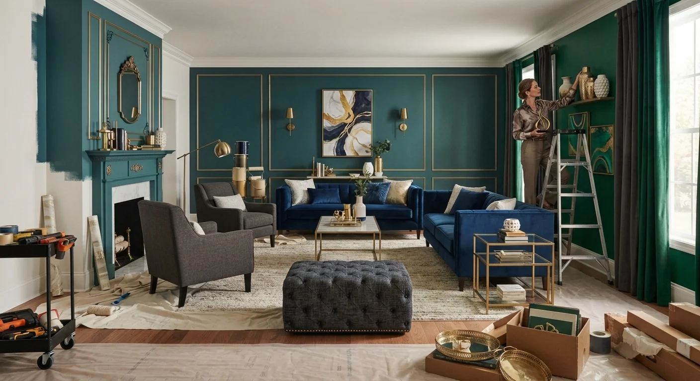
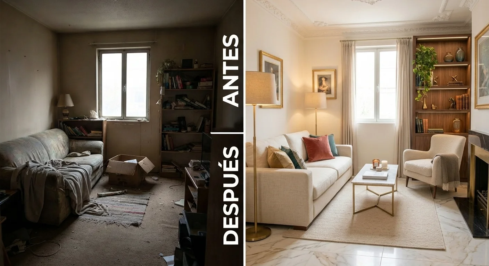

# Antes y Después: Cómo Transformar un Espacio con Bajo Presupuesto

Un antes y después impactante no depende del presupuesto. Depende de **priorizar bien los pocos cambios que realmente se notan**, en vez de repartir el dinero en muchos ajustes pequeños que, juntos, no logran el mismo efecto.

Te explico qué cambiar primero, qué evitar, y cómo documentar el resultado para que también sirva para tu portafolio profesional.

## Qué cambia más por menos dinero

Antes de gastar en nada, entiende esto: no todos los cambios tienen el mismo impacto visual por el mismo costo.

- **Pintura.** Es, sin comparación, el cambio de mayor impacto por menor costo que existe en decoración, y funciona en cualquier estilo de espacio.
- **Textiles.** Cojines, cortinas y una alfombra bien elegida transforman un espacio a una fracción del costo de muebles nuevos, sin comprometerte a un cambio permanente.
- **Reorganización.** Mover los muebles que ya existen, sin comprar nada, puede cambiar por completo cómo se siente un espacio, y es el cambio de costo cero más subestimado de toda la lista.
- **Iluminación.** Cambiar bombillas y sumar una lámpara adicional cuesta poco frente a lo mucho que cambia la percepción del espacio, sobre todo en las horas de la tarde y noche.

Lo que menos rinde por el dinero invertido: muebles grandes nuevos, cuando el problema real del espacio era otra cosa completamente distinta que nadie diagnosticó primero.

## Paso a paso de una transformación con presupuesto limitado

**Paso 1: Diagnóstico honesto del espacio**

Antes de cambiar nada, identifica qué es lo que realmente no funciona: ¿es el color, la distribución, la falta de luz, o el desorden visual de demasiados objetos acumulados con el tiempo?

Cambiar cosas al azar sin este diagnóstico desperdicia presupuesto en ajustes que no resuelven el problema real, y termina en un espacio distinto pero igual de insatisfactorio que antes.

**Paso 2: Prioriza uno o dos cambios de alto impacto**

Con presupuesto limitado, no intentes cambiarlo todo. Elige el cambio que más se conecta con el diagnóstico del paso anterior, y hazlo bien, en vez de repartir el presupuesto en muchos ajustes menores que, sumados, no logran el mismo efecto que uno solo bien ejecutado.

**Paso 3: Reorganiza antes de comprar**

Antes de sumar nada nuevo, prueba reorganizar lo que ya existe. Muchas veces el problema no es falta de mobiliario, sino una distribución que no aprovecha bien el espacio disponible, algo que cuesta cero pesos corregir.

**Paso 4: Invierte en pintura antes que en muebles**

Si el presupuesto es realmente limitado, la pintura debería ir primero en tu lista. Un cambio de color bien elegido transforma la percepción de todo el espacio, incluso con el mismo mobiliario de antes, sin necesidad de cambiar una sola pieza.

**Paso 5: Suma detalles finales con textiles**

Cojines, cortinas y una alfombra son el paso final, no el primero. Sin los cambios de fondo (color, distribución), los detalles textiles no logran el mismo impacto por sí solos, por más bien elegidos que estén.

<a href="/masters/interiorismo" class="articulo-recomendado">
  Siguiente paso
  Máster Profesional en Interiorismo, Decoración y Diseño 3D →
</a>

## Qué no vale la pena hacer con presupuesto limitado

Tan importante como saber qué priorizar es saber qué evitar cuando el presupuesto es corto.

- **Muebles baratos de baja calidad.** Suelen verse bien las primeras semanas y deteriorarse rápido, generando un gasto doble a mediano plazo cuando hay que reemplazarlos otra vez.
- **Cambios estructurales sin presupuesto real para hacerlos bien.** Mover un muro a medias, sin terminar el acabado, se nota más que no haberlo tocado, y suele costar más corregirlo después que hacerlo bien desde el inicio.
- **Comprar antes de definir un plan.** Si ya viste [nuestras ideas para decorar salas pequeñas](/blog/interiorismo/decorar-sala-pequena-2026), sabes que comprar sin plan termina en piezas que no dialogan entre sí, sin importar cuánto costaron individualmente.

## Cómo documentar el antes y después para tu portafolio

Si estás construyendo tu carrera en decoración, cada transformación con presupuesto limitado es material valioso para mostrar, incluso más que un proyecto de lujo sin restricciones.

- **Fotografía el "antes" con la misma seriedad que el "después".** Sin un buen antes, el después pierde fuerza narrativa frente a un cliente potencial.
- **Usa el mismo ángulo y la misma luz en ambas fotos.** Esto hace que la comparación se sienta honesta, no forzada con trucos de iluminación distintos.
- **Anota el presupuesto real invertido.** Un antes y después con presupuesto bajo, bien documentado, demuestra criterio, no solo buen gusto con presupuesto ilimitado.

## Preguntas frecuentes

**¿Cuánto presupuesto necesito para una transformación notable?**

Depende del espacio, pero cambios de pintura, reorganización y textiles pueden lograr una diferencia notable con una fracción del costo de una remodelación completa, sobre todo si están bien priorizados según el diagnóstico inicial.

**¿Vale la pena hacer esto yo mismo o necesito un profesional?**

Los cambios básicos (pintura, reorganización, textiles) los puedes hacer tú. Un profesional suma criterio en decisiones de color y proporción que son más difíciles de acertar sin experiencia previa en el tema.

**¿Estos antes y después sirven como portafolio profesional?**

Sí, y son especialmente valiosos porque demuestran capacidad de resolver con recursos limitados, algo que muchos clientes valoran tanto como el resultado estético final, sobre todo si el mercado al que apuntas no es exclusivamente de gama alta.

<a href="/masters/interiorismo" class="articulo-recomendado">
  Si quieres aprender a transformar espacios con criterio profesional, conoce nuestro
  Máster Profesional en Interiorismo, Decoración y Diseño 3D →
</a>
