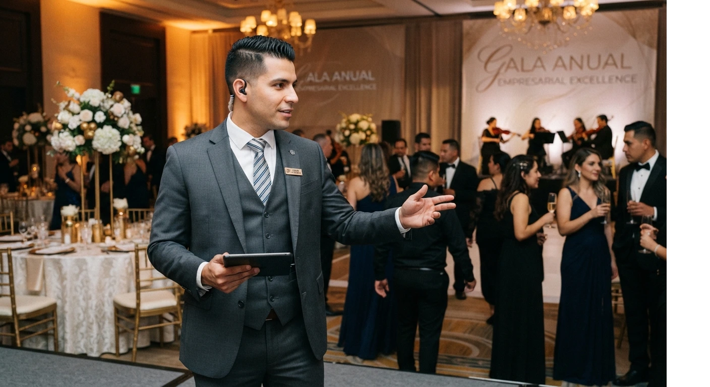

# Las Mejores Certificaciones para Wedding Planners en el Mundo Hispano

Una certificación seria de wedding planner debe incluir **casos prácticos, mentoría real y un portafolio al terminar**. No solo videos y un diploma.

El mercado hispano está lleno de opciones, y no todas valen lo mismo.

Te explico qué buscar, qué evitar, y cómo saber si un programa realmente te va a preparar.

## Qué debe tener una certificación seria

Antes de comparar precios, compara contenido. Esto es lo que enseño que debe tener cualquier programa que valga la pena.

- **Casos prácticos reales**, no solo teoría sobre historia de las bodas o protocolo genérico.
- **Módulos de presupuesto y tarifas.** Si un programa no te enseña a cobrar, te está dejando a la mitad del camino.
- **Manejo de proveedores.** Cómo cotizar, negociar y armar tu red de contactos en tu ciudad.
- **Mentoría con alguien que trabaja activamente en el sector**, no solo un instructor que dio clases hace diez años y ya no organiza bodas.
- **Un entregable final.** Un caso, un evento simulado o un portafolio que puedas mostrar a tu primer cliente.

Si un programa no toca al menos cuatro de estos cinco puntos, no es una certificación completa. Es un curso introductorio.

## Certificación online vs. presencial: qué elegir

Esta pregunta me la hacen todo el tiempo, y la respuesta corta es: **depende de dónde vivas, no de cuál es "mejor".**

**Online tiene sentido si:**

- Vives fuera de una ciudad grande con oferta presencial de calidad
- Necesitas compatibilizar el estudio con un trabajo actual
- Quieres aprender de instructores fuera de tu país

**Presencial tiene sentido si:**

- Valoras la práctica física con montajes, decoración y proveedores
- Tienes acceso a un programa reconocido en tu ciudad
- Aprendes mejor con seguimiento cara a cara

La exigencia del contenido debe ser la misma en cualquier modalidad. Un programa educativo deficiente, ya sea online o presencial, siempre enseñará menos que uno bien diseñado.

<a href="/masters/wedding-planner" class="articulo-recomendado">
  Siguiente paso
  Máster Profesional en Wedding Planning & Organización de Eventos →
</a>

## Señales de alerta: certificaciones que no valen la pena

He visto a alumnas llegar al máster después de haber pagado por programas que no les dieron nada usable. Estas son las señales que hubieran evitado esa pérdida de tiempo y dinero.

- **Promete "conviértete en wedding planner en 3 días".** Ningún oficio serio se aprende en un fin de semana.
- **No muestra el temario completo antes de pagar.** Si no te dejan ver el contenido detallado, algo están escondiendo.
- **No tiene instructores identificables.** Si no puedes buscar quién te va a enseñar, desconfía.
- **Solo vende con testimonios genéricos.** "Cambió mi vida" sin mencionar qué aprendiste específicamente no dice nada real.
- **No incluye nada sobre tarifas ni presupuestos.** Es la parte que más dinero te va a costar no saber manejar bien.

## Cuánto deberías pagar por una certificación seria

Los precios varían mucho según el país y la profundidad del programa, pero hay un rango razonable.

Un programa superficial de un fin de semana no debería costarte lo mismo que uno con mentoría y meses de duración. Si ves precios idénticos entre ambos, algo no cuadra en uno de los dos.

Lo que sí puedo decirte: **el precio más bajo casi nunca es la opción más barata a largo plazo.** Una certificación floja te obliga a aprender por prueba y error con clientes reales, y ese error sale más caro que la diferencia de precio entre programas.

Si ya tienes claro que quieres dar el salto, en [nuestra guía de cómo empezar sin título](/blog/wedding-planner/como-ser-wedding-planner-sin-titulo-2026) vimos justamente por qué la certificación es el primer paso, no el único.

## 3 preguntas para hacerle a cualquier programa antes de pagar

Antes de inscribirte en cualquier certificación, haz estas tres preguntas directamente a quien te esté vendiendo el programa. Cómo responden dice tanto como lo que responden.

- **"¿Puedo ver el temario completo, módulo por módulo?"** Un programa serio te lo muestra sin rodeos. Si te dan solo un resumen vago, insiste o busca otra opción.
- **"¿Quién dicta las clases y qué hace hoy en el sector?"** Un instructor activo, con casos recientes, enseña distinto a alguien que dejó de trabajar en esto hace años.
- **"¿Qué entrego al terminar?"** La respuesta debe ser concreta: un portafolio, un caso completo, una simulación de evento. "Un certificado" solo no es suficiente.

Si la respuesta a cualquiera de estas tres es evasiva, tómalo como una señal de alerta más, no menos importante que las anteriores.

## Certificación vs. experiencia: ¿cuál pesa más?

Ninguna certificación reemplaza la experiencia. Pero tampoco al revés.

La certificación te da el marco: cómo cotizar, cómo manejar un cronograma, cómo evitar errores que un principiante sin guía comete por no saber que existen.

La experiencia te da el criterio: qué hacer cuando el proveedor cancela dos días antes, cómo calmar a una novia nerviosa, cómo improvisar sin que se note.

Necesitas las dos. Y en ese orden: primero el marco, después el criterio.

## Preguntas frecuentes

**¿Vale la pena pagar por una certificación si ya tengo experiencia organizando eventos personales?**

Sí, porque estructura lo que ya sabes y te enseña la parte comercial: tarifas, contratos, manejo de proveedores. La experiencia personal no siempre cubre eso.

**¿Cuánto tiempo dura una buena certificación?**

Varía, pero desconfía de cualquier programa que prometa formarte por completo en menos de un mes. Lo serio toma tiempo de práctica real.

**¿Necesito varias certificaciones para verme profesional?**

No. Una certificación completa y bien elegida pesa más que tres certificados superficiales acumulados sin aplicación práctica.

<a href="/masters/wedding-planner" class="articulo-recomendado">
  Si buscas una certificación con mentoría real y casos prácticos, conoce nuestro
  Máster Profesional en Wedding Planning & Organización de Eventos →
</a>
