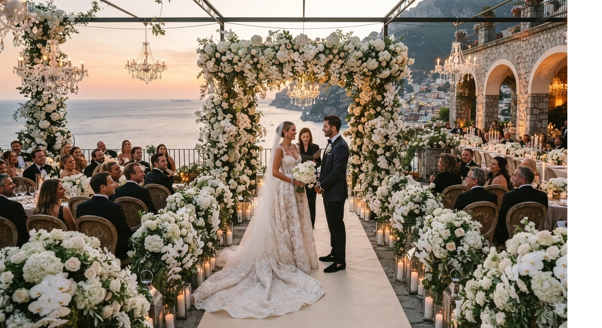
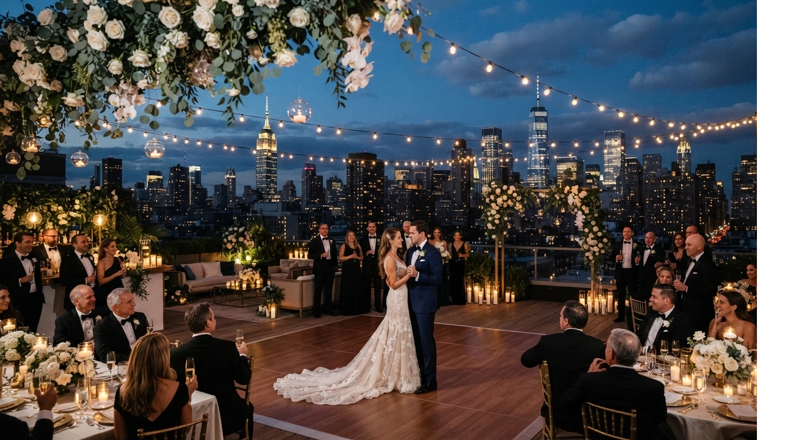

# Checklist Completo para Organizar una Boda, Paso a Paso (+ Descarga Gratis)

Organizar una boda sin checklist es la forma más rápida de olvidar algo importante, sobre todo cuando hay varios proveedores y fechas límite corriendo al mismo tiempo.

Aquí tienes el desglose completo, mes a mes, de qué resolver y cuándo, basado en cientos de bodas que he visto organizarse de cerca, tanto por profesionales como por parejas que lo hicieron por su cuenta. Al final puedes descargar la versión en PDF para seguirla paso a paso, marcando cada tarea a medida que avanzas.

## Por qué un checklist te ahorra los errores más comunes

La mayoría de los errores en una boda no son por falta de presupuesto. Son por **falta de orden en el tiempo**: algo que debía resolverse a los 6 meses se deja para el último mes, y ahí empieza el estrés que después se nota en la boda misma.

Un checklist no reemplaza tu criterio, pero sí te evita el problema de depender de la memoria para no olvidar nada, especialmente cuando estás manejando trabajo, familia y la boda al mismo tiempo.

Además, ordenar las tareas por fecha límite te ayuda a distribuir el estrés a lo largo de varios meses, en vez de acumularlo todo en las últimas semanas antes del evento.

## De 12 a 8 meses antes

Esta etapa define el marco de toda la boda. Lo que se decide aquí, condiciona todo lo que viene después, así que vale la pena no apresurarla.

- Definir presupuesto total, dividido por categoría
- Elegir fecha tentativa (con 2-3 opciones de respaldo, por si el lugar ideal no tiene disponibilidad)
- Reservar el lugar de la ceremonia y la recepción
- Armar la lista preliminar de invitados, aunque cambie después
- Contratar fotógrafo, si es una prioridad alta (los buenos se agotan primero en fechas populares)
- Empezar a investigar proveedores de catering y música, aunque todavía no cierres nada

## De 8 a 6 meses antes

Aquí empieza la parte de proveedores clave, los que suelen agendarse con más anticipación y son más difíciles de reemplazar si cambias de opinión tarde.

- Contratar catering y definir menú preliminar
- Reservar música o DJ
- Elegir y encargar el vestido (los tiempos de entrega y ajustes suelen ser largos)
- Definir estilo de decoración general
- Reservar hospedaje en bloque para invitados de fuera de la ciudad, si aplica

## De 6 a 3 meses antes

Esta etapa es donde se ajustan los detalles que dependen de decisiones anteriores, y donde empiezan a notarse los problemas si algo quedó pendiente de la etapa anterior.

- Enviar invitaciones (con el lugar ya confirmado en firme, nunca antes)
- Coordinar transporte para el día del evento
- Definir decoración final con proveedor, incluyendo flores y mobiliario
- Programar pruebas de vestido y traje
- Confirmar alojamiento para invitados de fuera, si aplica
- Empezar a armar el cronograma preliminar del día del evento

## De 3 a 1 mes antes

Aquí se cierra casi todo lo operativo, dejando el último mes libre de decisiones grandes y enfocado solo en confirmaciones.

- Confirmar número final de invitados con el catering
- Armar el cronograma detallado del día del evento, hora por hora
- Coordinar horarios entre todos los proveedores para evitar cuellos de botella
- Definir un plan B para clima, si la boda es al aire libre
- Delegar la logística del día a alguien de confianza o a un coordinador contratado

## Última semana y día del evento

Esta semana debería ser de confirmaciones, no de decisiones nuevas. Si llegas aquí improvisando, algo se planificó mal más atrás.

- Confirmar horarios finales con cada proveedor, por escrito
- Preparar kit de emergencia (costura, manchas, calzado de repuesto, analgésicos)
- Asignar a alguien responsable de manejar imprevistos el día del evento
- Revisar el cronograma una última vez con quien coordine ese día
- Descansar los días previos, en vez de dejar tareas pendientes para el final

## Descarga el checklist completo en PDF

Todo lo anterior, más las tareas específicas de cada categoría (decoración, catering, papelería, protocolo), está en la versión descargable en PDF, lista para imprimir o marcar directamente desde tu celular.

La ventaja de tenerlo en un solo documento es que puedes compartirlo con quien te esté ayudando a organizar (pareja, familiar, wedding planner) y todos trabajan sobre la misma línea de tiempo, sin depender de mensajes sueltos por WhatsApp para saber qué falta.

<a href="https://drive.google.com/file/d/1MHnHKiOXSDd29PWt5Q62h-LmRevum6aJ/view" class="articulo-recomendado" target="_blank" rel="noopener noreferrer">
  Descarga gratuita
  Checklist Completo para Organizar tu Boda (PDF) →
</a>

## Preguntas frecuentes

**¿Este checklist sirve para cualquier tipo de boda?**

Sí, aunque algunas tareas pesan más según el tipo de boda (destino, íntima, tradicional). Ajusta las fechas según la complejidad logística de la tuya, y elimina lo que no aplique a tu caso.

**¿Qué pasa si empiezo a organizar con menos de 12 meses de anticipación?**

Puedes comprimir las etapas, pero prioriza lugar, catering y fotografía primero: son los proveedores que más rápido se agotan en fechas populares, y los más difíciles de reemplazar sobre la marcha.

**¿Necesito un wedding planner si ya tengo este checklist?**

No necesariamente, pero un profesional agrega criterio en decisiones que un checklist no puede anticipar, como negociar con proveedores, prever imprevistos o resolver algo que sale mal el mismo día del evento.

<a href="/masters/wedding-planner" class="articulo-recomendado">
  Siguiente paso
  Máster Profesional en Wedding Planning & Organización de Eventos →
</a>
