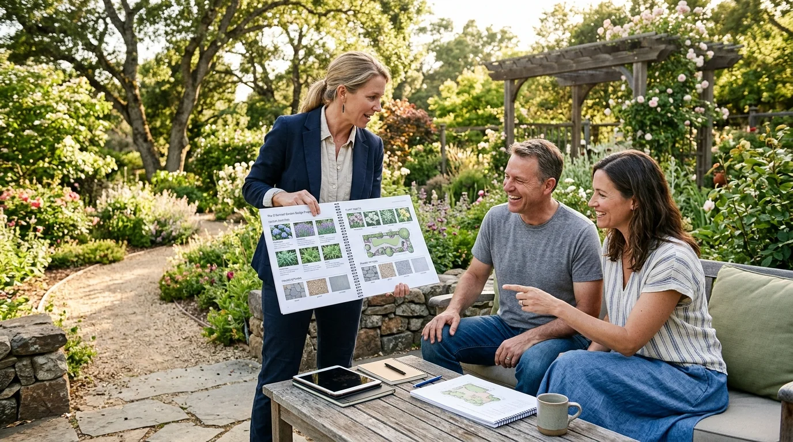

# Cómo Cobrar tus Primeros Proyectos de Diseño de Exteriores

Cobrar bien desde el principio no es una cuestión de osadía, sino de estructura. El error más común no es pedir demasiado: es entregar un precio sin contexto, sin desglose y sin propuesta escrita. Cuando el cliente no entiende qué incluye tu trabajo, compara tu tarifa con la de un jardinero de mantenimiento y negocia hacia abajo. Este artículo te da las herramientas para evitar ese escenario desde el primer proyecto.

---

## Los tres modelos de cobro más usados en paisajismo

Antes de decidir cuánto cobras, tienes que decidir *cómo* cobras. Hay tres modelos que conviven en el mercado hispanohablante y cada uno tiene condiciones específicas donde funciona mejor:

| Modelo | Cuándo aplicarlo | Ventaja principal | Riesgo que debes controlar |
|---|---|---|---|
| **Precio fijo por entregables** | Jardines residenciales de hasta 600 m² | Predecible para ambas partes | Alcance creep: cliente pide más sin pagar más |
| **Tarifa por m² de diseño** | Áreas grandes, corporativas o parques | Escala con el tamaño del terreno | Penaliza proyectos pequeños muy densos |
| **Porcentaje sobre presupuesto de obra** | Proyectos donde supervisas la ejecución | Premia proyectos de mayor inversión | Requiere confianza del cliente en tu rol |

Diversas **guías de costos del mercado estadounidense** sitúan los honorarios de referencia por diseño conceptual y planos entre **$50 y $175 USD por hora** o entre el **5% y el 15% del costo estimado de la obra**. En el mercado hispanohablante, los rangos son sensiblemente distintos, pero la lógica de valor es la misma.

Como punto de orientación para Latinoamérica: profesionales en España reportan tarifas de diseño conceptual entre **15€ y 35€ por metro cuadrado** para proyectos residenciales (según datos de referencia de portales especializados como Habitissimo). En México, Argentina y Colombia las tarifas varían considerablemente por ciudad, nivel de experiencia y tipología de cliente.

El modelo por precio fijo con entregables concretos es el más recomendable para empezar. No porque sea el más rentable a priori, sino porque te obliga a pensar antes de cotizar: ¿qué voy a entregar exactamente?, ¿cuántas revisiones incluye?, ¿el render 3D está dentro o se cotiza aparte?

---

## Qué incluir en tu primera propuesta de honorarios

Si vas a cobrar como profesional, necesitas presentarte como uno. Un presupuesto enviado por mensaje de texto con un número suelto no es una propuesta: es una invitación a regatear. Una propuesta estructurada resuelve ese problema antes de que aparezca.

Como vimos en nuestra [guía sobre cuánto gana un paisajista o diseñador de exteriores](/blog/paisajismo/cuanto-gana-un-paisajista), lo que más diferencia el nivel de ingresos de dos profesionales en el mismo mercado no suele ser el dominio técnico sino la claridad con la que presentan y defienden sus honorarios.

Una propuesta básica para proyectos de exteriores debe incluir:

**1. Alcance definido por fases.** Divide el proyecto en etapas claras: visita técnica y relevamiento, anteproyecto conceptual, proyecto ejecutivo completo y dirección estética de la siembra (si aplica). Cada fase tiene un valor y unas condiciones de entrega. El cliente sabe en todo momento qué paga y qué recibe.

**2. Entregables nombrados y contados.** No escribas "planos del jardín". Escribe: "Plano de zonificación exterior en escala 1:50, plano de especies vegetales con tabla de proporciones y tres renders fotorrealistas en alta resolución desde ángulos acordados con el cliente". Cuando nombras el entregable, el cliente lo percibe como un producto tangible y deja de preguntarse si están incluidos los cambios.

**3. Número de revisiones por etapa.** Lo más habitual en proyectos de diseño es incluir dos rondas de ajustes sin costo adicional por etapa. A partir de la tercera, cada modificación se factura como trabajo adicional. Definirlo desde el contrato evita el desgaste más frecuente en diseño de exteriores: el cliente que "solo quiere mover un poco el camino" cuatro veces seguidas.

**4. Condiciones de pago fraccionadas.** Un esquema habitual y razonable para empezar es: 40% al contratar, 40% al entregar el anteproyecto aprobado y 20% al entregar el proyecto ejecutivo final. Este modelo protege tu tiempo sin pedir al cliente el total de entrada.

---

<a href="/masters/paisajismo" class="articulo-recomendado">
  Siguiente paso
  Máster en Diseño de Exteriores, Paisajismo y Render 3D →
</a>

## Cómo calcular tu tarifa mínima sin trabajar a pérdida

Antes de buscar un número de referencia en internet, necesitas saber cuál es tu punto de equilibrio. El cálculo es directo:

1. Suma todos tus gastos mensuales (vivienda, alimentación, servicios, software de diseño, transporte, seguros y cualquier gasto de negocio).
2. Divide esa cifra entre las horas que puedes dedicar de forma productiva a proyectos de pago en un mes. Recuerda que no todo el tiempo que trabajas es tiempo facturable: reuniones, correos, cotizaciones y gestión no se cobran, pero consumen horas.
3. El resultado es tu tarifa horaria mínima de supervivencia. Ningún proyecto debe implicar una tarifa efectiva por hora por debajo de ese número.

Una vez que tienes ese piso, puedes proyectar el precio de un encargo concreto estimando cuántas horas te va a llevar cada entregable: visita técnica, medición, bocetos conceptuales, modelo 3D, renders, correcciones, memoria descriptiva. Suma todas esas horas, aplica tu tarifa mínima y el resultado es el precio por debajo del cual nunca deberías bajar.

Lo que fijas por encima de ese piso ya depende de tu posicionamiento, tu portafolio y la confianza que transmites en la primera reunión.

---

## Los errores que hacen que el primer proyecto no valga la pena

Cobrar poco conscientemente al inicio —para conseguir referencias y portafolio— es una estrategia válida si tienes un límite claro de cuánto tiempo lo harás. El problema real no es cobrar menos durante los primeros proyectos, sino hacerlo sin estructura y sin documentar el proceso, lo que convierte esa inversión de tiempo en experiencia que no puedes ni mostrar ni defender en una propuesta futura.

Los tres patrones más comunes que hacen que los primeros proyectos terminen siendo costosos para el diseñador:

- **Aceptar cambios verbales sin registrarlos.** El cliente dice "cambiemos el árbol por uno más grande" y al final del proyecto hay quince cambios acumulados que nadie contrató. Documenta cada modificación por escrito, aunque sea un simple mensaje de texto que ambas partes reconozcan.
- **No separar el coste del diseño del coste del material.** Si ayudas al cliente a comprar plantas o pavimentos y gestionas los pedidos, eso tiene un valor. No lo incluyas en el precio del diseño: desglosalo como un servicio de coordinación de compras con su propio margen.
- **Dar precios sin visitar el espacio.** La complejidad de un jardín no se puede estimar correctamente por fotos. Un nivel del terreno, un árbol maduro que hay que respetar o una canaleta de drenaje pueden triplicar las horas de proyecto. Visita el terreno o, si el proyecto es remoto, pide un relevamiento con medidas validadas antes de dar cualquier cifra.

---

## Preguntas frecuentes

**¿Cómo explico al cliente que mi trabajo vale más que el de un jardinero?**

La diferencia no es de precio, es de producto. Un jardinero gestiona el mantenimiento de lo que ya existe. Un diseñador de exteriores proyecta un espacio que no existe todavía: distribuye zonas, selecciona especies según clima y exposición solar, dimensiona caminos, resuelve la evacuación de agua y visualiza el resultado antes de mover una pala. Cuando lo explicas en esos términos —con un render que el cliente puede ver— la diferencia se vuelve evidente sin necesidad de justificar el precio con argumentos abstractos.

**¿Debo cobrar la primera visita técnica?**

Depende del perfil del cliente y del tamaño del proyecto. Para proyectos pequeños en tu ciudad, muchos profesionales optan por no cobrar la visita inicial si hay posibilidades reales de contratación. Para proyectos medianos a grandes, o cuando implica desplazamiento largo, cobrar la visita técnica —y luego descontarla del precio del proyecto si se contrata— es una práctica habitual y razonable que filtra además a los clientes que no tienen intención real de avanzar.

**¿Puedo trabajar en proyectos de exteriores de forma remota?**

Sí. Con herramientas de cartografía digital, modelos topográficos y software 3D, puedes recibir las medidas del cliente por videollamada, trabajar el proyecto desde tu estudio y entregar un dossier completo con renders de calidad. Esta modalidad es especialmente viable cuando el proyecto no requiere supervisión de obra física. Para proyectos en el mercado internacional —particularmente clientes en Estados Unidos o Europa— el trabajo remoto representa una oportunidad concreta de facturar en moneda fuerte desde cualquier país de América Latina.

<a href="/masters/paisajismo" class="articulo-recomendado">
  Si quieres dominar el diseño de exteriores y aprender a estructurar tus proyectos desde el primer cliente, conoce nuestro
  Máster en Diseño de Exteriores, Paisajismo y Render 3D →
</a>
