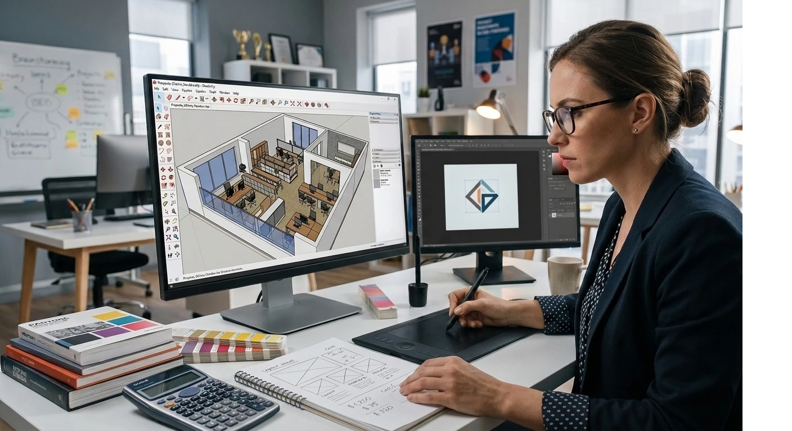

# Cómo Cobrar tus Primeros Proyectos de Decoración: Guía de Tarifas 2026

Para tu primer proyecto, cobra entre **10% y 15% del presupuesto de decoración**, o una tarifa fija de **$300 a $1,500 dólares**, según el tamaño del espacio.

No hay una fórmula única. Pero sí hay un método claro para llegar a tu número.

Te lo explico paso a paso, con los tres modelos que uso yo mismo con mis alumnos.

## Los 3 modelos para cobrar un proyecto de decoración

Antes del paso a paso, entiende esto: **no existe "la" tarifa correcta**. Existen tres formas distintas de cobrar, y cada una tiene su momento.

| Modelo | Cómo funciona | Cuándo usarlo |
|---|---|---|
| **Porcentaje del presupuesto** | 10% - 15% del total de la decoración | Proyectos grandes, presupuesto ya definido |
| **Tarifa fija** | Monto cerrado, sin importar el presupuesto final | Clientes que quieren certeza total |
| **Por hora o por ambiente** | Tarifa fija por espacio, ideal para asesorías puntuales | Solo una habitación, sin proyecto integral |

La mayoría de mis alumnos empiezan con **tarifa fija por ambiente**. Es la más fácil de explicar y la que menos fricción genera con un cliente nuevo.

El porcentaje llega después, cuando ya tienes casos y confianza para manejar presupuestos de casa completa.

## Paso a paso: cómo calcular tu tarifa

Esto es lo que enseño en el máster, resumido en cinco pasos.

**Paso 1: Calcula tus horas reales**

No cuentes solo las visitas a la casa. Cuenta moodboards, cotizaciones a proveedores, ajustes de plano, seguimiento de instalación.

Un proyecto de tamaño medio suele tomar entre **20 y 35 horas** de trabajo real, repartidas en semanas.

**Paso 2: Define tu tarifa por hora mínima**

Divide lo que necesitas ganar al mes entre las horas que puedes dedicar a clientes (no todas tus horas son facturables).

Esa cifra es tu piso. Nunca cobres por debajo de eso, aunque el cliente insista.

**Paso 3: Multiplica y ajusta por complejidad**

Horas estimadas × tu tarifa por hora = número base.

Ajusta hacia arriba si hay complejidad extra: mudanza de muros, coordinación con obra, acabados de importación.

**Paso 4: Compara con el mercado de tu país**

Revisa qué cobran otros diseñadores en tu ciudad. No para copiar, sino para no quedar muy por debajo ni muy por arriba sin explicación.

**Paso 5: Redondea a un número que suene profesional**

$847 suena a cálculo improvisado. $850 o $900 suena a que sabes lo que haces.

<a href="/masters/interiorismo" class="articulo-recomendado">
  Siguiente paso
  Máster Profesional en Interiorismo, Decoración y Diseño 3D →
</a>

## Qué incluir (y qué no) en tu tarifa

Aquí es donde más alumnos nuevos pierden dinero: cobran por "decorar la casa" sin desglosar qué entra en ese precio.

**Sí incluye en tu tarifa base:**

- Reuniones de diagnóstico y moodboard (define un número máximo)
- Búsqueda y cotización de proveedores
- Plano de distribución y lista de compras
- Una visita de seguimiento durante la instalación

**No incluyas sin cobrar aparte:**

- Coordinación de obra o remodelación estructural
- Reuniones extra fuera de lo pactado
- Cambios grandes de última hora sobre el moodboard aprobado
- Visitas adicionales más allá de las acordadas

Ponerlo por escrito en tu cotización te evita el problema más común del sector: el cliente que pide "una cosita más" gratis, cinco veces seguidas.

Si quieres ver cómo se ven estos números aplicados a una carrera completa, ya cubrimos [cuánto gana un diseñador de interiores en cada país](/blog/interiorismo/cuanto-gana-un-disenador-de-interiores-2026) en detalle.

## Errores comunes al poner precio a tu primer proyecto

Llevo años viendo los mismos tres errores en alumnos que recién empiezan.

- **Cobrar poco "para ganar experiencia".** Un cliente que paga poco exige igual que uno que paga bien, y a veces exige más.
- **No cobrar anticipo.** Sin anticipo, cualquier cliente puede cancelar sin costo para él y con pérdida total para ti.
- **Cotizar de memoria.** Sin plantilla ni desglose, es fácil olvidar costos y terminar trabajando gratis las últimas semanas.

Un alumno nuestro en Rosario perdió casi 12 horas de trabajo en su segundo proyecto por no cobrar anticipo. El cliente pospuso la decoración dos veces y él nunca vio ese dinero.

Desde entonces, en el instituto insistimos: **el anticipo no es opcional, es lo que protege tu tiempo.**

## Cómo comunicar tu tarifa sin sonar inseguro

El precio correcto, mal comunicado, también espanta clientes.

- **No te disculpes por el precio.** Decir "sé que es un poco caro, pero..." le mete duda al cliente antes de que la tenga.
- **Preséntalo por escrito, no por WhatsApp de corrido.** Una cotización formal, aunque sea simple, se ve más profesional que un mensaje de texto.
- **Da opciones, no un solo número.** Un paquete de asesoría básica y uno de proyecto integral hacen que el cliente compare entre tus servicios, no con la competencia.

La seguridad con la que presentas tu tarifa comunica tanto como la tarifa misma.

## Preguntas frecuentes

**¿Debo cobrar lo mismo por todos mis proyectos?**

No. Ajusta según metros cuadrados, complejidad y nivel de acabados. Ten un piso mínimo, pero deja margen para proyectos más grandes o de vivienda premium.

**¿Cuándo debo pedir el anticipo?**

Antes de empezar cualquier trabajo, entre el 30% y 50% del total. Sin anticipo firmado, no reserves fecha ni empieces a cotizar proveedores.

**¿Qué hago si el cliente dice que es muy caro?**

Explica qué incluye tu tarifa, paso por paso. Si aun así no encaja, ofrece un paquete más básico antes de bajar tu precio base.

<a href="/masters/interiorismo" class="articulo-recomendado">
  Si quieres aprender a calcular y defender tus tarifas con un método completo, mira nuestro
  Máster Profesional en Interiorismo, Decoración y Diseño 3D →
</a>
