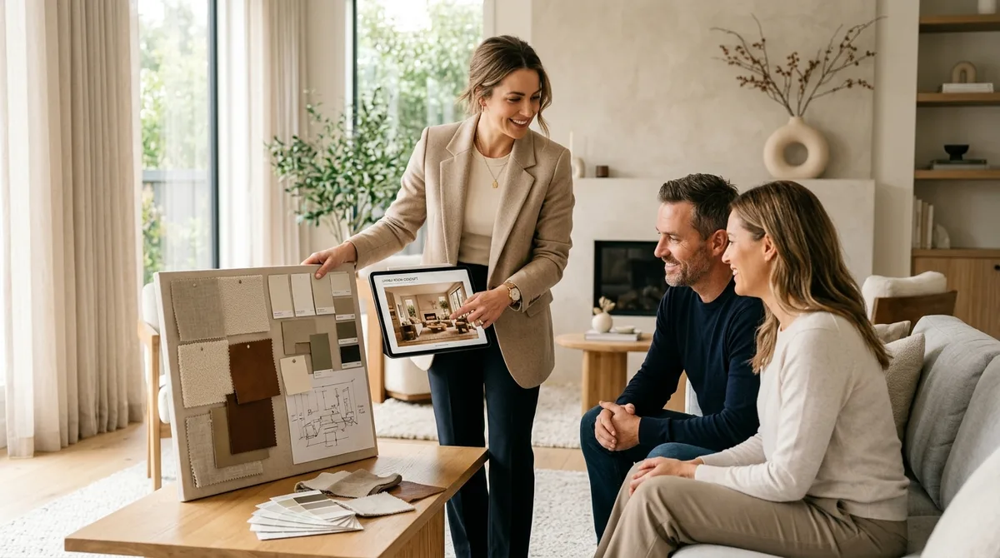
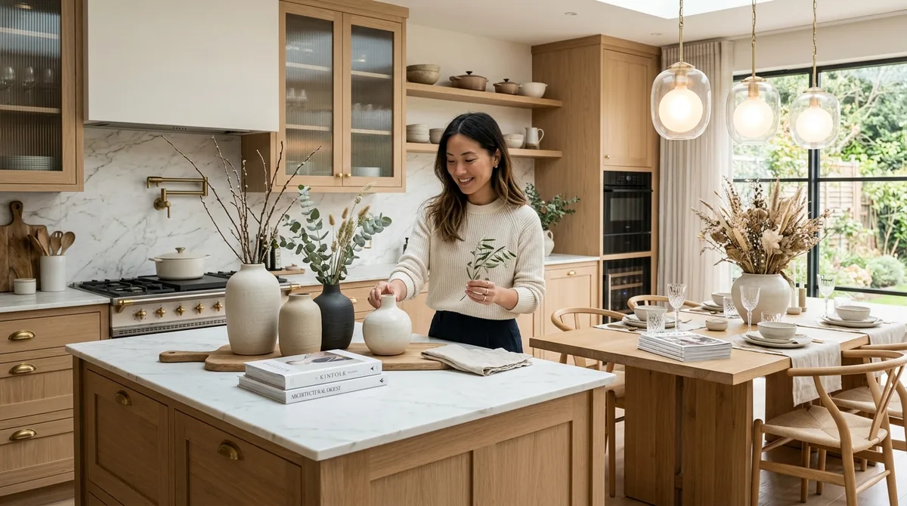

# Cómo Conseguir Clientes de Interiorismo sin Experiencia

Para conseguir tus primeros clientes de interiorismo y decoración sin contar con una trayectoria previa en el mercado, el camino más efectivo consiste en desarrollar dos proyectos conceptuales completos con visualización 3D fotorrealista, forjar alianzas estratégicas con inmobiliarias y tiendas de materiales de tu zona, y plantear una primera reunión consultiva centrada en resolver los problemas funcionales del espacio antes que en vender estética.

El gran obstáculo de quien decide dedicarse al hábitat es la aparente paradoja del portafolio: los clientes buscan profesionales que demuestren solvencia en trabajos anteriores, pero no es posible acumular obras previas sin haber tenido encargos. Salir de este bloqueo no requiere trabajar gratis durante meses ni invertir dinero en campañas publicitarias a ciegas.

En el diseño de interiores, el cliente no compra tu pasado; compra la seguridad de que entiendes sus necesidades, respetas su presupuesto y eres capaz de mostrarle exactamente cómo quedará su hogar antes de que gaste un solo euro en albañiles o mobiliario.

---

## Comparativa: Captación por posicionamiento y alianzas vs. Publicidad de pago

| Criterio de captación | Estrategia de alianzas y portafolio 3D | Publicidad de pago (Meta Ads / Google Ads) |
|---|---|---|
| **Inversión financiera de arranque** | Nula en pauta comercial; requiere dedicación en diseño | Gasto mensual ininterrumpido para captar clics |
| **Predisposición de la persona interesada** | Alta confianza al llegar por recomendación o ver un caso resuelto | Elevado escepticismo inicial que exige validar credibilidad |
| **Maduración del encargo** | Rápida; suelen tener una reforma o mudanza inminente | Dispersa; abundan consultas de curiosos sin fecha de obra |
| **Percepción del valor profesional** | Se te percibe como asesora y especialista técnica | Se te compara rápidamente por precio frente a otros anuncios |
| **Continuidad del negocio** | Efecto recomendación: cada vivienda terminada abre nuevas puertas | Cesa por completo en el momento en que se detiene el presupuesto |

---

## 1. Diseña dos proyectos conceptuales completos en 3D

El cliente residencial medio no sabe leer un plano en dos dimensiones con cotas y líneas técnicas. Si le enseñas un dibujo plano, le cuesta entender el volumen y asume que cualquier albañil o pintor puede hacer lo mismo. En cambio, cuando le muestras una perspectiva fotorrealista donde aprecia la calidez del suelo de madera, la iluminación indirecta en el foseado del techo y la textura del lino en las cortinas, la duda desaparece.

No necesitas que una constructora te contrate para crear ese material visual:

1. **Escoge dos tipologías con alta demanda:** Un salón comedor de piso urbano (de entre 25 m² y 40 m²) con problemas habituales de distribución de luz, y un dormitorio principal con vestidor integrado.
2. **Desarrolla el proyecto con rigor profesional:** Modela el espacio a escala real, define una paleta de colores coherente, selecciona piezas de mobiliario reales de catálogos comerciales accesibles y genera imágenes tridimensionales de alta calidad.
3. **Elabora la memoria de calidades:** Acompaña los renders de un moodboard material con muestras textiles, acabados de madera, referencias de pintura y una estimación orientativa de partidas.

Aprender a producir este material con soltura es el paso determinante que abordamos al explicar [cómo hacer un render 3D de interiores sin experiencia previa](/blog/interiorismo/como-hacer-render-3d-interiores), transformando una idea abstracta en una propuesta tangible que vende por sí sola.

---

## 2. Alianzas estratégicas con agentes inmobiliarios y tiendas locales

Los agentes inmobiliarios se enfrentan a diario con viviendas que llevan meses estancadas en los portales porque su distribución anticuada, la falta de luz o una decoración desfasada impiden que los compradores potenciales visualicen su potencial.

Aquí reside una de las mayores oportunidades de colaboración profesional:

- **Propuesta de home staging virtual:** Acércate a pequeñas y medianas agencias inmobiliarias independientes de tu barrio o ciudad. Ofréceles desarrollar la propuesta conceptual en 3D de una de sus viviendas más difíciles de vender. El agente utiliza tus imágenes para atraer visitas a su anuncio, y a cambio tú apareces acreditada como la diseñadora responsable, con acceso directo a los compradores que adquieren el inmueble y necesitan reformarlo.
- **Conexión con tiendas de reformas y cocinas:** Los estudios de cocinas, carpinterías a medida y tiendas de pavimentos reciben a diario clientes que van a gastar miles de euros pero tienen dudas sobre cómo combinar acabados con el resto del salón. Visita estos comercios, muestra tu portafolio conceptual y proponles actuar como decoradora externa de apoyo para sus clientes indecisos.

Este tipo de iniciativas demuestran que no es imprescindible contar con un título formal universitario tradicional para ejercer con profesionalismo, tal como detallamos en nuestra guía sobre [cómo ser decorador de interiores sin ir a la universidad](/blog/interiorismo/como-ser-decorador-interiores-sin-titulo).

---

## 3. La primera vivienda real: tarifa estratégica de lanzamiento

Tus primeros clientes particulares casi con total seguridad provendrán de tu círculo social o de recomendaciones de segundo grado (compañeros de trabajo, familiares de amigos, conocidos que acaban de comprar piso o firmar un alquiler de larga duración).

Para activar este canal con criterio profesional, evita dos extremos destructivos:

- **El error de trabajar gratis:** Cuando no cobras honorarios, el cliente inconscientemente asume que tu labor carece de valor profesional. Pospone decisiones, interfiere en las compras sin respetar la coherencia estética y no asume con seriedad los plazos de entrega.
- **La fórmula de la tarifa de lanzamiento:** Ofrece asumir el anteproyecto y la dirección estética de una estancia principal (por ejemplo, el salón o la suite) a una tarifa reducida de arranque, estipulando por contrato que a cambio tendrás derecho a realizar una sesión fotográfica y de vídeo profesional del resultado una vez instalado el mobiliario.

Esa primera vivienda real amueblada y fotografiada con luz adecuada constituye la pieza angular para pasar [de aficionada a decoradora profesional](/blog/interiorismo/de-aficionada-a-decoradora-profesional), sirviendo como aval definitivo para los clientes que llegarán después.

<a href="/masters/interiorismo" class="articulo-recomendado">
  Siguiente paso
  Máster Profesional en Interiorismo, Decoración y Diseño 3D →
</a>

---

## 4. Redes sociales enfocadas en resolver dudas funcionales

La mayoría de cuentas de decoración en redes sociales cometen el error de compartir fotografías impersonales de revistas de diseño o casas de lujo que poco tienen que ver con los retos reales de sus seguidores.

Para captar clientes particulares en tu zona geográfica, tu comunicación debe girar en torno a **soluciones prácticas de habitabilidad**:

- **Problemas espaciales concretos:** Publica carruseles o vídeos breves explicando cómo distribuir un salón estrecho y alargado para que no parezca un pasillo, cómo integrar una zona de teletrabajo sin romper la armonía del dormitorio o qué tipo de iluminación colocar en una cocina sin luz natural.
- **El valor del antes y el después:** Muestra el plano original desordenado, la propuesta de distribución corregida y el render del resultado final. Esto educa al cliente sobre todo el trabajo de análisis funcional que hay detrás de un espacio bonito.
- **Procesos y backstage:** Comparte visitas a tiendas de telas, selección de muestras cerámicas, pruebas de color sobre pared y visitas de replanteo con cinta métrica. Ver el método transmite orden, minuciosidad y rigor.

---

## 5. La reunión de valoración: escuchar para cerrar el encargo

Cuando alguien te pida un presupuesto por mensaje privado, nunca respondas con una cifra suelta. En interiorismo no se cotiza al tanteo sin conocer el estado del espacio, las dimensiones y las expectativas de intervención de los propietarios.

Agenda siempre una visita al espacio o una videollamada de media hora con un guion estructurado:

1. **Diagnóstico funcional previo:** Pregúntales qué es lo que más les incomoda de su vivienda actual, qué hábitos de vida tienen en casa (si cocinan a diario, si reciben invitados a cenar, si tienen niños o mascotas) y qué sensación desean experimentar al cruzar la puerta de entrada.
2. **Definición de presupuesto de intervención:** Ayúdales a ser realistas con lo que cuesta amueblar o reformar el espacio. Tu papel como profesional es optimizar sus recursos para evitar que malgasten dinero en compras impulsivas que luego no coordinan entre sí.
3. **Propuesta escalonada:** Presenta tu metodología de trabajo en fases claras (anteproyecto conceptual, proyecto ejecutivo con mediciones y shopping list, y supervisión estética de montaje). Cuando el cliente ve que controlas cada paso, adoptar las pautas sobre [cómo cobrar tus primeros proyectos de decoración](/blog/interiorismo/como-cobrar-primeros-proyectos-decoracion) te permitirá presupuestar tus honorarios con absoluta solvencia y firmeza.

---

## Especialización inicial: por qué acotar tu nicho acelera las contrataciones

Intentar abarcar reformas integrales, diseño de oficinas corporativas, locales comerciales y viviendas unifamiliares cuando estás empezando dispersa tu mensaje y dificulta que alguien te identifique como la opción evidente para su problema.

Al arrancar, suele ser mucho más eficaz posicionarte en una necesidad concreta y resolverla de forma impecable:

- **Rediseño de salones y dormitorios sin obra:** Intervenciones basadas en pintura, papel pintado, iluminación técnica, textiles a medida y selección de mobiliario. Es un encargo ágil, con ciclos de decisión cortos y menor resistencia inicial al precio por parte del cliente.
- **Diseño de interiores online (e-design):** Elaboración de dosieres digitales completos (planimetría de distribución, lista de compras con enlaces directos a tiendas y renders 3D) para clientes que prefieren ejecutar el montaje a su propio ritmo.
- **Viviendas para alquiler vacacional o residencial de calidad:** Propietarios e inversores que necesitan amueblar un piso con rapidez y buen gusto para maximizar el valor de la renta mensual. Para ellos el interiorismo no es un capricho estético, sino una inversión cuantificable que amortizan en poco tiempo.

---

## Preguntas frecuentes

**¿Se pueden conseguir clientes de interiorismo mostrando solo proyectos en 3D?**

Sí, es la práctica estándar con la que arrancan la mayoría de los estudios contemporáneos. Las infografías 3D de alta definición demuestran con total nitidez tu dominio de la distribución espacial, la iluminación, la selección cromática y la armonía de materiales. Los clientes comprenden perfectamente que se trata de proyectos conceptuales y valoran tu criterio visual independientemente de que la pared mostrada haya sido levantada físicamente o modelada digitalmente.

**¿Conviene hacer el primer proyecto de decoración gratis para conseguir fotos reales?**

No es aconsejable trabajar sin remuneración. Cuando un servicio se ofrece a coste cero, los clientes tienden a restar importancia a las reuniones, postergan la toma de decisiones y desestiman el esfuerzo invertido. Es preferible fijar una tarifa de lanzamiento moderada y transparente para amigos o conocidos, formalizando por escrito el compromiso de acceso a la vivienda para fotografiar profesionalmente el resultado final.

**¿Qué tipo de cliente es más fácil de captar al empezar: particular residencial o local comercial?**

El cliente particular residencial que busca renovar estancias concretas (salón, suite o cocina) suele tener un proceso de decisión más accesible y cercano. Sin embargo, los pequeños negocios locales (cafeterías de especialidad, clínicas de fisioterapia o tiendas de moda independiente) son clientes muy receptivos si les demuestras que una estética cuidada y funcional incrementa el tiempo de permanencia de sus usuarios y refuerza la identidad de su marca.

<a href="/masters/interiorismo" class="articulo-recomendado">
  Si quieres aprender a diseñar espacios con criterio profesional y captar clientes solventes, conoce nuestro
  Máster Profesional en Interiorismo, Decoración y Diseño 3D →
</a>
