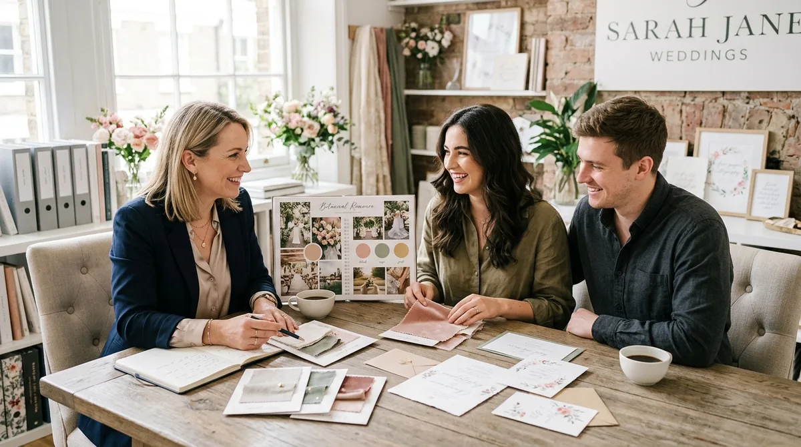
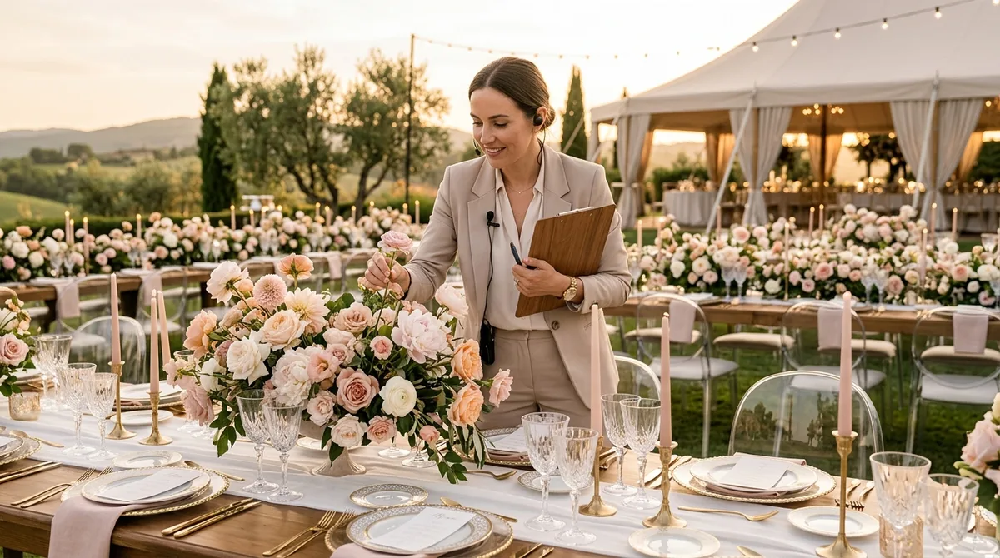

# Cómo Conseguir Clientes como Wedding Planner (Sin Anuncios)

Para conseguir tus primeros clientes como wedding planner sin invertir en publicidad de pago, la vía más rentable y sólida consiste en tejer alianzas estratégicas con fincas, fotógrafos y floristas locales, organizar una sesión editorial (*styled shoot*) para crear portafolio propio y transformar tus redes sociales en una muestra visible de tu método logístico.

Uno de los errores más frecuentes al iniciar en este sector es pensar que abriendo una cuenta de Instagram y activando campañas de anuncios de pago llegarán parejas listas para firmar un contrato. Una boda representa una de las decisiones financieras y emocionales más importantes en la vida de una pareja; nadie deposita el presupuesto y la tranquilidad del día más esperado de su vida en un anuncio impersonal de una profesional que aún no conoce.

La confianza en este rubro se construye a través de referencias de proveedores contrastados, demostración tangible de orden y una presencia profesional impecable.

---

## Comparativa: Captación orgánica vs. Publicidad de pago en bodas

| Factor de captación | Estrategia de alianzas y red orgánica | Campañas de anuncios (Meta / Google Ads) |
|---|---|---|
| **Inversión económica inicial** | Cero euros/dólares en pauta publicitaria | Presupuesto mensual constante para mantener tráfico |
| **Nivel de confianza inicial de la pareja** | Muy alto (llegan recomendados por su espacio o fotógrafo) | Bajo o escéptico (necesitan validar credibilidad desde cero) |
| **Tasa de conversión en primera reunión** | Muy elevada: la pareja llega con alta predisposición por la recomendación previa | Baja: predominan contactos en fase exploratoria o buscando comparar tarifas |
| **Tiempo de maduración del contacto** | Rápido, con fecha y espacio habitualmente definidos | Lento; parejas en fase exploratoria sin presupuesto claro |
| **Sostenibilidad a largo plazo** | Efecto bola de nieve: cada boda genera nuevos contactos | Se detiene en el momento exacto en que apagas la inversión |

---

## 1. Alianzas con espacios de eventos: el canal número uno

Los espacios de celebración (fincas rústicas, bodegas, hoteles boutique, casonas históricas) son el primer proveedor que una pareja contrata tras comprometerse. Cuando los novios reservan el lugar, se dan cuenta de la complejidad operativa que tienen por delante: coordinación de tiempos de cocina, montaje de iluminación, traslados de invitados y gestión de imprevistos meteorológicos.

Para el coordinador del espacio, una boda sin wedding planner profesional suele traducirse en retrasos en el banquete, llamadas de emergencia y tensión con los camareros. Tu labor no es pedirles que te vendan, sino presentarte como su aliada logística:

- **Visita el espacio en persona:** Solicita una cita previa fuera de temporada alta o en días entre semana. Preséntate con una tarjeta sobria y una carpeta de presentación donde expliques tu protocolo de montaje y desmontaje.
- **Demuestra que proteges sus instalaciones:** Deja claro que coordinas con tiempos estrictos, supervisas que ningún proveedor clave clavos en paredes históricas o dañe jardines, y garantizas que el salón se entregue impecable al finalizar el evento.
- **Ofrece soporte de coordinación:** Muchos espacios cuentan con personal comercial pero carecen de coordinadores de día B dedicados exclusivamente a los novios. Si aprendes [cómo elegir y negociar con proveedores para un evento](/blog/wedding-planner/elegir-negociar-proveedores-eventos), los administradores de salas comenzarán a incluirte en su dossier de colaboradores recomendados.

---

## 2. El poder del *Styled Shoot* para crear tu primer portafolio

El dilema de todo principiante es evidente: las parejas piden ver bodas reales que hayas coordinado para confiar en ti, pero necesitas clientes para tener fotos de bodas.

La solución profesional que utilizan las wedding planners más reconocidas es organizar una **sesión editorial inspiracional** (*styled shoot*). No se trata de fingir una boda falsa, sino de diseñar un concepto estético completo en colaboración con otros profesionales emergentes del sector que también necesitan material visual de alta calidad:

1. **Elige una temática con personalidad definida:** Huye de lo genérico. Diseña una mesa imperial de inspiración botánica mediterránea, una ceremonia íntima minimalista o una recepción en tonos terracota.
2. **Convoca a un equipo de proveedores locales:** Necesitarás un fotógrafo que busque renovar su portfolio de bodas, una florista dispuesta a mostrar sus mejores arreglos, un diseñador de papelería nupcial (minutas, seating plan, caligrafía) y una pastelería artesanal para la tarta.
3. **Tu rol como directora:** Tú concibes la dirección creativa, coordinas los horarios de llegada de cada proveedor, montas la ambientación y supervisas que cada plano fotográfico capture los detalles de diseño.
4. **Resultado inmediato:** En una sola jornada obtienes decenas de fotografías profesionales y clips de vídeo de nivel editorial donde figuras como la mente organizadora detrás de ese montaje, listas para nutrir tu sitio web y tus redes sociales.

Aprender este proceso paso a paso es parte de la transición natural que explicamos al detallar cómo pasar [de cero a wedding planner profesional](/blog/wedding-planner/de-cero-a-wedding-planner).

---

## 3. Tu círculo cálido y la primera coordinación a precio de lanzamiento

Tus primeras dos parejas suelen salir de tu entorno cercano o de amigos de amigos. Sin embargo, existe una diferencia crítica entre regalar tu trabajo y ofrecer una tarifa de lanzamiento estratégica:

- **Nunca trabajes al 100% gratis:** Cuando un servicio no cuesta nada, el cliente tiende a no valorar tu criterio, cambia horarios a última hora y no se compromete con tus plazos de organización.
- **La fórmula de la tarifa de lanzamiento:** Ofrece un descuento considerable (por ejemplo, cobrar únicamente los honorarios básicos de coordinación del día de la boda) a cambio de un compromiso explícito por escrito: permiso total para fotografiar y grabar el proceso, y una reseña detallada en vídeo o texto al terminar el banquete.
- **Vívelo como tu caso de estudio:** Trata ese primer evento como si fuera la boda de mayor presupuesto de tu carrera. Esa primera pareja satisfecha será tu mejor altavoz ante sus invitados solteros y comprometidos, tal como analizamos en nuestra guía sobre [cómo se vive el primer evento pagado de una wedding planner](/blog/wedding-planner/primer-evento-pagado-wedding-planner).

<a href="/masters/wedding-planner" class="articulo-recomendado">
  Siguiente paso
  Máster Profesional en Wedding Planning & Organización de Eventos →
</a>

---

## 4. Redes sociales que transmiten orden, no solo decoración

Muchas wedding planners novatas llenan su Instagram de fotos de archivo de vestidos de novia o citas románticas. Ese contenido atrae a personas soñadoras, pero no convence a la novia estresada que necesita delegar su boda a una profesional eficiente.

El contenido que realmente genera consultas privadas en tu bandeja de entrada muestra **método, control y anticipación**:

- **Muestra las bambalinas del trabajo:** Publica vídeos breves de cómo organizas un cronograma minuto a minuto, cómo revisas el contrato de un proveedor de sonido o cómo preparas el kit de emergencias de la novia (hilo, horquillas, quitamanchas, medicación básica).
- **Resuelve objeciones reales:** Explica qué hacer si llueve en una boda al aire libre, cómo calcular la cantidad adecuada de botellas para la barra libre o cómo gestionar a invitados que no confirman asistencia.
- **Pinterest como motor de búsqueda pasiva:** A diferencia de Instagram, donde una publicación desaparece a las 48 horas, los pines en Pinterest continúan generando clics hacia tu propuesta de servicios durante meses o años. Sube fotos de tus montajes enlazadas a artículos donde resuelvas dudas logísticas de las parejas.

---

## 5. La reunión de valoración: venta consultiva sin presiones

Cuando una pareja interesada te contacte por primera vez, no cometas el error de enviar un PDF genérico de tarifas por WhatsApp de inmediato. Ese documento descontextualizado solo propicia que comparen números fríos con otros proveedores.

El paso profesional consiste en agendar una videollamada o café de 30 minutos:

1. **Escucha el 70% del tiempo:** Pregúntales cómo imaginan su día, qué aspectos les generan mayor preocupación, cuántos invitados esperan y cuál es la atmósfera que desean lograr.
2. **Identifica sus puntos de dolor:** La mayoría de las parejas no busca solo flores bonitas; buscan no discutir entre ellos por falta de tiempo, evitar sobrecostos sorpresa y disfrutar de la fiesta sin estar pendientes de los horarios del autobús.
3. **Presenta una solución personalizada:** Al finalizar la conversación, desglosa cómo tu servicio de organización integral o coordinación del día B elimina exactamente esos miedos. Cuando comprenden el valor de tu presencia, aplicar las recomendaciones sobre [cuánto cobrar por organizar un evento](/blog/wedding-planner/cuanto-cobrar-por-organizar-un-evento) resulta natural y convincente.

---

## El efecto red: por qué los fotógrafos son tus mejores prescriptores

Después de los espacios de celebración, los **fotógrafos y videógrafos de bodas** son los prescriptores más valiosos que puedes cultivar en tu ciudad o región:

- **Trabajo coordinado durante toda la jornada:** Si mantienes el cronograma a tiempo, aseguras que la pareja aproveche la hora dorada para su reportaje y evitas que los familiares dispersos retrasen las fotos de grupo, el fotógrafo te considerará una colaboradora indispensable.
- **Te recomendarán espontáneamente:** Cuando sus futuros clientes les pregunten si conocen a alguien de confianza para coordinar la boda, mencionarán tu nombre antes que el de cualquier otra persona, porque saben que trabajar contigo les facilita su propio trabajo.
- **Intercambio de material:** Facilítales el listado de proveedores para que puedan etiquetarlos en sus publicaciones y pídeles imágenes en alta resolución de tus montajes decorativos para nutrir tu portfolio.

---

## Preguntas frecuentes

**¿Cuánto tiempo toma conseguir el primer cliente pagado como wedding planner?**

El tiempo varía según la proactividad con la que construyas tu red de contactos y la solidez del material visual que presentes. Quienes organizan una sesión editorial colaborativa para mostrar su criterio y visitan personalmente a proveedores locales consiguen cerrar sus primeras bodas con mucha mayor rapidez que quienes se limitan a publicar contenido de forma pasiva en redes sociales.

**¿Conviene organizar una primera boda gratis para tener fotos de portafolio?**

No es recomendable asumir la responsabilidad completa de una boda de forma gratuita. Es preferible ofrecer un servicio de coordinación del día del evento a una tarifa reducida de lanzamiento para familiares o amigos cercanos, o participar como asistente de campo de una wedding planner consolidada durante varias bodas para adquirir experiencia real y contactos.

**¿Qué canal es más efectivo para conseguir parejas hoy en día: Instagram o el boca a boca?**

El boca a boca profesional (recomendaciones directas de fincas, fotógrafos y catering) es el canal que mayor tasa de cierre produce en las reuniones de contratación. Sin embargo, Instagram actúa como la carta de validación inmediata: cuando un proveedor recomienda tu nombre, la pareja irá de inmediato a tu perfil social para comprobar la estética, seriedad y estilo de tus eventos antes de escribirte.

<a href="/masters/wedding-planner" class="articulo-recomendado">
  Si quieres aprender a estructurar tu negocio de eventos y captar parejas con método profesional, conoce nuestro
  Máster Profesional en Wedding Planning & Organización de Eventos →
</a>
