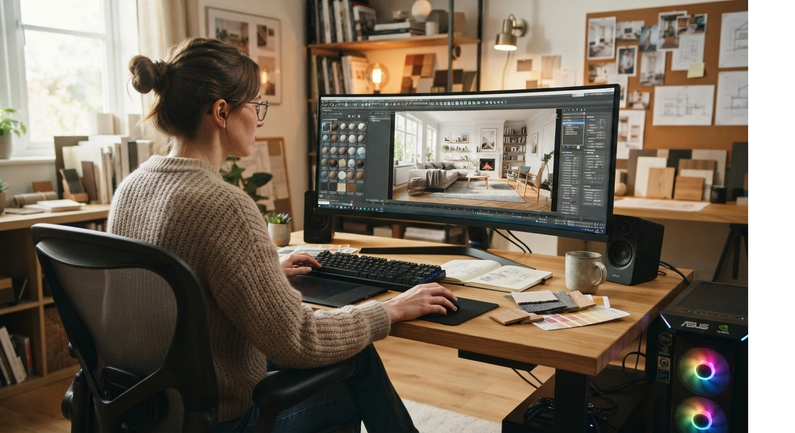

# Cómo Hacer un Render 3D de Interiores sin Experiencia Previa

Un render 3D se hace en cuatro etapas: **modelar el espacio, aplicar materiales, configurar la luz y ejecutar el render**, siempre en ese orden.

No necesitas experiencia previa en diseño para empezar, pero sí necesitas seguir el orden correcto, paso por paso. Saltarse un paso es la razón número uno por la que un primer render sale mal.

Te explico el proceso completo, sin asumir que ya sabes nada de software.

## Qué necesitas antes de empezar

Antes del paso a paso, deja claro esto: un render no reemplaza el modelado. Es el último paso de un proceso, no un atajo para saltarte los anteriores.

Si ya viste [qué software dominar como interiorista](/blog/interiorismo/software-diseno-3d-interiores), sabes que necesitas mínimo dos herramientas: **SketchUp** para el modelo 3D, y **Enscape** o **V-Ray** como motor de render sobre ese modelo.

Sin un modelo bien hecho, ningún motor de render arregla el resultado final, sin importar cuánto tiempo le dediques a la iluminación después.

## Paso a paso: de modelo 3D a render final

**Paso 1: Modela el espacio en SketchUp**

Empieza por la estructura básica: muros, aberturas y el volumen general del espacio. No agregues detalles de decoración todavía, aunque tengas ganas de ver cómo se vería el mobiliario desde el primer momento.

Un error común es querer modelar hasta el último detalle antes de ver una sola imagen de render. Modela lo esencial primero, renderiza una vista de prueba, y después perfecciona con base en lo que ves ahí.

**Paso 2: Aplica materiales y texturas**

Aquí defines qué material tiene cada superficie: madera en el piso, pintura en los muros, tela en el mobiliario.

Usa materiales de bibliotecas ya preparadas para render, no fotos genéricas de internet. Una textura mal escalada arruina el realismo más que cualquier otro error en este paso.

**Paso 3: Configura la iluminación**

La luz es lo que más cambia el resultado final, más incluso que los materiales. Un mismo modelo se ve completamente distinto con luz cálida de tarde que con luz fría de mediodía, aunque no hayas tocado un solo material.

Empieza con la luz natural (ventanas) antes de agregar luces artificiales. Sin esa base, la iluminación artificial se ve plana y poco realista, sin importar cuántas lámparas agregues al modelo.

**Paso 4: Ejecuta el render con Enscape o V-Ray**

Con el modelo, materiales y luz ya definidos, ejecuta una primera vista previa en baja calidad antes del render final. Esto te permite corregir errores rápido, sin esperar el tiempo completo de un render de alta calidad.

Solo cuando la vista previa se ve bien, corres el render final en la resolución que vas a necesitar para mostrárselo al cliente.

**Paso 5: Ajusta y exporta**

Revisa el render final: sombras, reflejos y proporciones. Pequeños ajustes de color o exposición en un editor de imágenes pueden mejorar bastante el resultado sin tener que rehacer el render completo.

## Errores comunes en tu primer render

Estos son los errores que más se repiten entre quienes hacen su primer render sin guía.

- **Renderizar antes de terminar el modelado.** Corregir un error de distribución después de renderizar duplica el trabajo, porque tienes que ajustar el modelo y volver a correr todo el proceso de render.
- **Ignorar la escala de los materiales.** Una textura de madera demasiado grande o pequeña rompe el realismo, aunque todo lo demás esté bien configurado.
- **Usar solo luz artificial.** Sin luz natural como base, el espacio se ve artificial incluso con buena configuración de materiales y buenos muebles en el modelo.
- **No revisar la vista previa antes del render final.** Correr un render de alta calidad sin revisar antes es la forma más común de perder horas de espera por un error que se pudo corregir en segundos.
- **Copiar configuraciones de otro proyecto sin ajustar.** Cada espacio tiene su propia orientación y tamaño de ventanas, así que la iluminación que funcionó en un proyecto anterior rara vez funciona igual en el siguiente.

## Cuánto tiempo toma hacer un buen render

Depende de la complejidad del espacio, pero para un ambiente residencial estándar, calcula entre **2 y 4 horas** desde el modelo terminado hasta el render final aprobado, incluyendo los ajustes de materiales y luz.

Tus primeros renders van a tomar más tiempo que eso. Es normal. La velocidad mejora con la práctica, no leyendo más teoría sobre el proceso.

<a href="/masters/interiorismo" class="articulo-recomendado">
  Siguiente paso
  Máster Profesional en Interiorismo, Decoración y Diseño 3D →
</a>

## Preguntas frecuentes

**¿Necesito saber dibujar o tener experiencia en diseño para empezar?**

No. Necesitas seguir el proceso en orden y practicar con proyectos reales. La habilidad de render se aprende con repetición, no con talento previo para el dibujo o la ilustración.

**¿Puedo hacer un buen render sin pagar licencias caras?**

Sí, para empezar. Muchas herramientas de render tienen versiones de prueba o planes básicos suficientes para tus primeros proyectos, antes de invertir en una licencia completa que se justifique con clientes reales.

**¿Por qué mi render se ve "plástico" o poco realista?**

Casi siempre es un problema de iluminación o materiales mal configurados, no del software. Revisa primero la luz natural antes de sospechar del programa que estás usando, y ajusta la escala de las texturas si el problema persiste.

<a href="/masters/interiorismo" class="articulo-recomendado">
  Si quieres aprender este proceso completo aplicado a proyectos reales, conoce nuestro
  Máster Profesional en Interiorismo, Decoración y Diseño 3D →
</a>
