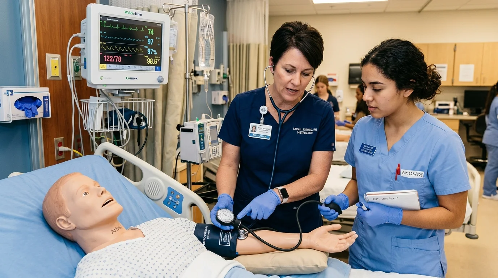

# Cómo Ser Auxiliar de Enfermería sin Ir a la Universidad

No necesitas cursar un grado universitario de cuatro o cinco años para trabajar en el sector sanitario. La figura del auxiliar de enfermería es una ocupación técnica enfocada en la atención directa, el bienestar básico del paciente y el soporte operativo al equipo médico. A continuación analizamos los requisitos formativos, las competencias clínicas reales y las particularidades legales de cada país.

---

## Grado universitario vs. formación técnica: diferencias clave

Existe una confusión habitual entre el enfermero graduado y el auxiliar de enfermería. Ambas figuras son indispensables en cualquier institución de salud, pero responden a niveles de responsabilidad, formación y competencias claramente diferenciados:

| Criterio | Licenciatura / Grado en Enfermería | Auxiliar de Enfermería Clínica |
|---|---|---|
| **Ámbito educativo** | Universidad (carrera de grado) | Formación técnico-profesional no universitaria |
| **Tiempo de estudio** | 4 a 5 años académicos | Programas intensivos de meses a 2 años |
| **Responsabilidad clínica** | Diagnósticos de enfermería, fármacos intravenosos, liderazgo de sala | Higiene, confort, control de constantes vitales, soporte asistencial |
| **Acceso académico** | Examen de ingreso universitario y bachillerato completo | Educación secundaria obligatoria o equivalente |
| **Regulación** | Colegiatura profesional obligatoria en todos los países | Registro técnico según normativa sanitaria local |

El enfermero universitario diseña planes de cuidados complejos, administra tratamientos intravenosos de alta precisión y coordina turnos hospitalarios. El auxiliar de enfermería ejecuta las tareas fundamentales de soporte diario: monitoriza las constantes fisiológicas del paciente, asiste en la alimentación e higiene, previene úlceras por presión y comunica de inmediato cualquier alteración al profesional a cargo.

---

## Requisitos de acceso y perfil necesario

Para iniciar una formación como auxiliar de enfermería no se exigen credenciales complejas ni experiencia previa en entornos hospitalarios. En la mayoría de los países hispanohablantes, los requisitos habituales comprenden:

- **Edad mínima:** Generalmente 16 o 18 años, según la jurisdicción y el tipo de centro de prácticas.
- **Nivel de estudios previos:** Certificado de educación secundaria obligatoria (ESO en España, secundaria o preparatoria en México, bachillerato básico en Colombia y Argentina).
- **Aptitud física y emocional:** Capacidad para permanecer de pie durante turnos prolongados, movilizar pacientes con ergonomía adecuada y gestionar situaciones de estrés con serenidad y empatía.
- **Vocación asistencial:** Interés genuino por el cuidado humanizado de personas en situación de vulnerabilidad o convalecencia.

---

## Diferencias de titulación y marco legal por país

La denominación y el marco regulatorio del auxiliar de enfermería varían según el territorio. Comprender estas distinciones resulta indispensable para orientar tus expectativas laborales:

### España
En el sistema sanitario español, la titulación reglada oficial es el **Técnico en Cuidados Auxiliares de Enfermería (TCAE)**, perteneciente a la Formación Profesional de Grado Medio (Ministerio de Educación y Formación Profesional). Para optar a plazas estatutarias en el Sistema Nacional de Salud (hospitales públicos mediante oposición o bolsa de empleo) se exige el título oficial de FP. Los cursos y certificaciones privadas proporcionan formación de actualización o capacitación para el ámbito privado (clínicas dentales, residencias de mayores privadas, ayuda a domicilio o centros de estética), pero no equivalen por sí mismos al título oficial de FP ni otorgan acceso directo al empleo público regulado.

### México
Coexisten diversas modalidades formativas. Por un lado, las escuelas técnicas y centros de capacitación para el trabajo ofrecen diplomados y cursos de auxiliar de enfermería orientados a la asistencia en consultorios, clínicas privadas y atención geriátrica. Por otro lado, la carrera de Enfermería General Técnica (nivel medio superior, con validez oficial de la SEP) otorga cédula profesional técnica y permite mayor rango de acción hospitalaria.

### Colombia
La ocupación está tipificada como **Técnico Laboral por Competencias en Auxiliar en Enfermería**, impartida por Instituciones de Educación para el Trabajo y el Desarrollo Humano (IETDH) debidamente autorizadas por las secretarías de educación locales. El programa contempla módulos teórico-prácticos y prácticas formativas en convenios docencia-servicio con instituciones prestadoras de salud (IPS).

### Estados Unidos
La figura análoga más extendida es el **CNA (Certified Nursing Assistant)**. Para ejercer, se requiere completar un programa formativo aprobado por el departamento de salud de cada estado y aprobar el examen estatal de evaluación de competencias (*State Competency Exam*). La credencial permite trabajar en centros de enfermería especializada (*skilled nursing facilities*), hospitales y agencias de atención domiciliaria (*home health care*).

*Aclaración de cumplimiento legal:* Toda persona interesada en ejercer profesionalmente en el sector de la salud debe consultar la legislación sanitaria específica de su país de residencia. Ninguna certificación privada garantiza por sí sola la convalidación o la homologación automática ante ministerios de salud u organismos reguladores de carácter público.

---

<a href="/masters/enfermeria" class="articulo-recomendado">
  Siguiente paso
  Curso Profesional Superior: Auxiliar de Enfermería Clínica →
</a>

---

## Competencias reales que debes dominar en la práctica clínica

El trabajo del auxiliar de enfermería combina rigor procedimental, higiene estricta y calidad humana. Entre las habilidades centrales que componen la rutina diaria destacan:

### 1. Monitorización de signos vitales
Aprender a medir e interpretar de forma correcta los parámetros fisiológicos básicos:
- **Tensión arterial:** Detección de cifras fuera de los rangos basales del paciente.
- **Frecuencia cardíaca y respiratoria:** Conteo de pulso y respiraciones por minuto en reposo.
- **Temperatura corporal:** Manejo de termómetros digitales, timpánicos y de contacto.
- **Saturación de oxígeno:** Uso adecuado del pulsioxímetro y registro en gráfica de enfermería.

Tal como detallamos en nuestra [guía sobre cuánto gana un auxiliar de enfermería](/blog/enfermeria/cuanto-gana-un-auxiliar-de-enfermeria), el dominio de estas competencias clínicas y la capacidad de reportar anomalías con lenguaje técnico son factores que inciden directamente en las oportunidades de contratación en el sector privado.

### 2. Higiene, movilización y confort del paciente
El aseo en cama, los cambios posturales programados cada dos o tres horas para prevenir úlceras por presión y el traslado seguro de la cama al sillón o silla de ruedas constituyen una parte esencial de la jornada asistencial. Aplicar principios de mecánica corporal protege tanto la integridad física del paciente como la salud lumbar del propio profesional.

### 3. Asepsia, bioseguridad y prevención de infecciones
El ámbito hospitalario exige el cumplimiento estricto de las precauciones universales: protocolo de lavado clínico de manos en los cinco momentos estipulados por la OMS, uso de guantes, mascarillas y batas descartables, así como la separación adecuada de residuos biocontaminados.

---

## Dónde puede trabajar un auxiliar de enfermería

La demanda de perfiles auxiliares capacitados abarca múltiples sectores sociosanitarios, tanto institucionales como residenciales:

1. **Hospitales y sanatorios privados:** Apoyo directo en unidades de hospitalización general, consultas externas, servicios de admisión y cuidados postoperatorios.
2. **Residencias geriátricas y centros de día:** Atención integral y continuada a adultos mayores dependientes, supervisión de comidas y fomento de la autonomía personal.
3. **Atención domiciliaria a pacientes convalecientes:** Cuidados personalizados a personas con patologías crónicas, secuelas de accidentes cerebrovasculares o movilidad reducida en el entorno de su hogar.
4. **Centros de rehabilitación y fisioterapia:** Asistencia en la movilización de usuarios durante terapias físicas y acondicionamiento.
5. **Consultorios médicos y odontológicos:** Preparación de instrumental básico, recepción de pacientes y apoyo en exploraciones rutinarias.

---

## Preguntas frecuentes

**¿Se puede trabajar en sanidad pública solo con un curso privado de auxiliar de enfermería?**

No en sistemas fuertemente regulados como el de España, donde las bolsas de empleo del Sistema Nacional de Salud exigen el título oficial de Formación Profesional (TCAE). Las certificaciones emitidas por instituciones privadas capacitan y acreditan conocimientos para el ejercicio en el sector privado (residencias de mayores privadas, mutuas, ayuda a domicilio, clínicas dentales o consultas médicas), pero no reemplazan los títulos oficiales estatales exigidos en las oposiciones del sector público.

**¿Cuánto tiempo se tarda en formarse como auxiliar de enfermería?**

La duración depende del itinerario formativo elegido. Los programas de capacitación técnica y cursos superiores privados suelen estructurarse en itinerarios intensivos de entre 6 y 12 meses de formación teórico-práctica. Por su parte, las titulaciones oficiales de Formación Profesional reglada (como la FP de Grado Medio en España) tienen una carga lectiva estándar de 1.400 a 2.000 horas, distribuidas habitualmente en dos cursos académicos con período de prácticas en centros sanitarios.

**¿Qué diferencia hay entre un auxiliar de enfermería y un técnico en enfermería?**

La distinción varía según el país. En varios países de América Latina, como Chile, Perú o Colombia, el "técnico en enfermería" cursa una formación de nivel superior con atribuciones clínicas adicionales respecto al auxiliar, tales como administración de ciertos medicamentos orales o colocación de sondas bajo supervisión. En otros entornos territoriales, ambos términos suelen utilizarse de manera equivalente para designar al personal técnico no universitario de apoyo asistencial.

<a href="/masters/enfermeria" class="articulo-recomendado">
  Si quieres formarte en el cuidado clínico de pacientes con estándares actualizados, conoce nuestro
  Curso Profesional Superior: Auxiliar de Enfermería Clínica →
</a>
