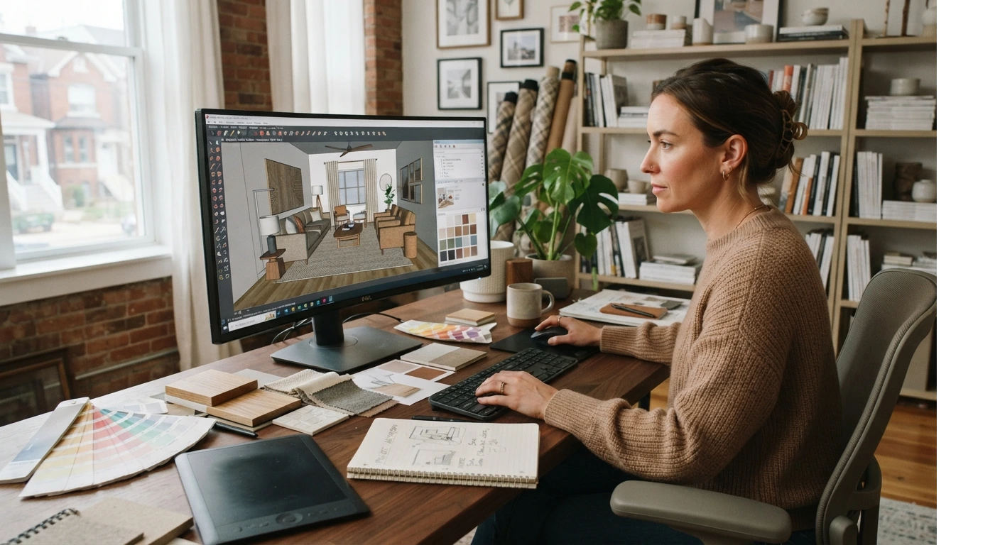

# Cómo Ser Decorador de Interiores sin Ir a la Universidad: Guía Paso a Paso

Sí, puedes ser decorador de interiores sin pasar por la universidad.

Lo que sí necesitas es **formación seria, portafolio real y un primer cliente** que confíe en ti. En ese orden.

Te explico los 4 pasos, tal como se los enseño a mis alumnos que empiezan desde cero.

## ¿Por qué no hace falta un título universitario?

En interiorismo, el cliente no te contrata por tu diploma. Te contrata porque confía en que va a quedar contento con su espacio.

Esa confianza se construye con **proyectos reales, referencias y una presencia profesional**, no con un cartón en la pared.

Dicho esto, "sin título" no significa "sin formación". Ahí está la diferencia que casi nadie te explica.

## Los 4 pasos para convertirte en decorador de interiores

**Paso 1: Fórmate con una certificación seria**

No necesitas una carrera de 4 años. Necesitas un programa que te enseñe lo que realmente vas a usar: distribución de espacios, paleta de color, manejo de proveedores y diseño 3D.

Una certificación con casos prácticos vale más que un título genérico sin experiencia aplicada.

**Paso 2: Practica con proyectos reales, aunque sean pequeños**

Tu primer proyecto no tiene que ser una casa completa. Puede ser la sala de un familiar, o un espacio con presupuesto reducido a cambio de fotos y testimonio.

Lo que importa es que sea **real**, no un ejercicio de práctica sin cliente de por medio.

**Paso 3: Arma tu portafolio y presencia digital**

Con 2 o 3 proyectos reales documentados, ya tienes material para mostrar.

- Fotos de antes y después de cada proyecto (pide esto a cambio de tu tarifa reducida)
- Testimonio corto del cliente, en texto o video
- Perfil de Instagram y Pinterest activos, no solo creados

<a href="/masters/interiorismo" class="articulo-recomendado">
  Siguiente paso
  Máster Profesional en Interiorismo, Decoración y Diseño 3D →
</a>

**Paso 4: Consigue tu primer cliente pagado**

Aquí es donde muchos se quedan atascados: pasan de "proyecto gratis por experiencia" a "proyecto pagado" sin saber cómo dar el salto.

- Define tu tarifa antes de buscar el cliente, no después
- Usa tu portafolio de los pasos anteriores como prueba, no tu currículum
- Ofrece un paquete claro y simple para tu primer cliente pagado, no el más completo que tengas

Cuando llegues a este punto, te sirve tener claro [cómo calcular qué cobrarle a ese primer cliente](/blog/interiorismo/como-cobrar-primeros-proyectos-decoracion) antes de sentarte a cotizar.

## Qué te van a preguntar los clientes (y cómo responder)

Sin título universitario, es normal que un cliente pregunte por tu experiencia. No lo evites, respóndelo de frente.

- **"¿Dónde estudiaste esto?"** Nombra tu certificación específica, no digas "aprendí solo".
- **"¿Cuántos proyectos has hecho?"** Sé honesto con el número, pero enfócate en el resultado, no en la cantidad.
- **"¿Tienes referencias?"** Ten siempre 2-3 testimonios listos para enviar, no los busques en el momento.

La seguridad con la que respondes estas preguntas pesa más que la respuesta en sí.

## Errores comunes al empezar sin título

Llevo años acompañando a alumnos en esta transición. Estos son los tres errores que más se repiten.

- **Regalar demasiados proyectos "por experiencia".** Dos o tres bastan. Después de eso, cada proyecto gratis te resta tiempo que podrías cobrar.
- **No definir una especialidad.** "Hago cualquier estilo" comunica menos que "me especializo en minimalismo" o "en vivienda de lujo".
- **Esperar el cliente "perfecto" para empezar a cobrar.** Ese cliente no existe. El primero pagado casi nunca es el ideal, y está bien que así sea.

Un alumno nuestro en Barranquilla, el mismo que ya mencionamos al hablar de [cuánto gana un diseñador de interiores](/blog/interiorismo/cuanto-gana-un-disenador-de-interiores), arrancó exactamente así: con un proyecto gratis a cambio de fotos, antes de conseguir su primer cliente pagado.

No fue el diploma. Fue el portafolio.

## Preguntas frecuentes

**¿Necesito una certificación para trabajar como decorador de interiores?**

No es obligatoria por ley, pero sí recomendable. Te da estructura, credibilidad frente al cliente y te ahorra errores costosos en tus primeros proyectos.

**¿Cuánto tiempo toma desde cero hasta el primer cliente pagado?**

Depende del ritmo de cada quien, pero entre 3 y 6 meses es realista si formación, portafolio y primeros proyectos avanzan en paralelo.

**¿Puedo cobrar desde mi primer proyecto?**

Puedes, pero muchos empiezan con un proyecto a tarifa reducida a cambio de fotos y testimonio. Después de eso, ya no hay razón para no cobrar tarifa completa.

<a href="/masters/interiorismo" class="articulo-recomendado">
  Si quieres empezar tu carrera con una base sólida desde el primer día, mira nuestro
  Máster Profesional en Interiorismo, Decoración y Diseño 3D →
</a>
