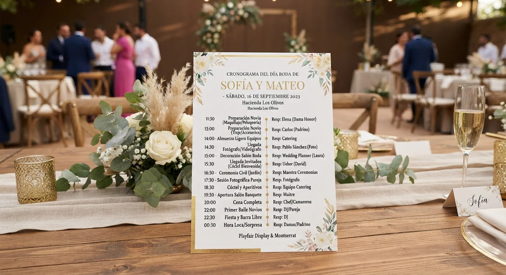

# Cómo Hacer el Cronograma del Día de la Boda

El cronograma del día de la boda se arma por bloques: **preparación, ceremonia, cóctel, banquete y fiesta**, cada uno con horarios exactos y responsables asignados, sin dejar nada a interpretación libre.

Sin este documento, hasta el evento mejor planeado se desordena en cuestión de minutos, sin importar cuánto se haya invertido en el resto de la planeación. Te explico cómo armarlo bien, bloque por bloque.

## Por qué el cronograma es el documento más importante del día

Un moodboard define cómo se ve la boda. Un presupuesto define cuánto cuesta. Pero el cronograma es lo único que define cómo se ejecuta todo, minuto a minuto, con varios proveedores trabajando al mismo tiempo y sin margen para malentendidos.

Sin un cronograma detallado, cada proveedor asume sus propios tiempos, y esas suposiciones casi nunca coinciden entre sí el día del evento, generando fricciones que se pudieron evitar con una hoja de cálculo bien compartida.

## Qué debe incluir un cronograma completo

Un cronograma bien hecho no es solo una lista de horas. Incluye:

- **Hora exacta de cada actividad**, no rangos aproximados como "por la tarde" que dejan margen a interpretaciones distintas entre proveedores.
- **Responsable de cada bloque**, para que quede claro quién ejecuta y quién supervisa, sin que dos personas asuman que la otra se está encargando.
- **Tiempos de traslado**, si hay más de una locación entre ceremonia y recepción, incluyendo margen para imprevistos de tráfico.
- **Margen de contingencia**, especialmente en los primeros bloques del día, donde un retraso se arrastra a todo lo demás sin posibilidad de recuperarlo después.

## Cómo calcular los tiempos de cada bloque

**Preparación de novios**

Calcula más tiempo del que crees necesario, sobre todo si hay maquillaje, peinado y fotos de preparación incluidas. Es habitual que esta etapa se atrase, y ese atraso es el que más se arrastra al resto del día, porque todo lo demás depende de que la pareja esté lista a tiempo.

**Ceremonia**

El tiempo varía según el tipo de ceremonia (civil, religiosa, simbólica), pero siempre conviene dejar un margen de 10 a 15 minutos antes del horario oficial para que los invitados terminen de ubicarse, sobre todo en locaciones grandes o con estacionamiento alejado del salón.

**Cóctel**

Este bloque suele durar entre 60 y 90 minutos, y sirve como colchón natural si algo se atrasó antes. Es también el momento ideal para tomar las fotos formales de la pareja, sin la presión del resto del cronograma pendiente.

**Banquete**

Calcula el tiempo según el número de invitados y el tipo de servicio (plato servido, buffet, estaciones). Un banquete de plato servido para muchos invitados necesita más tiempo del que la mayoría de las parejas estima al planear, sobre todo si hay varios tiempos de comida.

**Fiesta**

El bloque más flexible del día, pero conviene definir momentos clave dentro de él (primer baile, brindis, torta) para que no se pierdan entre el resto de la celebración y el ambiente informal de la fiesta.

<a href="/masters/wedding-planner" class="articulo-recomendado">
  Siguiente paso
  Máster Profesional en Wedding Planning & Organización de Eventos →
</a>

## Cómo compartirlo con proveedores

Un cronograma que solo tú tienes no sirve de mucho. Compártelo con cada proveedor con al menos una semana de anticipación, y confirma que cada uno entendió su parte específica, no solo el horario general del evento, para evitar sorpresas de última hora.

Si ya viste [nuestro checklist completo para organizar una boda](/blog/wedding-planner/checklist-organizar-boda), sabes que coordinar horarios entre proveedores es justamente una de las tareas clave del último mes antes del evento, no algo que se resuelve improvisando la semana anterior.

## Errores comunes al armar el cronograma

Estos son los errores que más se repiten, incluso entre quienes ya tienen experiencia organizando eventos.

- **Calcular tiempos optimistas.** Cada bloque suele tomar más tiempo del estimado, así que siempre conviene dejar margen extra, sobre todo en las primeras horas del día que condicionan todo lo que sigue.
- **No asignar un responsable por bloque.** Sin esto, nadie sabe con certeza quién debe avisar si algo se está atrasando, y el problema se detecta demasiado tarde para corregirlo.
- **No compartir el cronograma completo con todos los proveedores.** Cada uno necesita ver el panorama general, no solo su parte, para poder ajustarse si algo cambia en un bloque anterior al suyo.
- **Ignorar los tiempos de traslado.** Si hay cambio de locación, el tiempo entre un bloque y otro necesita calcularse con margen real, no con el tiempo ideal sin tráfico ni imprevistos de última hora.

## Preguntas frecuentes

**¿Cuánto tiempo antes debo tener listo el cronograma final?**

Idealmente, dos semanas antes del evento, con margen para hacer ajustes finales después de confirmar detalles con cada proveedor uno por uno.

**¿Quién debe tener el cronograma el día del evento?**

Todos los proveedores clave, la pareja (aunque sea una versión simplificada), y quien esté coordinando la logística general del día, con copia impresa además de digital por si falla la conexión.

**¿Qué hago si el cronograma se atrasa durante el evento?**

Prioriza los bloques que menos se pueden mover (ceremonia, momentos protocolarios) y ajusta el resto del cronograma. Un buen cronograma siempre tiene margen para absorber pequeños atrasos sin que se note, sobre todo en el bloque de cóctel.

<a href="/masters/wedding-planner" class="articulo-recomendado">
  Si quieres aprender a coordinar el día completo con criterio profesional, conoce nuestro
  Máster Profesional en Wedding Planning & Organización de Eventos →
</a>
