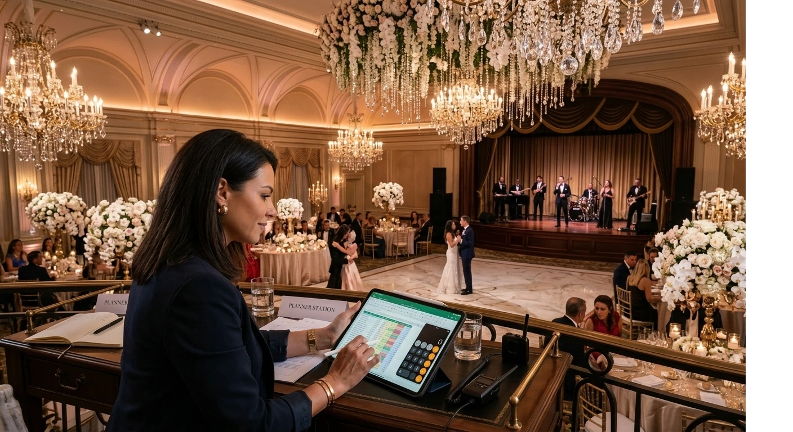
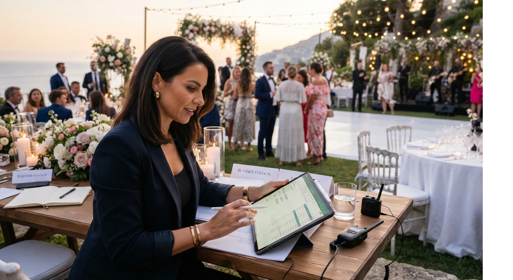

# Cuánto Cobrar por Organizar un Evento: Guía Paso a Paso (Tarifas 2026)

Para tu primer evento, cobra entre **10% y 15% del presupuesto total**, o una tarifa fija de **$300 a $1,500 dólares**, según el tamaño.

No hay una fórmula única. Pero sí hay un método claro para llegar a tu número.

Te lo explico paso a paso, con los tres modelos que uso yo mismo con mis alumnos.

## Los 3 modelos para cobrar un evento

Antes del paso a paso, entiende esto: **no existe "la" tarifa correcta**. Existen tres formas distintas de cobrar, y cada una tiene su momento.

| Modelo | Cómo funciona | Cuándo usarlo |
|---|---|---|
| **Porcentaje del presupuesto** | 10% - 15% del total del evento | Eventos grandes, presupuesto ya definido |
| **Tarifa fija** | Monto cerrado, sin importar el presupuesto | Clientes que quieren certeza total |
| **Por hora** | Tarifa horaria, ideal para coordinación puntual | Solo el día del evento, sin planeación previa |

La mayoría de mis alumnos empiezan con **tarifa fija**. Es la más fácil de explicar y la que menos fricción genera con un cliente nuevo.

El porcentaje llega después, cuando ya tienes casos y confianza para manejar presupuestos grandes.

## Paso a paso: cómo calcular tu tarifa

Esto es lo que enseño en el máster, resumido en cinco pasos.

**Paso 1: Calcula tus horas reales**

No cuentes solo el día del evento. Cuenta reuniones, cotizaciones, visitas a proveedores, WhatsApp con el cliente.

Un evento mediano suele tomar entre **25 y 40 horas** de trabajo real, repartidas en semanas.

**Paso 2: Define tu tarifa por hora mínima**

Divide lo que necesitas ganar al mes entre las horas que puedes dedicar a clientes (no todas tus horas son facturables).

Esa cifra es tu piso. Nunca cobres por debajo de eso, aunque el cliente insista.

**Paso 3: Multiplica y ajusta por complejidad**

Horas estimadas × tu tarifa por hora = número base.

Ajusta hacia arriba si hay logística difícil: destino, muchos proveedores, fecha en temporada alta.

**Paso 4: Compara con el mercado de tu país**

Revisa qué cobran otras planners en tu ciudad. No para copiar, sino para no quedar muy por debajo ni muy por arriba sin explicación.

**Paso 5: Redondea a un número que suene profesional**

$847 suena a cálculo improvisado. $850 o $900 suena a que sabes lo que haces.

<a href="/masters/wedding-planner" class="articulo-recomendado">
  Siguiente paso
  Máster Profesional en Wedding Planning & Organización de Eventos →
</a>

## Qué incluir (y qué no) en tu tarifa

Aquí es donde más alumnos nuevos pierden dinero: cobran por "organizar el evento" sin desglosar qué entra en ese precio.

**Sí incluye en tu tarifa base:**

- Reuniones de planeación (define un número máximo)
- Búsqueda y cotización de proveedores
- Cronograma del día del evento
- Coordinación presencial el día del evento

**No incluyas sin cobrar aparte:**

- Viajes fuera de tu ciudad
- Reuniones extra fuera de lo pactado
- Cambios grandes de última hora (menos de 2 semanas antes)
- Horas extra el día del evento, más allá de lo acordado

Ponerlo por escrito en tu cotización te evita el problema más común del sector: el cliente que pide "una cosita más" gratis, cinco veces seguidas.

Si quieres ver cómo se ven estos números aplicados a una carrera completa, ya cubrimos [cuánto gana un wedding planner en cada país](/blog/wedding-planner/cuanto-gana-un-wedding-planner-2026) en detalle.

## Errores comunes al poner precio a tu primer evento

Llevo años viendo los mismos tres errores en alumnos que recién empiezan.

- **Cobrar poco "para ganar experiencia".** Un cliente que paga poco exige igual que uno que paga bien, y a veces exige más.
- **No cobrar anticipo.** Sin anticipo, cualquier cliente puede cancelar sin costo para él y con pérdida total para ti.
- **Cotizar de memoria.** Sin plantilla ni desglose, es fácil olvidar costos y terminar trabajando gratis las últimas semanas.

Una alumna nuestra en México perdió casi 15 horas de trabajo en su segundo evento por no cobrar anticipo. El cliente pospuso la boda dos veces y ella nunca vio ese dinero.

Desde entonces, en el instituto insistimos: **el anticipo no es opcional, es lo que protege tu tiempo.**

## Cómo comunicar tu tarifa sin sonar insegura

El precio correcto, mal comunicado, también espanta clientes.

- **No te disculpes por el precio.** Decir "sé que es un poco caro, pero..." le mete duda al cliente antes de que la tenga.
- **Preséntalo por escrito, no por WhatsApp de corrido.** Una cotización formal, aunque sea simple, se ve más profesional que un mensaje de texto.
- **Da opciones, no un solo número.** Un paquete básico y uno completo hacen que el cliente compare entre tus servicios, no con la competencia.

La seguridad con la que presentas tu tarifa comunica tanto como la tarifa misma.

## Preguntas frecuentes

**¿Debo cobrar lo mismo por todos mis eventos?**

No. Ajusta según tamaño, logística y temporada. Ten un piso mínimo, pero deja margen para eventos más complejos o de temporada alta.

**¿Cuándo debo pedir el anticipo?**

Antes de empezar cualquier trabajo, entre el 30% y 50% del total. Sin anticipo firmado, no reserves fecha ni empieces a cotizar proveedores.

**¿Qué hago si el cliente dice que es muy caro?**

Explica qué incluye tu tarifa, paso por paso. Si aun así no encaja, ofrece un paquete más básico antes de bajar tu precio base.

<a href="/masters/wedding-planner" class="articulo-recomendado">
  Si quieres aprender a calcular y defender tus tarifas con un método completo, mira nuestro
  Máster Profesional en Wedding Planning & Organización de Eventos →
</a>
