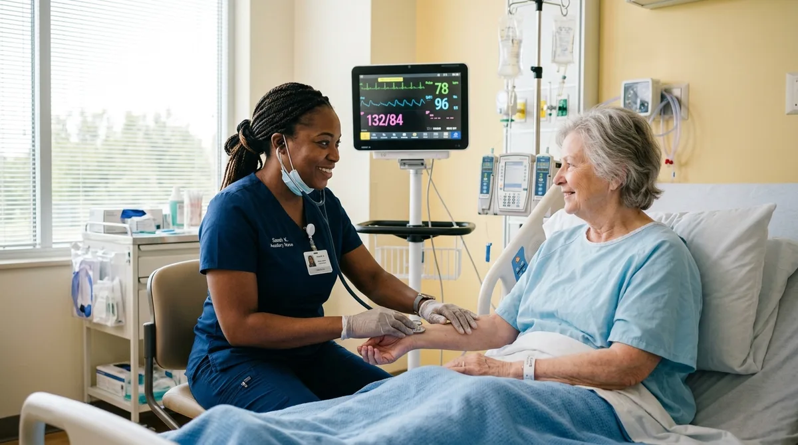

# Cuánto Gana un Auxiliar de Enfermería (Guía por País)

El sueldo de un auxiliar de enfermería oscila entre **1.100€ y 1.900€ brutos al mes en España** (entre 20.000€ y 25.000€ anuales según complementos), entre **$8,000 y $14,000 pesos mensuales en México**, y alrededor de **$1.400.000 a $1.900.000 COP en Colombia**. En Estados Unidos, donde la figura equivale al *Certified Nursing Assistant* (CNA), la remuneración mediana alcanza los **$39,530 USD al año**.

El sector sanitario es uno de los motores laborales más estables del mundo: el envejecimiento demográfico, la atención a pacientes crónicos y la expansión de centros geriátricos y clínicas especializadas sostienen una demanda constante de personal asistencial cualificado. Sin embargo, los ingresos varían de forma notable según el país, el tipo de institución (hospital público, mutua privada, residencia o centro de día) y los complementos por turnicidad, noches y festivos.

A continuación analizamos en detalle las cifras reales del mercado en los principales países hispanohablantes y en Estados Unidos.

---

## Tabla comparativa de ingresos por país

| País / Mercado | Rango mensual estimado (sanidad privada) | Rango mensual estimado (sanidad pública / institucional) | Salario anual de referencia |
|---|---|---|---|
| **España (TCAE)** | 1.150€ - 1.450€ / mes brutos | 1.350€ - 1.950€ / mes brutos | 18.000€ - 25.000€ brutos (14 pagas) |
| **México** | $8,000 - $14,000 MXN / mes | $9,000 - $13,500 MXN / mes (base + complementos) | $105,000 - $160,000 MXN brutos |
| **Colombia** | $1.300.000 - $1.800.000 COP / mes | $1.450.000 - $2.400.000 COP / mes (con recargos) | $17.000.000 - $28.000.000 COP |
| **Argentina** | $1.100.000 - $1.300.000 ARS / mes | $1.150.000 - $1.450.000 ARS / mes | Variable según paritarias sectoriales FATSA |
| **Estados Unidos (CNA)** | $18.00 - $22.50 USD / hora | $19.50 - $24.00 USD / hora | $39,530 USD / año (mediana BLS) |

---

## Cuánto gana un auxiliar de enfermería en España

En España, la profesión está tipificada como **Técnico en Cuidados Auxiliares de Enfermería (TCAE)**. La diferencia retributiva más marcada se da entre la sanidad pública (gestionada por los servicios de salud de cada comunidad autónoma) y el sector privado (hospitales concertados, clínicas privadas y residencias sociosanitarias).

*Las cifras reflejan estimaciones salariales del sector sanitario privado y tablas retributivas orientativas del sistema público de salud (grupo C2), sujetas a antigüedad, turnicidad y comunidad autónoma.*

### Sanidad pública
En los servicios públicos de salud (como SAS en Andalucía, SERMAS en Madrid, ICS en Cataluña o SACYL en Castilla y León), el auxiliar de enfermería pertenece al grupo C2 de la función pública. El salario base se complementa con el complemento de destino, el complemento específico y los trienios acumulados:

- **Sueldo inicial:** Ronda entre **1.350€ y 1.550€ brutos al mes** en jornada diurna ordinaria.
- **Con complementos de rotación:** Con turnos rotatorios, noches continuadas, festivos y festivos especiales (Navidad, Año Nuevo), la nómina habitual se sitúa entre **1.600€ y 1.950€ brutos mensuales**.
- **Cómputo anual:** Con las dos pagas extraordinarias completas, los ingresos brutos oscilan entre **21.000€ y 26.000€ al año**.

### Sanidad privada y sector sociosanitario
En la sanidad privada, las retribuciones se regulan mediante convenios colectivos provinciales de sanidad privada o residencias de la tercera edad:

- **Clínicas y hospitales privados:** El salario medio se mueve entre **1.150€ y 1.450€ brutos al mes**.
- **Residencias geriátricas y centros de día:** Suele ser el sector con retribuciones más ajustadas, situándose generalmente entre **1.100€ y 1.280€ brutos mensuales** para jornadas completas según convenio marco.

---

## Cuánto gana un auxiliar de enfermería en México

En el sistema de salud mexicano conviven las grandes instituciones públicas de seguridad social (IMSS, ISSSTE, IMSS-Bienestar) y una extensa red de sanidad privada que abarca desde consultorios y clínicas locales hasta grandes grupos hospitalarios privados en Ciudad de México, Guadalajara y Monterrey.

*Las cifras de plantilla son estimaciones de portales de empleo (Computrabajo México, Indeed, Talent.com) y referencias tabulares de instituciones de salud pública. Las remuneraciones finales varían según turnos, zona económica y nivel de atención.*

- **Promedio en portales laborales:** De acuerdo con los registros agregados de portales como **Computrabajo México**, la media salarial reportada se ubica en **$8,373 MXN al mes**, mientras que **Indeed México** registra un promedio de **$10,547 MXN mensuales** con base en sueldos declarados por usuarios (con un rango habitual entre $7,268 y $15,306 MXN).
- **Sector privado:** En clínicas privadas y hospitales de segundo y tercer nivel, los sueldos para auxiliares y técnicos de enfermería se sitúan comúnmente entre **$8,000 y $14,000 MXN mensuales**, a lo que suelen sumarse prestaciones superiores a las de ley en cadenas hospitalarias consolidadas (vales de despensa, fondo de ahorro y seguro de gastos médicos).
- **Sector público institucional (IMSS / ISSSTE):** El sueldo base tabular inicial parte de unos **$5,925 MXN mensuales**, pero la percepción neta final aumenta con conceptos como riesgo laboral, puntualidad, asistencia, turnos nocturnos y compensaciones de zona, alcanzando habitualmente entre **$9,000 y $13,500 MXN mensuales**.
- **Atención domiciliaria particular:** El cuidado privado de adultos mayores o pacientes en convalecencia postquirúrgica por turnos de 12 o 24 horas representa una vía habitual de ingresos independientes, donde las tarifas por turno oscilan entre **$500 y $1,200 MXN**, dependiendo de la complejidad clínica requerida.

La capacitación continuada y el dominio de procedimientos clínicos actualizados son determinantes para acceder a vacantes de mayor responsabilidad y remuneración en cualquier entorno sanitario. Si estás evaluando esta profesión, revisa nuestra guía sobre [cómo ser auxiliar de enfermería sin ir a la universidad](/blog/enfermeria/como-ser-auxiliar-enfermeria-sin-titulo), donde detallamos los requisitos formativos y las particularidades del marco regulatorio de cada país.

---

## El mercado en Colombia y Argentina: fuentes y rangos de referencia

*Las cifras de Colombia son estimaciones de portales de empleo (Computrabajo Colombia, Indeed, Magneto365). En Argentina, los valores corresponden a estimaciones salariales del sector salud con base en escalas del convenio CCT 122/75 de FATSA sujetas a acuerdos paritarios periódicos.*

En **Colombia**, la posición de Auxiliar en Enfermería es uno de los perfiles de formación técnica con mayor volumen de contratación en Instituciones Prestadoras de Salud (IPS), EPS, laboratorios y cajas de compensación familiar:

- Según datos recopilados por **Computrabajo Colombia**, el sueldo mensual promedio para auxiliares de enfermería se sitúa en **$1.417.029 COP**.
- En **Indeed Colombia**, el promedio registrado asciende a **$1.654.515 COP mensuales**, con bandas salariales que parten del salario mínimo legal y alcanzan los **$2.000.000 COP** en puestos intermedios.
- En hospitales universitarios, unidades de cuidados intensivos (UCI) y clínicas de alta complejidad, la remuneración con recargos de nocturnidad, dominicales y festivos supera frecuentemente los **$2.000.000 COP a $2.400.000 COP mensuales**.
- Para servicios domiciliarios privados de enfermería, el turno diurno de 8 horas se cobra entre **$60.000 y $110.000 COP**, mientras que las guardias de 12 horas nocturnas o de fin de semana rondan entre **$90.000 y $150.000 COP**.

En **Argentina**, la escala remunerativa está vinculada a los convenios colectivos de trabajo de la **Federación de Asociaciones de Trabajadores de la Sanidad Argentina (FATSA)** para clínicas, sanatorios y geriátricos privados (CCT 122/75):

- De acuerdo con las escalas de referencia de FATSA, los sueldos básicos de convenio para el personal asistencial y enfermeros de piso se sitúan entre **$1.100.000 y $1.300.000 ARS mensuales**, actualizados regularmente mediante paritarias frente al contexto inflacionario.
- Con adicionales de convenio por área crítica (terapia intensiva, quirófano, neonatología), presentismo y horas extraordinarias, las remuneraciones brutas se ubican entre **$1.200.000 y $1.450.000 ARS mensuales**.
- Al tipo de cambio financiero de referencia, esta franja representa una horquilla orientativa de **$800 a $1.150 USD mensuales**.

<a href="/masters/enfermeria" class="articulo-recomendado">
  Siguiente paso
  Curso Profesional Superior: Auxiliar de Enfermería Clínica →
</a>

---

## El mercado de Estados Unidos: datos de la BLS para CNA

En Estados Unidos, la figura homóloga a la del auxiliar de enfermería es la del **Certified Nursing Assistant (CNA)** o *Nursing Assistant*. Es un rol regulado que requiere completar un programa formativo aprobado por el estado y aprobar el examen de certificación estatal.

*Los datos para Estados Unidos provienen de la U.S. Bureau of Labor Statistics (BLS, Occupational Employment and Wage Statistics, SOC 31-1131, mayo 2024), complementados con estimaciones de Indeed y ZipRecruiter.*

- De acuerdo con el informe de mayo de 2024 de la **U.S. Bureau of Labor Statistics (BLS)**, el salario mediano anual de los auxiliares de enfermería (*Nursing Assistants*) en Estados Unidos es de **$39,530 USD al año**, lo que equivale a una tarifa horaria mediana de aproximadamente **$19.00 USD por hora**.
- La distribución salarial nacional muestra que el **percentil 25 gana $36,260 USD anuales**, mientras que los profesionales en el **percentil 75 alcanzan los $46,070 USD al año** (superando los $22.15 USD por hora).
- El 10% superior de los CNA, con experiencia en hospitales de agudos o en estados con mayor coste de vida (como California, Nueva York, Massachusetts o Alaska), supera los **$52,000 USD anuales**.
- Plataformas de empleo como **Indeed EE.UU.** y **ZipRecruiter** reportan salarios promedio para agencias de enfermería itinerante (*Travel CNA*) de entre **$22 y $30 USD por hora**, gracias a pluses de movilidad y disponibilidad inmediata para cubrir contingencias hospitalarias.

Para los profesionales formados en países de habla hispana, el dominio del inglés técnico sanitario y la preparación para los exámenes de certificación estatal representan el puente directo para acceder a este mercado.

---

## Los 5 factores que aumentan el salario de un auxiliar de enfermería

No todos los puestos de auxiliar perciben la misma remuneración. Existen variables objetivas que marcan diferencias sustanciales en la nómina:

### 1. El área clínica de asignación
El trabajo en planta de hospitalización ordinaria o en residencias tiene una retribución base. Sin embargo, áreas especializadas como **Unidades de Cuidados Intensivos (UCI), quirófano, urgencias o unidades de diálisis** suelen incluir pluses por complejidad asistencial, manejo de instrumental específico y mayor exigencia protocolaria.

### 2. Turnicidad, noches y festivos
En la sanidad hospitalaria, la cobertura es ininterrumpida (24/7/365). Trabajar en turnos rotatorios (mañana/tarde/noche), asumir noches completas y cubrir festivos señalados puede incrementar el sueldo mensual entre un **20% y un 40% adicional** respecto a un horario fijo diurno de lunes a viernes.

### 3. Sector público vs. sanidad privada
En España y varios países de la región, los salarios del sistema público superan en promedio a los del sector privado entre un **15% y un 30%**. El acceso se realiza habitualmente mediante bolsas de trabajo temporales, oposiciones o concursos de méritos, donde contar con formación acreditada y certificaciones continuadas otorga puntos clave en el baremo.

### 4. Atención domiciliaria especializada
El cuidado de pacientes dependientes con patologías complejas a domicilio (administración de nutrición enteral supervisada, movilización técnica de encamados, higiene protocolizada) suele retribuirse a tarifas por hora sensiblemente mayores que las de centros asistenciales convencionales.

### 5. Formación y actualización continua
Los centros sanitarios de primer nivel valoran al personal que domina técnicas actualizadas de control de infecciones hospitalarias, primeros auxilios avanzados, soporte vital básico (SVB) y registro clínico digital. Una sólida base teórica y procedimental agiliza la integración en equipos multidisciplinares y abre puertas a puestos de coordinación técnica.

---

## Dónde hay más demanda de auxiliares de enfermería

La inserción laboral para auxiliares de enfermería es amplia y abarca múltiples entornos asistenciales:

1. **Hospitales y clínicas de agudos:** Tanto públicos como privados, en servicios de urgencias, hospitalización médica y quirúrgica, maternidad y pediatría.
2. **Residencias sociosanitarias y centros de día:** Sector con crecimiento ininterrumpido por la longevidad poblacional, donde el auxiliar es el pilar diario del cuidado, higiene y acompañamiento.
3. **Centros de atención primaria y consultas externas:** Apoyo a médicos y enfermeros en toma de constantes, preparación de consultas, curas menores y vacunación.
4. **Servicios de ayuda a domicilio (SAD):** Atención directa a personas en situación de dependencia dentro de sus hogares, coordinada con los servicios sociales municipales.
5. **Clínicas dentales, estéticas y centros de rehabilitación:** Asistencia en gabinete, esterilización de instrumental y atención al paciente en procedimientos ambulatorios.

---

## Preguntas frecuentes

**¿Cuál es la diferencia salarial entre trabajar en sanidad pública y en clínica privada?**

En países como España, la sanidad pública ofrece en promedio retribuciones entre un 15% y un 25% más altas que el sector privado para puestos de entrada, además de mayor estabilidad laboral mediante plazas fijas u oposiciones. Sin embargo, las clínicas privadas y hospitales concertados ofrecen mayor rapidez de inserción laboral sin necesidad de esperar baremaciones de bolsas públicas, y permiten negociar incentivos por especialización en quirófano o unidades de diagnóstico.

**¿Qué complementos o turnos incrementan el salario de un auxiliar de enfermería?**

Los complementos que más elevan la nómina son el plus de nocturnidad (habitualmente entre 25€ y 45€ adicionales por noche trabajada según convenio), los pluses por domingo o festivo, el complemento por turnicidad rotatoria y los incentivos por guardias localizadas o doblaje de turno en picos de demanda asistencial.

**¿Se puede ejercer como auxiliar de enfermería en el extranjero con formación previa?**

Cada país exige cumplir rigurosamente con su propio proceso de homologación, convalidación o certificación ante las autoridades sanitarias locales (por ejemplo, en Estados Unidos es indispensable cumplir con los requisitos del estado correspondiente y aprobar el examen estatal de CNA). Es importante tener claro que una certificación o curso privado de formación no equivale automáticamente a un título oficial reconocido por el sistema nacional de salud de ningún país; su valor radica en aportar competencias prácticas, conocimientos clínicos actualizados y un perfil asistencial competitivo, pero el ejercicio profesional formal en instituciones públicas o concertadas depende siempre de la normativa regulatoria de cada territorio.

<a href="/masters/enfermeria" class="articulo-recomendado">
  Si quieres dar el salto profesional en el sector sanitario con formación clínica actualizada, conoce nuestro
  Curso Profesional Superior: Auxiliar de Enfermería Clínica →
</a>
