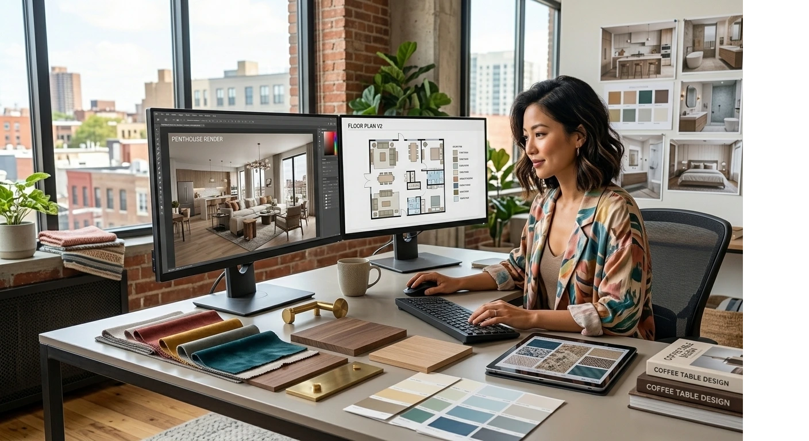
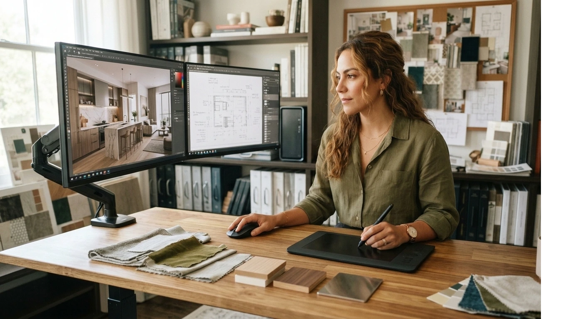

# Cuánto Gana un Diseñador de Interiores Freelance en 2026 (Guía por País)

Un diseñador de interiores freelance gana entre **$300 y $4,000 dólares por proyecto**, dependiendo del país y del tamaño del espacio.

En estudio o firma de arquitectura, el sueldo fijo es más bajo. Freelance, el techo lo pones tú.

Abajo te desgloso las cifras reales por país: Colombia, Venezuela, México, España y Argentina.

Antes de entrar en las cifras, una aclaración de mi parte.

Llevo años formando diseñadores de interiores en Latinoamérica y España. Y hay algo que veo repetirse mucho: la gente busca "el sueldo promedio" como si existiera un número mágico.

No existe.

Lo que sí existe son **rangos reales** según el país, el tipo de proyecto y cómo cobras. Vamos con eso.

| País | Asesoría puntual (1 ambiente) | Proyecto integral (casa completa) | Moneda |
|---|---|---|---|
| Colombia | $600.000 - $1'800.000 | $3'000.000 - $12'000.000 | COP |
| Venezuela | $150 - $400 | $600 - $2,500 | USD |
| México | $6.000 - $18.000 | $25.000 - $120.000 | MXN |
| España | €400 - €1.200 | €2.000 - €9.000 | EUR |
| Argentina | $150 - $500 | $700 - $3.000 | USD |

## Cuánto gana un diseñador de interiores en Colombia

En Colombia, un diseñador de interiores freelance en Bogotá o Medellín cobra normalmente entre **$3'000.000 y $12'000.000 COP por proyecto integral**.

Eso equivale, hoy, a algo entre 700 y 2,800 dólares aproximadamente.

**El rango depende de tres cosas:**

- Si es proyecto integral o solo asesoría de un ambiente
- Los metros cuadrados a intervenir
- Si trabajas en ciudad principal o municipio

Una asesoría puntual (una sola sala, un dormitorio) cobra menos: entre $600.000 y $1'800.000 COP.

Un proyecto integral, de plano a instalación final, es lo que mueve los números hacia arriba.

## Cuánto gana un diseñador de interiores en Venezuela

Venezuela funciona distinto. Aquí casi todo se cotiza en dólares, no en bolívares, por la inflación.

Un diseñador de interiores en Caracas o Valencia cobra entre **$600 y $2,500 dólares por proyecto integral**, dependiendo del presupuesto total de la remodelación.

Proyectos de presupuesto alto (más de $20,000 dólares en total) pueden dejarle al diseñador entre el **10% y el 15% del presupuesto**, que es el estándar que enseño en el máster.

Lo que cambia en Venezuela no es la habilidad del diseñador. Es el tamaño del mercado de remodelaciones de alto presupuesto, que es más chico que en Colombia o México.

Por eso en el instituto insistimos tanto en aprender a atender también clientes internacionales por videollamada, algo que ya hacen varios de nuestros egresados venezolanos con proyectos de compatriotas en Miami o Madrid.

## Cuánto gana un diseñador de interiores en México

México es uno de los mercados más fuertes de la región para interiorismo.

Un diseñador de interiores en Ciudad de México, Guadalajara o Querétaro cobra entre **$25,000 y $120,000 pesos mexicanos por proyecto integral**.

En zonas de vivienda de alto nivel, como Polanco o San Pedro Garza García, las cifras suben mucho más. Ahí es común ver proyectos de **$5,000 a $15,000 dólares**, porque el presupuesto de construcción y acabados también es más alto.

Ese nicho de vivienda premium es, para mí, el más rentable de todo el mercado hispano. Y es el que menos diseñadores saben atender bien, porque exige manejo de proveedores de acabados de lujo.

<a href="/masters/interiorismo" class="articulo-recomendado">
  Siguiente paso
  Máster Profesional en Interiorismo, Decoración y Diseño 3D →
</a>

## Cuánto gana un diseñador de interiores en España

En España, el negocio ya está más maduro y profesionalizado que en Latinoamérica.

Un diseñador de interiores en Madrid o Barcelona cobra entre **2,000 y 9,000 euros por proyecto integral**, según metros cuadrados y nivel de acabados.

En zonas como Marbella o Ibiza, donde hay muchas segundas viviendas de extranjeros (ingleses, alemanes, escandinavos), los honorarios suben hasta **12,000 o 20,000 euros**.

España tiene algo que no siempre existe en Latinoamérica: contratos formales y facturación clara. Eso también sube la percepción de valor del servicio, y con ella, la tarifa.

## Cuánto gana un diseñador de interiores en Argentina

Argentina tiene su propia lógica, marcada por la inflación local.

La mayoría de diseñadores de interiores en Buenos Aires cotizan directamente en **dólares**, aunque cobren en pesos al tipo de cambio del día.

El rango típico es de **$700 a $3,000 dólares por proyecto integral**, con Buenos Aires y zona norte del Gran Buenos Aires concentrando los presupuestos más altos.

Fuera de la capital, en ciudades como Córdoba o Rosario, los honorarios bajan, pero también baja la competencia.

## Qué mueve realmente tus tarifas (más allá del país)

El país da el punto de partida. Pero lo que realmente sube tu tarifa son estas cinco cosas:

- **Portafolio visible.** Proyectos reales, fotografiados en 3D o terminados, valen más que cualquier diploma.
- **Especialización.** "Hago de todo" cobra menos que "soy experto en minimalismo" o "en vivienda de lujo".
- **Red de proveedores.** Tener contactos de confianza en carpintería, iluminación y acabados acelera cotizaciones, y eso se paga.
- **Presencia en redes.** Instagram y Pinterest siguen siendo el escaparate número uno del sector.
- **Casos de éxito documentados.** Antes y después reales, no renders genéricos bajados de internet.

Un alumno nuestro, diseñador en Barranquilla, subió su tarifa un 35% en seis meses solo por documentar tres proyectos reales con fotos profesionales y un video de antes y después.

No cambió su método de trabajo. Cambió cómo lo mostraba.

## Freelance vs. estudio: dos formas distintas de ganar dinero

Aquí hay una decisión que casi nadie te explica bien: ¿trabajar para un estudio de arquitectura o interiorismo, o ser independiente?

**Trabajar para un estudio:**

- Sueldo fijo mensual, más bajo, pero estable
- Aprendes procesos ya probados y software a nivel profesional
- No cargas con el riesgo comercial de conseguir clientes

**Trabajar como freelance:**

- Tú pones el precio
- Tú cargas con la parte de ventas y marketing
- El ingreso es variable, pero sin techo

Después de uno o dos años, ya con casos propios, el salto a freelance rinde mucho más.

## Cómo subir tus tarifas sin espantar clientes

Subir precios da miedo. Lo entiendo, lo he visto en cientos de alumnos.

Pero hay una forma de hacerlo sin perder clientes en el camino:

1. **Sube gradualmente**, no de golpe. Un 15-20% cada 6 meses es razonable.
2. **Justifica con resultados**, no con antigüedad. "Llevo 5 proyectos entregados" convence más que "llevo 5 años".
3. **Segmenta tu oferta.** Ten un paquete de asesoría básica y uno de diseño integral, así el cliente elige, no compara tu precio con el de otro diseñador.
4. **No compitas por precio.** Si tu única ventaja es ser el más barato, siempre habrá alguien más barato que tú.

La tarifa no sube sola. Sube cuando tu propuesta de valor es más clara que la de tu competencia.

## Preguntas frecuentes

**¿Se puede vivir solo de ser diseñador de interiores?**

Sí, con cartera de clientes constante. La mayoría empieza combinándolo con otro trabajo los primeros 1-2 años, mientras construye referencias y portafolio.

**¿Necesito título universitario para cobrar bien?**

No. Lo que sube tu tarifa es tu portafolio y casos reales, no un diploma. Una certificación seria ayuda a generar confianza inicial con el cliente.

**¿Cuántos proyectos hay que hacer al año para vivir de esto?**

Depende del ticket promedio. Con tarifas de gama media, entre 8 y 15 proyectos al año suelen sostener un ingreso estable en la mayoría de países de la región.

<a href="/masters/interiorismo" class="articulo-recomendado">
  Si quieres convertirte en diseñador de interiores y aprender a cobrar lo que vale tu trabajo, mira nuestro
  Máster Profesional en Interiorismo, Decoración y Diseño 3D →
</a>
