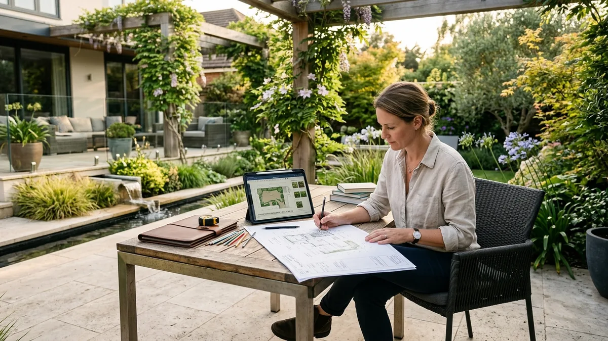
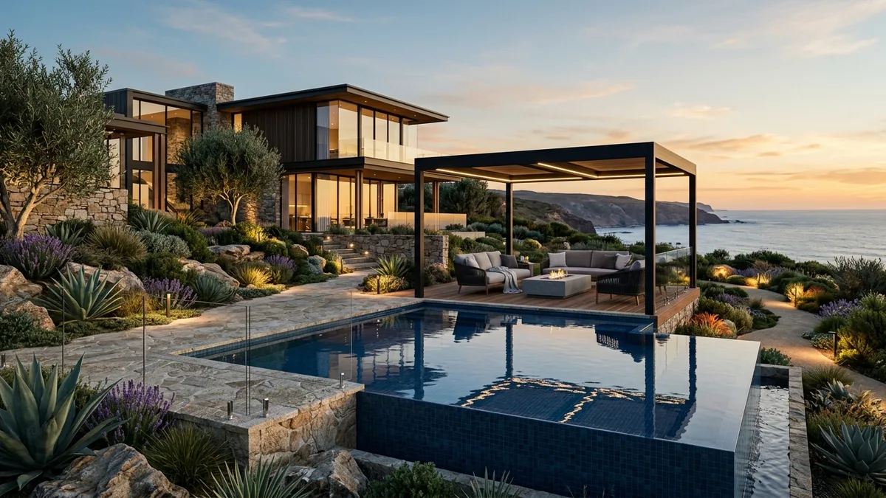

# Cuánto Gana un Paisajista (Guía por País)

Un diseñador de exteriores o paisajista independiente gana entre **$800 y más de $4,500 dólares por proyecto residencial**, dependiendo de la escala del terreno y de si incluye planimetría técnica y render 3D. En plantilla de estudio o constructora, el sueldo oscila entre **21.000€ y 30.500€ brutos anuales en España**, o entre **12.000 y 20.000 pesos mensuales en México**.

Como ocurre en la mayoría de las disciplinas creativas aplicadas al hábitat, no existe un salario único ni una cifra mágica. Lo que define tus ingresos no es el título en una pared, sino tu capacidad de entregar un proyecto ejecutable: distribución funcional del espacio exterior, selección vegetal adecuada al clima, iluminación técnica y visualización fotorrealista.

Abajo tienes el desglose con números de mercado en España, México, Colombia, Argentina y el mercado internacional remoto hacia Estados Unidos.

---

## Tabla comparativa de ingresos por país

| País | Sueldo mensual en estudio / empresa | Rango freelance por proyecto integral | Modelo de cobro predominante |
|---|---|---|---|
| **España** | 1.750€ - 2.650€ / mes (21k€–30.5k€ anuales) | 1.500€ - 6.000€ por diseño | Tarifa fija de proyecto o 3%–8% de la obra |
| **México** | $12,000 - $20,000 MXN / mes | $22,000 - $90,000 MXN por jardín | Por m² o paquete de anteproyecto con render |
| **Colombia** | $2.000.000 - $6.000.000 COP / mes | $1.800.000 - $7.500.000 COP | Tarifa por fases (anteproyecto + planimetría) |
| **Argentina** | $300 - $750 USD / mes (en pesos al cambio) | $450 - $2.200 USD por proyecto | Cotización en dólares por proyecto |
| **Clientes EE.UU. (Remoto)** | $2.200 - $4.000 USD / mes (asistente técnico) | $2.500 - $8.500 USD por diseño residencial | Paquete integral en dólares con visualización 3D |

---

## Cuánto gana un paisajista en España

En el mercado español, el paisajismo vive una transformación clara. Durante años se confundió el rol del paisajista con el del jardinero de mantenimiento. Hoy, la demanda de terrazas urbanas, jardines sostenibles de bajo consumo hídrico (xerojardinería) y piscinas integradas ha creado un perfil técnico muy valorado.

*Las cifras de plantilla son estimaciones agregadas de portales de empleo (Talent.com, Indeed, Glassdoor), no tablas salariales de convenio colectivo regulado.*

En plantilla para un estudio de arquitectura, ingeniería ambiental o empresa constructora, un diseñador de exteriores júnior parte de unos **21.000€ brutos anuales** (según datos de Talent.com, Indeed y Glassdoor). Con tres a cinco años de experiencia y dominio de software de visualización tridimensional, la retribución se sitúa entre los **26.000€ y los 30.500€ brutos al año**.

Como profesional independiente, los siguientes son rangos orientativos de mercado:

- **Terrazas y áticos urbanos (Madrid, Barcelona, Valencia):** El proyecto de diseño (sin incluir ejecución de obra ni plantas) se cotiza entre **1.200€ y 2.800€**.
- **Jardines unifamiliares medianos (200 m² a 600 m²):** Honorarios de diseño técnico completo entre **2.500€ y 5.500€**.
- **Fincas rústicas o parcelas residenciales amplias:** Suelen presupuestarse calculando entre un **5% y un 8% del presupuesto total de ejecución material del jardín**. Si la obra exterior cuesta 60.000€, los honorarios profesionales rondan entre 3.000€ y 4.800€.

---

## Cuánto gana un diseñador de exteriores en México

México representa uno de los mercados de mayor volumen de construcción residencial de toda América Latina. Ciudades como Guadalajara, Querétaro, Monterrey, Puebla y la zona metropolitana de Ciudad de México concentran una demanda permanente de interiorismo y paisajismo en fraccionamientos privados y desarrollos verticales.

*Las cifras de plantilla son estimaciones de portales de empleo (Computrabajo México e Indeed), no salarios mínimos regulados por decreto. Las tarifas freelance son rangos orientativos de mercado.*

En un despacho de arquitectura o empresa de bienes raíces, el sueldo mensual oscila entre **$12,000 y $20,000 pesos mexicanos** según la antigüedad y la responsabilidad sobre obra (según registros de Computrabajo México e Indeed).

En la práctica freelance:

- Un anteproyecto de jardín residencial pequeño o patio posterior arranca en **$18,000 a $28,000 MXN**.
- Desarrollos residenciales completos en terrenos de 300 m² a 800 m², con diseño de alberca, pérgola, paleta vegetal adaptada y recorrido en render 3D, se cotizan entre **$45,000 y más de $95,000 MXN**.
- En destinos turísticos como Riviera Maya, Valle de Bravo o Los Cabos, donde conviven clientes internacionales y villas de alquiler vacacional, las tarifas se dolarizan con facilidad, cobrándose entre **$2,500 y $6,000 USD** por concepto de diseño integral de exteriores.

Al igual que vimos en nuestra [guía sobre cuánto gana un diseñador de interiores](/blog/interiorismo/cuanto-gana-un-disenador-de-interiores), el ingreso de quien diseña el hábitat se dispara en el momento en que deja de vender "horas de dibujo" y empieza a vender soluciones completas de proyecto que le ahorran dinero al cliente en la obra.

---

## El mercado en Colombia y Argentina: fuentes y rangos de referencia

*Las cifras de Colombia son estimaciones de portales de empleo (Computrabajo, Magneto365). Los honorarios freelance son rangos orientativos basados en los aranceles de referencia de la SCA. En Argentina no existe un salario regulado por decreto para paisajistas; los valores del CPAU y CAAP son tablas arancelarias de referencia, no de obligatorio cumplimiento.*

En **Colombia**, los portales de empleo de referencia como **Computrabajo Colombia** y **Magneto365** sitúan el sueldo promedio en plantilla para perfiles de arquitectura y diseño proyectual entre **$2.000.000 y $3.900.000 COP mensuales**. La dispersión va desde los **$1.400.000 COP** para cargos júnior de apoyo técnico hasta **$6.000.000 COP** en profesionales sénior con posgrado o dominio avanzado de software de render.

En el ejercicio independiente, tomando como referencia los aranceles orientativos de la **Sociedad Colombiana de Arquitectos (SCA)** y las prácticas de firmas en Bogotá, Medellín y el Eje Cafetero:
- Un proyecto conceptual de jardín residencial se cotiza entre **$1.800.000 y $7.000.000 COP** según la complejidad del terreno.
- Cuando el paisajista coordina además el suministro de material vegetal con viveros locales y supervisa la plantación, el margen suele incrementarse entre un 15% y un 25% adicional sobre el presupuesto de insumos.

En **Argentina**, los honorarios profesionales se encuentran formalmente desregulados, pero el **Consejo Profesional de Arquitectura y Urbanismo (CPAU)** y el **Centro Argentino de Arquitectos Paisajistas (CAAP)** publican cuadros arancelarios y calculadoras de referencia basados en el monto de obra y ajustados periódicamente frente a la inflación (mediante el Índice del Costo de la Construcción, ICC).

Debido a la volatilidad cambiaria, en el ámbito residencial privado (especialmente en countries y barrios cerrados de Nordelta, Pilar o Canning) la práctica habitual del sector es presupuestar en **dólares billete**:
- Un anteproyecto paisajístico para vivienda unifamiliar parte de **$450 a $800 USD**.
- Parques residenciales de mayor envergadura, con planimetría de riego, iluminación y cálculo botánico, se mueven en un rango de **$1.200 a $2.200 USD**.

<a href="/masters/paisajismo" class="articulo-recomendado">
  Siguiente paso
  Máster en Diseño de Exteriores, Paisajismo y Render 3D →
</a>

---

## El mercado de Estados Unidos: datos de la BLS y ASLA

Si te interesa brindar servicios de diseño de exteriores de forma remota hacia el mercado estadounidense, los datos disponibles explican por qué es una de las opciones mejor remuneradas del sector.

*El dato de la BLS es el más sólido de este artículo: publicado por la U.S. Bureau of Labor Statistics (SOC 17-1012, mayo 2025). Las demás cifras de EE.UU. son estimaciones de ZipRecruiter y rangos orientativos de la ASLA y Angi.*

- Según la **U.S. Bureau of Labor Statistics (BLS)**, el salario mediano anual de un *Landscape Architect* en Estados Unidos se ubica en **$79,870 USD al año**.
- Para la posición de *Landscape Designer* (enfocado en diseño residencial sin requerir colegiatura de obra civil pesada), la plataforma **ZipRecruiter** reporta un promedio nacional de **$65,400 USD anuales**, con rangos habituales entre $53,000 y $74,000 USD.
- En cuanto al costo por proyecto residencial, los informes de costes de la **American Society of Landscape Architects (ASLA)** y plataformas de reformas como **HomeAdvisor** y **Angi** indican que los propietarios pagan habitualmente entre **$2,200 y $6,180 USD** solo por el paquete de diseño y planos conceptuales (superando los **$10,000 USD** en fincas o parcelas de lujo), con honorarios profesionales de **$50 a $175 USD por hora**.

Muchos propietarios particulares y pequeños contratistas de jardinería en estados de alta demanda residencial como Florida, Texas, California o Arizona buscan diseñadores externos que elaboren el paquete conceptual: modelo 3D, selección de especies adaptadas a su zona climática (*USDA Plant Hardiness Zone*) y renders fotorrealistas.

Un profesional hispanohablante que trabaja desde su país puede cotizar este paquete digital completo entre **$1,500 y $4,000 USD**. Para el cliente estadounidense resulta una tarifa muy competitiva frente a sus precios locales, mientras que para el diseñador representa una facturación sustancialmente superior a la media de su mercado local.

---

## Los 4 factores que realmente determinan cuánto puedes cobrar

El país en el que vives marca el costo de vida base, pero dentro de una misma ciudad un paisajista puede cobrar 600 euros por un jardín mientras otro cobra 4.000 euros por exactamente el mismo espacio. ¿Por qué ocurre esto?

### 1. El dominio de la visualización y el Render 3D
Si entregas un plano en dos dimensiones con círculos verdes que representan árboles, el cliente medio no logra imaginar su jardín. Le cuesta ver el valor y regatea el precio. En cambio, cuando muestras un render fotorrealista donde se aprecia la madera de la pérgola, el agua de la piscina reflejando el atardecer y la iluminación cálida entre las plantas, el cliente se enamora del resultado. Como ocurre con el [software de diseño 3D para interiorismo](/blog/interiorismo/software-diseno-3d-interiores), dominar herramientas de modelado y motores de render eleva tu tarifa de inmediato.

### 2. Sostenibilidad y xerojardinería técnica
Con las restricciones de agua actuales y el encarecimiento del mantenimiento, los clientes ya no quieren céspedes británicos imposibles de regar. Piden jardines secos, especies autóctonas, sistemas de riego por goteo zonificados y pavimentos drenantes. Demostrar conocimiento técnico en sostenibilidad te posiciona como especialista, no como aficionado.

### 3. La claridad en la presentación de honorarios
Muchos principiantes cometen el error de dar un precio al voleo por mensaje sin desglosar el alcance. Aprender [cómo cobrar tus primeros proyectos de exteriores](/blog/paisajismo/cobrar-primeros-proyectos-paisajismo) con una propuesta profesional en tres fases (anteproyecto, proyecto ejecutivo y dirección estética de siembra) transmite seguridad y justifica tarifas altas.

### 4. Inteligencia Artificial para acelerar el anteproyecto
Los diseñadores que integran herramientas de IA en sus primeras sesiones de lluvia de ideas generan múltiples conceptos visuales en cuestión de minutos. Esto reduce significativamente el tiempo previo de bocetado, permitiendo asumir más proyectos por mes sin trabajar más horas.

---

## Modelos de cobro: ¿por metro cuadrado o por proyecto cerrado?

Para no perder dinero en tus primeros trabajos, debes elegir el modelo de cobro adecuado según el tipo de encargo:

1. **Precio fijo por proyecto (Recomendado para residencial):** Fijas una tarifa cerrada por entregables concretos (ejemplo: levantamiento, memoria de especies vegetales, plano de zonificación y 4 renders). Evita disputas y te premia si eres rápido trabajando.
2. **Por metro cuadrado ($/m² o €/m²):** Útil para terrenos muy grandes o áreas corporativas (habitualmente entre **4€ y 15€ por m²** en diseño conceptual). Cuidado con parcelas muy pequeñas: diseñar 50 m² exige casi el mismo esfuerzo intelectual que 250 m², por lo que siempre debes fijar una tarifa mínima de arranque.
3. **Porcentaje sobre presupuesto de obra:** Reservado para proyectos medianos a grandes donde además del diseño asumes la supervisión de contratas y viveros (habitualmente entre el **5% y el 10%** del costo de ejecución).

---

## Preguntas frecuentes

**¿Se necesita ser arquitecto para cobrar bien como paisajista?**

No. En el ámbito residencial privado, el cliente busca estética, funcionalidad exterior, conocimiento botánico y visualización en 3D. Salvo que el proyecto requiera demolición de muros de carga, excavaciones profundas que comprometan estructuras edilicias o permisos urbanísticos mayores de obra civil (que sí exigen firma colegiada), cualquier diseñador formado puede proyectar jardines, terrazas y fincas privadas con honorarios de primer nivel.

**¿Qué es más rentable: cobrar por metro cuadrado o por proyecto cerrado?**

El proyecto cerrado con entregables delimitados suele ser mucho más rentable para espacios residenciales estándar (hasta 500 m²). El cobro por metro cuadrado penaliza los patios pequeños, donde el nivel de detalle y diseño por metro es muy denso. Si usas tarifa por metro cuadrado, establece siempre un suelo mínimo de cobro (por ejemplo, ningún proyecto por debajo de 800€ o $15,000 MXN, sin importar cuántos metros tenga).

**¿Es posible trabajar como diseñador de exteriores freelance de forma remota?**

Sí, es una realidad consolidada. Con las herramientas actuales de cartografía digital, modelos topográficos y software 3D, puedes recibir las medidas del terreno y fotos del cliente por videollamada, modelar el espacio y entregar un proyecto técnico completo con renders de calidad cinematográfica a clientes en cualquier parte del mundo.

<a href="/masters/paisajismo" class="articulo-recomendado">
  Si quieres aprender a diseñar exteriores de alto nivel y cobrar lo que vale tu trabajo, conoce nuestro
  Máster en Diseño de Exteriores, Paisajismo y Render 3D →
</a>
