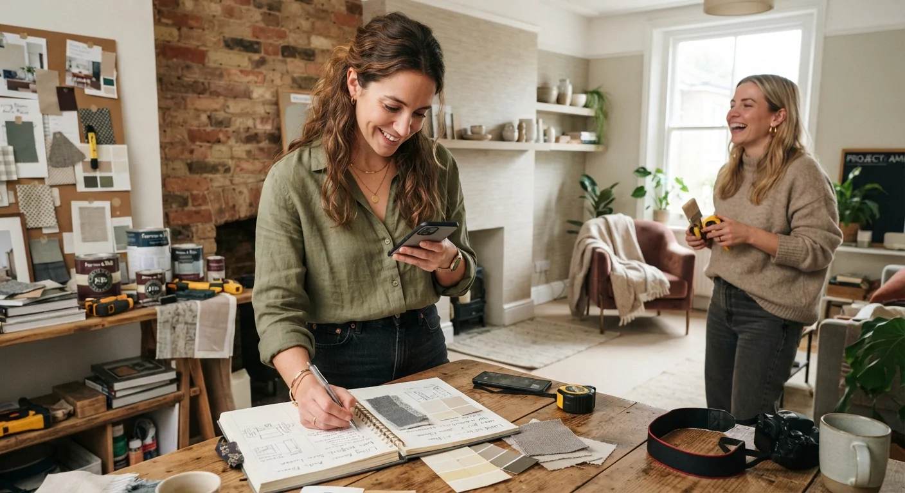

# De Aficionada a Profesional: Cómo Cobrar tus Primeros Proyectos

El salto de aficionada a profesional no se trata de aprender más técnica. Se trata de **cambiar cómo te ves a ti misma** frente a lo que ya sabes hacer, y de cómo comunicas ese cambio a las personas que te rodean.

Muchas personas con buen ojo para decorar se quedan años en "modo favor" antes de cobrar, no por falta de habilidad, sino por no saber cómo dar ese paso sin sentirse incómodas o culpables. Te explico cómo hacerlo con criterio, sin quemar las relaciones que te dieron tus primeras oportunidades.

## La señal de que ya estás lista para cobrar

No necesitas sentirte "completamente lista" para empezar a cobrar. Esa sensación casi nunca llega antes de tener experiencia real cobrando, así que esperar a sentirte lista suele significar posponer indefinidamente algo que ya podrías empezar hoy.

Las señales que sí importan son otras: te piden consejo de decoración con frecuencia, ya tienes dos o tres proyectos que puedes mostrar como referencia, y sientes que estás dando tu tiempo gratis a personas que podrían pagarte perfectamente por él sin que representara un problema para ellas.

Si esas tres cosas ya son ciertas, el problema no es tu nivel de habilidad. Es que todavía no has hecho el cambio de posicionarte como profesional frente a los demás, algo que depende más de tu comunicación que de tu técnica.

## Por qué cuesta tanto dar el salto

El obstáculo casi nunca es técnico. Es emocional, y tiene una lógica bastante predecible.

Cobrarle a un amigo o familiar por algo que antes hacías gratis genera culpa, aunque sea completamente razonable hacerlo desde cualquier punto de vista profesional. También existe el miedo a que digan que no, o a que la relación cambie una vez que el dinero entra en la conversación, incluso cuando esa relación no debería depender de que sigas trabajando gratis.

Ninguno de estos miedos desaparece solo, pero sí se manejan mejor cuando entiendes que seguir regalando tu trabajo no te acerca a la carrera que quieres construir. Al contrario, la aleja, porque refuerza la idea (en ti y en los demás) de que lo que haces no tiene valor comercial real, aunque el resultado final sea indistinguible del de alguien que sí cobra tarifa completa.

## Cómo hacer la transición sin quemar relaciones

No tienes que cortar de golpe con las personas que antes te pedían ayuda gratis. Hay una forma de hacer el cambio sin que se sienta abrupto ni incómodo.

- **Anuncia el cambio con anticipación**, no en medio de una conversación sobre un proyecto específico. "Estoy empezando a tomar esto como algo profesional" prepara el terreno antes de que llegue la próxima solicitud, sin que se sienta como una sorpresa incómoda.
- **Ofrece una tarifa de transición a personas cercanas**, más baja que tu tarifa completa pero real, en vez de pasar de gratis a tarifa completa de un día para otro sin ningún punto intermedio.
- **Sé consistente con la nueva regla.** Si haces una excepción para "la última vez, gratis", la transición se estira indefinidamente y nunca termina de consolidarse del todo.

Si ya viste [nuestra guía de cómo cobrar tus primeros proyectos de decoración](/blog/interiorismo/como-cobrar-primeros-proyectos-decoracion), sabes que definir el número exacto es solo una parte del proceso. La otra parte, igual de importante, es sostener esa tarifa frente a las personas que te conocían "antes de cobrar", sin ceder cada vez que alguien pide una excepción especial.

<a href="/masters/interiorismo" class="articulo-recomendado">
  Siguiente paso
  Máster Profesional en Interiorismo, Decoración y Diseño 3D →
</a>

## Cómo presentar tu primera tarifa formal

La forma en que comunicas tu tarifa importa tanto como el número mismo, y muchas veces determina si el cliente la percibe como justa o como algo que hay que negociar hacia abajo.

Preséntala como parte natural de cómo trabajas ahora, no como una disculpa. Evita frases como "sé que es raro cobrarte, pero..." — esa introducción le resta seriedad a algo que no necesita justificación ni excusas de tu parte.

Ten una cotización simple y clara lista para enviar, en vez de negociar precio de palabra en una conversación informal y sin registro. El formato formal, aunque sea breve, comunica que esto ya es un servicio profesional, no un favor con precio simbólico agregado.

## Errores comunes en esta transición

Estos son los que más se repiten entre quienes están dando este salto.

- **Cobrar menos a conocidos "para no incomodar".** Esto retrasa la transición real y genera resentimiento a mediano plazo, cuando ya inviertes las mismas horas que en un proyecto pagado completo pero recibes una fracción del ingreso.
- **No definir la tarifa antes de que te la pregunten.** Improvisar un número en el momento comunica inseguridad, incluso cuando el trabajo detrás es sólido y bien pensado desde hace tiempo.
- **Dejar de comunicar el cambio.** Si sigues aceptando proyectos gratis sin avisar que ahora cobras, nadie tiene forma de saber que la dinámica cambió, y vas a seguir recibiendo las mismas solicitudes de siempre.

## Preguntas frecuentes

**¿Debo cobrar lo mismo a todos mis primeros clientes?**

No es obligatorio, pero sí conviene tener una tarifa mínima clara, incluso reducida, en vez de trabajar completamente gratis de forma indefinida sin ningún criterio detrás.

**¿Qué hago si un amigo se molesta porque ahora cobro?**

Es una reacción posible, pero no significa que estés haciendo algo mal. Una relación que no resiste que valores tu trabajo dice más de esa dinámica que de tu decisión de cobrar, por más incómodo que se sienta en el momento de tener esa conversación.

**¿Cuánto tiempo toma sentirse cómoda cobrando?**

Varía, pero la incomodidad inicial baja notablemente después de los primeros dos o tres proyectos cobrados. La práctica repetida normaliza lo que al principio se siente forzado, hasta que cobrar tarifa completa se vuelve tan natural como el trabajo mismo.

<a href="/masters/interiorismo" class="articulo-recomendado">
  Si quieres dar el salto con una base sólida y sin dudas, conoce nuestro
  Máster Profesional en Interiorismo, Decoración y Diseño 3D →
</a>
