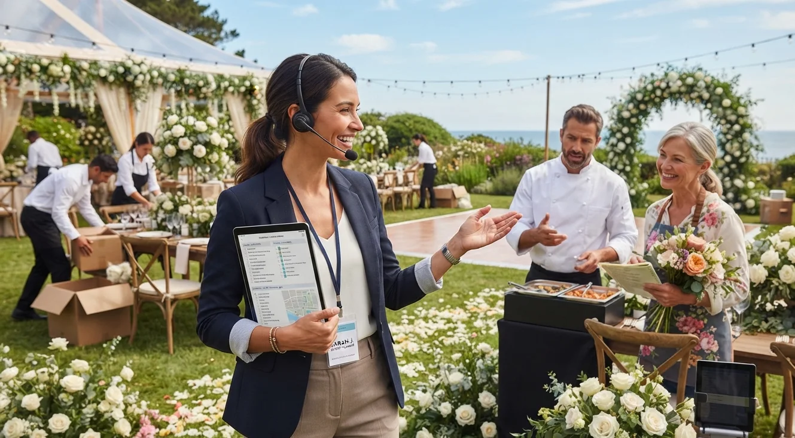

# De Cero a Wedding Planner Profesional: Así se Ve el Camino

No existe una fórmula mágica, pero sí un patrón que se repite en la mayoría de las historias de éxito del sector: **formación, primeros eventos sin cobrar tarifa completa, primer cliente pagado, y recién ahí, un negocio que se sostiene solo**, sin depender de un golpe de suerte puntual.

Lo que sigue no es la historia de una persona en particular. Es el camino típico que veo repetirse, curso tras curso, con distintas caras y distintos países, pero con la misma estructura de fondo, una y otra vez.

## El punto de partida: casi siempre el mismo

Quien empieza en wedding planning casi nunca llega con experiencia formal en eventos. Llega con algo más simple: le organizó una boda a un familiar, o ayudó con la logística de un evento y descubrió que se le daba bien, casi de casualidad, sin haberlo planeado como carrera.

Ese punto de partida genera una duda constante: ¿esto se puede convertir en una carrera real, o es solo algo que se le da bien de casualidad? Esa pregunta es, casi siempre, el primer obstáculo a resolver, más que cualquier falta de habilidad técnica, y es justo la duda que más frena a quienes tienen potencial real para esta carrera.

## Los primeros meses: formación y primeros eventos

La etapa siguiente es la que definimos con más detalle en [nuestra guía de cómo empezar sin título universitario](/blog/wedding-planner/como-ser-wedding-planner-sin-titulo): certificación seria, y primeros eventos reales, aunque sea con tarifa reducida a cambio de fotos y testimonio, para empezar a construir prueba tangible del trabajo.

Esta etapa suele tomar entre 3 y 6 meses, dependiendo de cuánto tiempo se pueda dedicar mientras se mantiene otro ingreso en paralelo. Nadie llega a su primer cliente pagado sin pasar por aquí, aunque muchas veces se busca saltarse este paso con la esperanza de acelerar el proceso, algo que casi siempre termina costando más tiempo del que se pretendía ahorrar.

## El primer cliente pagado

Este es el punto donde más se repite el mismo error: seguir cobrando tarifa reducida "por si acaso", incluso cuando el portafolio ya está listo para justificar una tarifa completa, por miedo a perder al cliente si el precio sube de golpe.

El primer cliente pagado rara vez es el cliente ideal. Suele ser alguien que confía por referencia directa, no por presencia digital todavía consolidada. Cobrar tarifa justa desde ese primer cliente, en vez de seguir regalando trabajo, es lo que marca la diferencia entre quienes avanzan rápido y quienes se quedan atascados meses de más en la etapa anterior, repitiendo el mismo patrón de "experiencia gratuita" una y otra vez.

## Cuando el negocio empieza a sostenerse solo

Después de varios eventos pagados, con portafolio y testimonios acumulados, empieza la etapa donde el negocio deja de depender de referidos puntuales y empieza a generar demanda propia: presencia en redes, casos documentados, y clientes que llegan sin necesidad de conocerte de antes ni de que alguien los refiera personalmente.

Esta etapa no llega por tiempo transcurrido, sino por consistencia acumulada: cada evento bien documentado suma al siguiente, y el negocio empieza a crecer con menos esfuerzo de búsqueda activa de clientes, algo que al inicio del camino parece lejano pero que se construye paso a paso.

<a href="/masters/wedding-planner" class="articulo-recomendado">
  Siguiente paso
  Máster Profesional en Wedding Planning & Organización de Eventos →
</a>

## Qué tienen en común las trayectorias que sí avanzan

Después de acompañar a muchas personas por este camino, hay algo que se repite en quienes logran construir una carrera sostenible, sin importar el país ni el tipo de bodas que terminan atendiendo:

- **Cobran tarifa justa apenas el portafolio lo justifica**, sin quedarse años en "modo experiencia gratuita" por miedo a perder clientes que de todas formas no habrían pagado tarifa completa.
- **Documentan cada evento**, aunque sea pequeño, sin esperar a que llegue "el proyecto grande" para empezar a construir portafolio real y mostrable a futuros clientes.
- **Tratan la formación como base, no como sustituto de la práctica real** con clientes verdaderos, entendiendo que ningún curso, por completo que sea, reemplaza la experiencia de resolver un problema en vivo, con presión de tiempo real.

Nada de esto depende de talento excepcional. Depende de seguir el orden correcto, sin saltarse etapas por impaciencia ni quedarse estancado en una etapa por miedo a avanzar.

## Preguntas frecuentes

**¿Cuánto tiempo toma llegar de cero a un negocio sostenible?**

Varía según cada caso, pero entre 12 y 18 meses es un rango realista si formación, primeros eventos y primer cliente pagado avanzan sin pausas largas entre etapa y etapa, manteniendo constancia incluso cuando el ritmo se siente lento.

**¿Es necesario pasar por la etapa de eventos gratuitos o con tarifa reducida?**

Casi siempre sí, porque es lo que construye el portafolio inicial. Lo importante es no quedarse ahí más tiempo del necesario una vez que ese material ya está listo para justificar una tarifa completa.

**¿Qué pasa si no tengo contactos ni referencias para empezar?**

Los primeros eventos suelen salir de círculos cercanos (familia, amigos) precisamente porque ahí es más fácil conseguir la primera oportunidad real, aunque sea con condiciones distintas a las de un cliente completamente externo que no te conoce todavía.

<a href="/masters/wedding-planner" class="articulo-recomendado">
  Si quieres recorrer este camino con una base sólida desde el primer paso, conoce nuestro
  Máster Profesional en Wedding Planning & Organización de Eventos →
</a>
