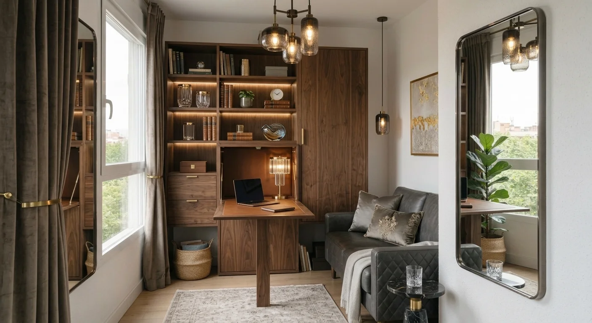
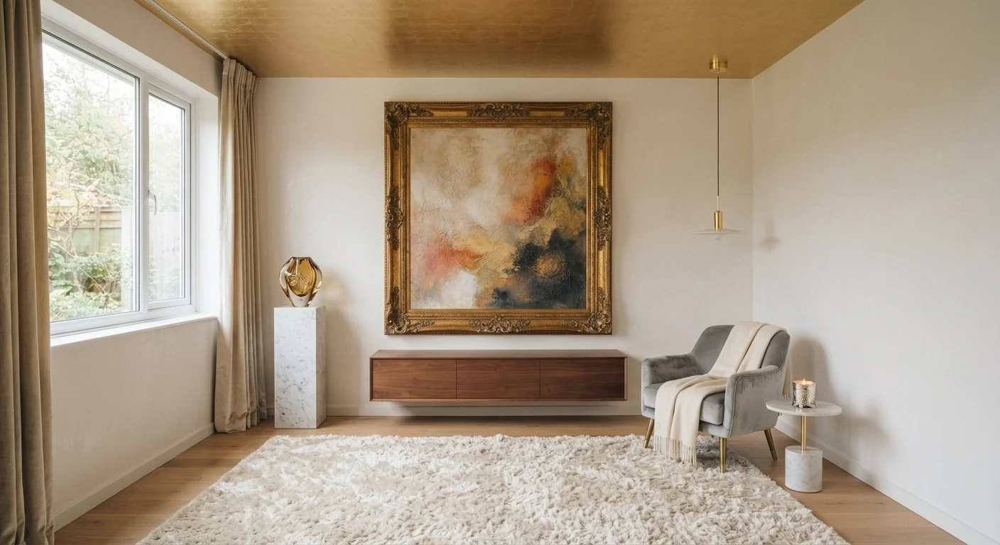

# Ideas para Decorar una Sala Pequeña sin Gastar de Más

Una sala pequeña no necesita muebles nuevos para verse más grande. Necesita **mejor uso de color, luz y proporción**, no una remodelación completa ni un presupuesto elevado.

Estas son las 10 ideas que más funcionan en espacios reducidos, sin presupuesto de remodelación completa.

## 1. Usa color con carácter, no solo blanco

El blanco no es la única forma de "abrir" un espacio pequeño. Un tono cálido y no demasiado oscuro, aplicado con consistencia en muros y textiles, puede unificar visualmente la sala y hacerla sentir más amplia que si mezclas demasiados colores distintos, aunque cada uno individualmente te guste.

Lo que realmente reduce un espacio no es el color, es la fragmentación visual de muchos tonos compitiendo entre sí, algo muy común cuando se van sumando muebles y objetos de distintas épocas sin un criterio de color en común.

## 2. Espejos en el lugar correcto

Un espejo bien ubicado, frente a una ventana o una fuente de luz, duplica la sensación de profundidad del espacio.

No necesitas un espejo enorme y costoso. Uno de tamaño medio, bien posicionado, funciona mejor que uno grande mal colocado.

## 3. Muebles multifuncionales

En espacios reducidos, cada mueble debería resolver más de una función: una mesa de centro con almacenamiento, un sofá cama, banquitos que sirvan de mesa auxiliar y asiento extra cuando llegan invitados.

Esto no solo ahorra espacio, también reduce la cantidad de piezas visibles, que es lo que realmente afecta la sensación de amplitud.

## 4. Cuelga las cortinas más arriba

Un truco simple que cambia mucho: cuelga las cortinas cerca del techo, no justo sobre el marco de la ventana. Esto alarga visualmente la altura del muro y hace que el techo se sienta más alto.

Es uno de los cambios de menor costo con mayor impacto visual en toda esta lista.

## 5. Ilumina en capas, no con una sola luz central

Una sola lámpara en el centro del techo genera sombras planas que achican el espacio. Combina luz general, luz de lectura y alguna luz decorativa baja (lámpara de piso o de mesa), distribuidas en distintos puntos de la sala.

La iluminación en capas da profundidad al espacio, algo que una sola fuente de luz nunca logra por sí sola, sin importar cuán potente sea el foco central.

## 6. Menos piezas, más grandes

Es contraintuitivo, pero funciona: en espacios chicos, es mejor tener pocas piezas de buen tamaño que muchas piezas pequeñas dispersas.

Muchos objetos decorativos pequeños generan ruido visual. Una o dos piezas con presencia real generan la sensación contraria: orden y amplitud.

<a href="/masters/interiorismo" class="articulo-recomendado">
  Siguiente paso
  Máster Profesional en Interiorismo, Decoración y Diseño 3D →
</a>

## 7. Aprovecha las esquinas

Las esquinas suelen quedar vacías o mal usadas. Un mueble angular, una planta alta o una estantería esquinera aprovechan un espacio que normalmente se desperdicia, en vez de dejarlo vacío o convertido en depósito de cosas sin acomodar.

Esto libera el centro de la sala para circulación, que es lo que más se necesita en un espacio reducido.

## 8. Textiles y alfombras, no muebles nuevos

Cambiar cojines, cortinas o sumar una alfombra bien elegida transforma un espacio a una fracción del costo de comprar muebles nuevos, y es de los cambios más fáciles de revertir si más adelante quieres actualizar el estilo otra vez.

Una alfombra que defina el área de la sala, sin quedar demasiado pequeña bajo los muebles, también ayuda a que el espacio se sienta más intencional y menos improvisado, algo que se nota especialmente en salas pequeñas donde cada detalle pesa más visualmente.

## 9. Estantería vertical, no horizontal

En espacios chicos, sube en vez de expandirte hacia los lados. Una estantería alta y angosta guarda lo mismo (o más) que un mueble bajo y ancho, sin robarle metros cuadrados a la circulación.

## 10. Un solo punto focal

Elige un elemento como protagonista (un cuadro grande, una pared de color, una pieza de mobiliario destacada) y deja que el resto del espacio lo acompañe, sin competir por atención con otros elementos igual de llamativos.

Varios puntos focales compitiendo entre sí es una de las razones por las que una sala pequeña se siente desordenada, incluso cuando técnicamente no tiene demasiadas cosas.

## Preguntas frecuentes

**¿Necesito pintar toda la sala para que se vea más grande?**

No necesariamente. A veces un solo muro de color, bien elegido, aporta más que pintar todo el espacio del mismo tono plano, y es una intervención mucho más económica y rápida de revertir.

**¿Los espejos grandes siempre ayudan más que los pequeños?**

No. Lo que importa es dónde reflejan luz o profundidad, no el tamaño. Un espejo mediano bien ubicado supera a uno grande mal colocado que solo refleja una pared vacía.

**¿Vale la pena invertir en un profesional para un espacio tan pequeño?**

Sí, si quieres evitar errores costosos de proporción o color. Un espacio chico perdona menos los errores de decoración que uno grande, donde un mueble mal escalado se nota mucho menos.

Si te gustó pensar en estos detalles de proporción, luz y color, quizás te interese ver [las diferencias entre diseño de interiores y decoración](/blog/interiorismo/diseno-interiores-vs-decoracion-2026) y por qué formarte en los dos te da más herramientas para resolver espacios como este.

<a href="/masters/interiorismo" class="articulo-recomendado">
  Si quieres aprender a resolver espacios como este de forma profesional, conoce nuestro
  Máster Profesional en Interiorismo, Decoración y Diseño 3D →
</a>
