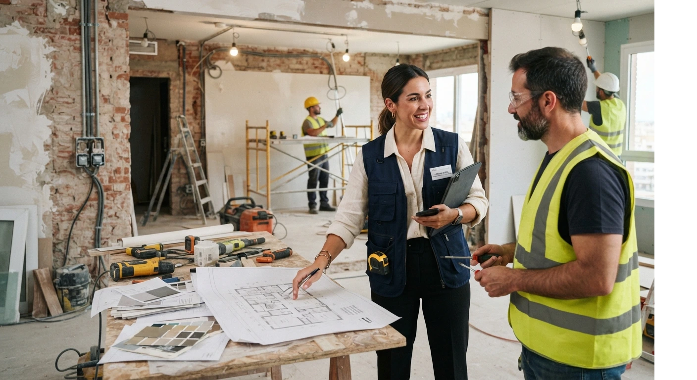
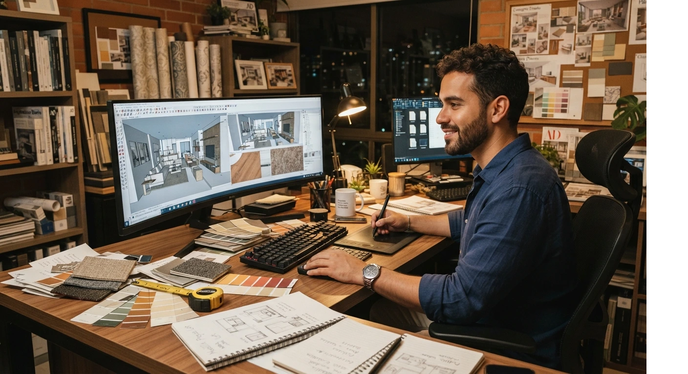

# Diseño de Interiores vs. Decoración: Diferencias y Por Qué Van Juntos

La diferencia corta: **diseño de interiores** interviene la estructura del espacio (distribución, iluminación, materiales). **Decoración** trabaja sobre lo que ya existe (color, mobiliario, accesorios).

No son lo mismo, pero tampoco son caminos separados. En la práctica, un buen profesional necesita manejar los dos.

Te explico las diferencias reales, por qué no conviene formarte solo en uno de los dos, y cómo se ven combinados en un proyecto real.

## Diseño de interiores vs. decoración, en una tabla

| | Diseño de interiores | Decoración |
|---|---|---|
| **Interviene** | Distribución, muros, iluminación, instalaciones | Color, mobiliario, textiles, accesorios |
| **Formación técnica** | Planos, medidas, software 3D | Estilo, tendencias, combinación de elementos |
| **Tipo de proyecto** | Remodelaciones, obra nueva, proyectos integrales | Ambientación, styling, refresh de espacios |
| **Ticket promedio** | Más alto, por la complejidad técnica | Más accesible, proyectos más rápidos |
| **Tiempo del proyecto** | Semanas o meses | Días o pocas semanas |

Ninguno es "mejor" que el otro. Son dos oficios que se complementan, y en la mayoría de los proyectos reales terminas necesitando los dos a la vez.

## Qué es diseño de interiores (el alcance real)

El diseño de interiores toca la estructura del espacio. Un diseñador puede mover un muro, rediseñar la distribución de una cocina o definir dónde va cada punto de luz antes de que exista la instalación eléctrica.

Requiere leer planos, coordinar con maestros de obra y manejar software de diseño 3D para que el cliente vea el resultado antes de construirlo.

Es la parte técnica del oficio: medidas, materiales, cómo se construye realmente un espacio. Sin esto, cualquier proyecto de decoración tiene un techo bajo.

## Qué es decoración (el alcance real)

La decoración trabaja con lo que el espacio ya tiene. No mueve muros ni cambia instalaciones. Cambia color, mobiliario, textiles y accesorios para transformar cómo se siente un ambiente.

Un proyecto de decoración puede resolverse en días: nueva paleta de color, muebles reubicados, cortinas y objetos que cambian por completo la sensación del espacio, sin tocar nada estructural.

Es la parte estética del oficio: la que hace que un espacio bien resuelto técnicamente también se sienta bien. Sin esto, un proyecto técnicamente correcto puede quedarse frío o impersonal.

<a href="/masters/interiorismo" class="articulo-recomendado">
  Siguiente paso
  Máster Profesional en Interiorismo, Decoración y Diseño 3D →
</a>

## Diferencias clave que casi nadie te explica

Más allá de la tabla, hay tres diferencias que conviene entender bien, aunque termines manejando los dos frentes a la vez.

- **Responsabilidad técnica.** Un diseñador de interiores responde por decisiones que afectan la estructura. Un error ahí cuesta caro. Un decorador trabaja con menos riesgo técnico.
- **Curva de aprendizaje.** Diseño de interiores toma más tiempo dominar por la parte técnica (planos, medidas, normativa básica). Decoración se aprende más rápido, pero requiere buen ojo constante.
- **Escalabilidad del negocio.** Un diseñador de interiores puede cobrar proyectos integrales de alto ticket. Un decorador puede tomar más proyectos pequeños en menos tiempo. Los dos modelos funcionan, pero se administran distinto.

## Cuál paga mejor

En cifras generales, un proyecto integral de diseño de interiores paga más por proyecto individual, porque incluye más horas, más responsabilidad técnica y coordinación de obra.

La decoración compensa con **volumen**: puedes tomar más proyectos al mes porque cada uno toma menos tiempo.

Si ya quieres ver las cifras reales por país, ya cubrimos [cuánto gana un diseñador de interiores freelance](/blog/interiorismo/cuanto-gana-un-disenador-de-interiores-2026) en detalle.

Lo importante: no tienes que elegir entre un ingreso u otro. Cuando manejas ambos frentes, puedes tomar proyectos rápidos de decoración para flujo constante, y proyectos integrales de diseño para los tickets más altos, sin depender de un solo tipo de cliente.

## Por qué conviene formarte en los dos juntos

Aquí está el error más común al elegir formación: pensar que hay que escoger un camino y dejar el otro para después.

En la práctica, casi ningún proyecto real se resuelve con uno solo de los dos:

- Una remodelación técnica sin criterio de decoración termina siendo un espacio bien construido, pero frío.
- Un proyecto de decoración sin base técnica se topa con un límite rápido: no puedes proponer cambios de distribución o iluminación si no entiendes cómo funcionan.

Por eso el enfoque que enseñamos en el instituto no separa ambos mundos en programas distintos. Se estudian **juntos, de forma integrada**, porque así es como se resuelven los proyectos en la vida real.

Formarte solo en uno de los dos no te hace más rápido para empezar a trabajar. Te deja con un techo bajo apenas el proyecto pide un poco más de lo que sabes resolver.

## Un caso real: los dos frentes, en el mismo proyecto

Una alumna nuestra en Cali tuvo un proyecto que empezó como "solo decoración": la clienta quería cambiar color, muebles y textiles de su sala.

Al revisar el espacio, notó que la distribución actual no aprovechaba la luz natural. Sin ese ajuste técnico, ningún cambio de decoración iba a resolver el problema real del espacio.

Aplicó los dos frentes en el mismo proyecto: ajustó la distribución primero, y después trabajó color, mobiliario y accesorios sobre esa nueva base.

El resultado final fue muy distinto al que hubiera logrado si solo hubiera decorado sobre la distribución original. Ese es justamente el punto de verlos juntos, no por separado.

## Preguntas frecuentes

**¿Puedo formarme en los dos al mismo tiempo?**

Sí, de hecho es común. Un programa integral que cubra ambos te da flexibilidad para tomar tanto proyectos rápidos de decoración como proyectos técnicos más grandes.

**¿Tiene sentido formarme primero en uno y después en el otro?**

No es lo más eficiente. Aprender ambos de forma integrada te ahorra tiempo y te evita el techo bajo de manejar solo la mitad de un proyecto real.

**¿Los clientes distinguen entre uno y otro?**

No siempre. Muchos clientes usan "decorador" y "diseñador de interiores" como sinónimos, así que tú tienes que dejar claro qué puedes resolver, sin necesidad de limitarte a uno solo.

**¿Un proyecto de bienes raíces o remodelación necesita los dos frentes?**

Casi siempre. Ese tipo de proyecto necesita distribución y normativa técnica, pero también criterio estético para que el resultado final se sienta terminado, no solo "correcto".

<a href="/masters/interiorismo" class="articulo-recomendado">
  Si quieres formarte en ambos caminos con una base sólida, conoce nuestro
  Máster Profesional en Interiorismo, Decoración y Diseño 3D →
</a>
