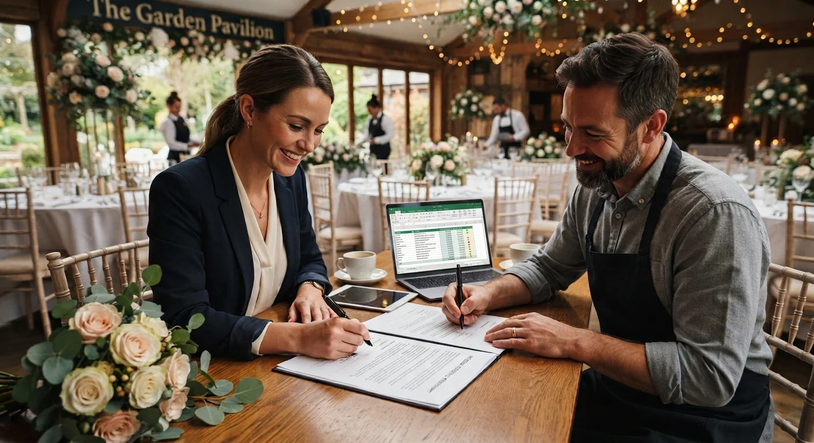

# Cómo Elegir y Negociar con Proveedores para un Evento

Elegir bien a un proveedor pesa más que negociar bien el precio. Un proveedor confiable, aunque cueste un poco más, evita problemas que ninguna negociación puede corregir después, y ese ahorro invisible vale más que cualquier descuento inicial.

Te explico cómo elegir con criterio y negociar sin que la relación quede tensa desde el inicio, algo que también afecta cómo trabaja el proveedor el día del evento.

## Qué buscar en un proveedor antes de cotizar

Antes de pedir precio, verifica lo básico: portafolio real de trabajos anteriores, referencias de otros clientes, y disponibilidad confirmada para la fecha exacta de tu evento, no una fecha aproximada.

Un proveedor que responde rápido no es necesariamente el mejor. Muchas veces, disponibilidad inmediata significa que tiene menos demanda que otros en el mercado, y eso también dice algo sobre su nivel de trabajo o su reputación en el rubro.

Revisa también cómo se comunica desde el primer contacto. Si tarda en responder o da información confusa antes de firmar nada, esa dinámica rara vez mejora una vez que ya está contratado y tiene menos incentivo para atender rápido tus dudas.

## Cómo comparar cotizaciones sin quedarte solo con el precio

Comparar tres cotizaciones solo por el número final es un error común. El precio más bajo puede significar menos horas de trabajo, materiales de menor calidad, o servicios que no están incluidos y que vas a tener que pagar aparte después, inflando el costo real por encima de la opción que parecía más cara al principio.

Compara cada cotización por lo que realmente incluye: horas de servicio, personal asignado, materiales, y qué pasa si el evento se extiende más de lo previsto, un escenario que casi siempre termina pasando en algún grado.

Si ya viste [cómo calcular tu propia tarifa](/blog/wedding-planner/cuanto-cobrar-por-organizar-un-evento), sabes que el mismo criterio de desglosar qué incluye el precio aplica igual cuando cotizas proveedores para tus clientes, no solo cuando defines tu propia tarifa.

## Cómo negociar sin sonar agresiva ni insegura

Negociar bien no es pedir un descuento a cualquier costo. Es entender qué margen tiene el proveedor y encontrar un punto donde ambos ganen, en vez de tratar la negociación como una competencia donde alguien tiene que perder.

- **Pregunta antes de pedir descuento.** "¿Qué opciones tienes para ajustar esto a mi presupuesto?" abre una conversación distinta a simplemente pedir menos precio, y muestra que entiendes que el proveedor también tiene costos que cubrir.
- **Negocia condiciones, no solo precio.** Un mejor horario de entrega, un servicio adicional incluido, o flexibilidad en el pago pueden valer tanto como un descuento directo, y suelen ser más fáciles de conceder para el proveedor.
- **No negocies por WhatsApp de corrido.** Una conversación formal, aunque sea por llamada o videollamada, se toma más en serio que mensajes sueltos a lo largo del día, y reduce malentendidos sobre lo que finalmente se acordó.
- **Ten un presupuesto límite claro antes de empezar.** Negociar sin ese límite definido termina en decisiones improvisadas bajo presión del momento, aceptando condiciones que después resultan difíciles de sostener.

<a href="/masters/wedding-planner" class="articulo-recomendado">
  Siguiente paso
  Máster Profesional en Wedding Planning & Organización de Eventos →
</a>

## Qué poner por escrito siempre

Un acuerdo verbal, por más claro que parezca en el momento, no protege a nadie cuando algo sale distinto a lo hablado, y en eventos las condiciones cambian con más frecuencia de la que se piensa al inicio.

Deja siempre por escrito: qué incluye el servicio exactamente, fecha y hora de entrega, monto total y forma de pago, política de cancelación, y qué pasa si hay cambios de último momento por parte de cualquiera de las dos partes.

Esto no es desconfianza hacia el proveedor. Es una práctica profesional que protege a las dos partes, y que cualquier proveedor serio va a aceptar sin problema. Si alguno se resiste a dejarlo por escrito, esa reacción ya es información valiosa sobre cómo va a manejarse el resto de la relación.

## Señales de alerta con un proveedor

Algunas señales conviene tomarlas en serio antes de firmar cualquier contrato, sin importar lo convincente que suene la presentación inicial.

- **No tiene referencias verificables.** Un proveedor sin trabajos anteriores mostrables, o con referencias que no puedes contactar directamente, es un riesgo mayor de lo que parece a primera vista.
- **Pide el pago completo por adelantado.** Un anticipo razonable es normal. Exigir el 100% antes de prestar cualquier servicio no lo es, y limita mucho tu capacidad de reclamar si algo sale mal después de pagado.
- **Cambia de precio sin explicación clara.** Si la cotización sube sin justificación entre una conversación y otra, es señal de que algo no está bien organizado de su lado, o de que la primera cifra nunca fue seria.
- **Evita poner nada por escrito.** Si insiste en mantener todo verbal, incluso después de pedirlo directamente, considera esto una alerta seria antes de comprometerte con ese proveedor.

## Preguntas frecuentes

**¿Cuántas cotizaciones debería pedir antes de decidir?**

Al menos tres, para tener una base de comparación real y confiable. Menos de eso limita tu criterio para saber si un precio es razonable o no, y te deja negociando a ciegas frente al único proveedor que consultaste.

**¿Es normal negociar precio con todos los proveedores?**

Es normal preguntar por opciones de ajuste, pero no todos los proveedores tienen el mismo margen de maniobra. Algunos rubros (como flores en temporada alta) tienen menos espacio de negociación que otros, así que ajusta tus expectativas según el tipo de servicio que estés contratando.

**¿Qué hago si un proveedor no cumple lo acordado por escrito?**

Ese documento es justamente lo que te da respaldo para exigir una solución. Sin acuerdo por escrito, la conversación se vuelve mucho más difícil de resolver a tu favor, y termina siendo tu palabra contra la del proveedor frente al cliente.

<a href="/masters/wedding-planner" class="articulo-recomendado">
  Si quieres aprender a manejar proveedores con criterio profesional, conoce nuestro
  Máster Profesional en Wedding Planning & Organización de Eventos →
</a>
