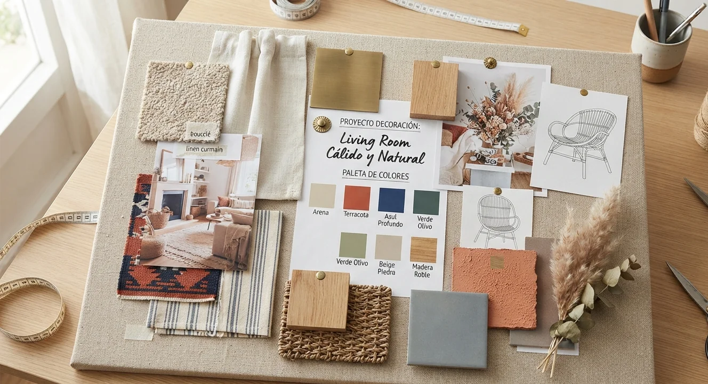
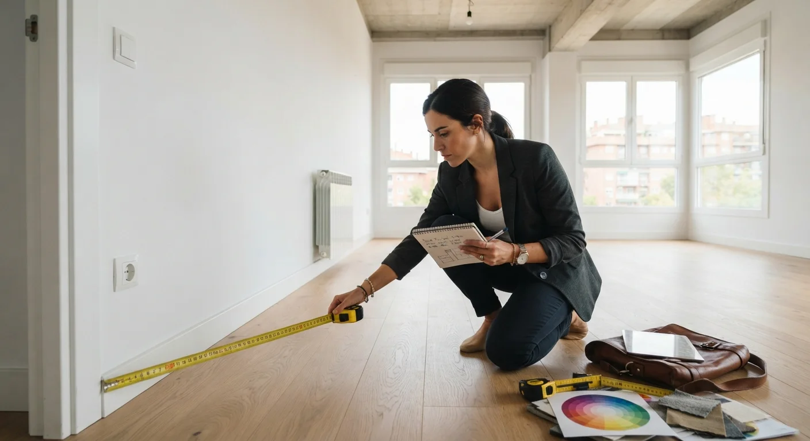

# 10 Errores Comunes al Decorar tu Primer Proyecto Profesional

El error más común: **empezar a comprar antes de tener un moodboard definido**. El segundo: **no medir el espacio con precisión antes de proponer mobiliario**.

Estos y otros ocho errores se repiten una y otra vez entre quienes decoran su primer proyecto profesional, sin importar el país o el tipo de cliente.

Después de años acompañando a alumnos en sus primeros trabajos, esto es lo que más se repite y cómo evitarlo.

## 1. No definir un moodboard antes de comprar nada

Comprar sobre la marcha, sin una referencia visual clara, termina en un espacio con piezas que no dialogan entre sí, aunque cada una individualmente te haya gustado en el momento de comprarla.

Define primero el moodboard completo: paleta de color, estilo, referencias de materiales. Compra después, no al revés, aunque tengas la tentación de aprovechar una oferta que encuentres en el camino.

## 2. No medir el espacio con precisión

Un sofá que se ve perfecto en una foto puede no caber, o verse desproporcionado, en el espacio real si no mides con exactitud antes de proponerlo.

Toma medidas exactas de cada ambiente, incluyendo puertas y pasillos por donde va a entrar el mobiliario, antes de comprometerte con cualquier pieza.

## 3. Mezclar demasiados estilos sin un hilo conductor

Combinar estilos puede funcionar muy bien, pero solo si hay un criterio detrás. Mezclar sin ese hilo conductor termina en un espacio que se siente desordenado, no ecléctico.

Elige un elemento común (color, material, época) que conecte las piezas de distintos estilos, en vez de combinarlas al azar.

## 4. No pedir suficientes referencias visuales al cliente

Un cliente que dice "quiero algo moderno" puede tener en mente algo completamente distinto a lo que tú entiendes por moderno, y esa diferencia de interpretación es la fuente más común de fricción en un primer proyecto.

Pide referencias visuales concretas antes de proponer nada. Ahorra revisiones completas más adelante, y evita el desgaste de rehacer una propuesta desde cero.

## 5. Subestimar el rol de la iluminación

Muchos proyectos de decoración se enfocan en color y mobiliario, dejando la iluminación como un detalle secundario que se resuelve al final, casi como una ocurrencia tardía.

La luz cambia por completo cómo se perciben los colores y materiales elegidos. Defínela desde el inicio del proyecto, no como un añadido de último momento, porque cambiar la iluminación después de instalar todo lo demás sale mucho más caro.

<a href="/masters/interiorismo" class="articulo-recomendado">
  Siguiente paso
  Máster Profesional en Interiorismo, Decoración y Diseño 3D →
</a>

## 6. No dejar presupuesto para imprevistos

Un presupuesto ajustado al centavo, sin margen, se rompe con el primer imprevisto: un mueble que no llega a tiempo, un color que no se ve igual una vez aplicado.

Deja al menos un 10% del presupuesto total sin asignar a nada específico, como colchón para lo que surja durante el proyecto.

## 7. No poner nada por escrito con el cliente

Un acuerdo verbal sobre alcance y presupuesto genera problemas cuando el cliente pide cambios que tú consideras "extra" y él considera "parte del proyecto original".

Deja por escrito qué incluye tu propuesta, qué no, y qué pasa si hay cambios sobre lo ya acordado.

## 8. Ignorar la escala de los muebles frente al espacio real

Un mueble que se ve bien en un catálogo puede quedar completamente desproporcionado en un espacio real, ya sea muy grande o muy pequeño para el ambiente.

Si ya viste [nuestras ideas para decorar salas pequeñas](/blog/interiorismo/decorar-sala-pequena), sabes que la proporción, más que el gusto individual por una pieza, es lo que define si un espacio se siente equilibrado.

## 9. No fotografiar el proyecto profesionalmente al terminar

Terminar un proyecto sin fotos profesionales es perder la mejor prueba de tu trabajo. Un celular puede servir en un apuro, pero no reemplaza fotos bien iluminadas y compuestas, tomadas por alguien que sepa resaltar el espacio.

Ese material es lo que después construye tu portafolio y te consigue el siguiente cliente, así que vale la pena invertir en esto aunque el presupuesto del proyecto sea ajustado, incluso si tienes que negociar el costo de la sesión de fotos aparte.

## 10. No pedir feedback ni testimonio al cerrar

Cerrar un proyecto sin pedir testimonio del cliente es dejar pasar la oportunidad más natural de conseguirlo. Después, con el tiempo pasado, es mucho más difícil que el cliente se tome el tiempo de escribirlo.

Pide el testimonio apenas el cliente ve el resultado final, cuando la satisfacción todavía está fresca.

## Preguntas frecuentes

**¿Estos errores solo aplican a proyectos grandes?**

No. Se repiten igual en proyectos pequeños, muchas veces con más impacto, porque un espacio chico perdona menos los errores de proporción o color que uno grande.

**¿Cuál de estos errores es el más costoso de corregir?**

No poner nada por escrito con el cliente. Un malentendido sobre el alcance del proyecto puede costarte tiempo, dinero y la relación con ese cliente, además del desgaste de una discusión que se pudo evitar.

**¿Vale la pena documentar todo, incluso en mis primeros proyectos con tarifa reducida?**

Sí, especialmente ahí. Esos primeros proyectos son los que construyen el portafolio que te va a conseguir tus próximos clientes pagados, así que documentarlos bien vale más que el ingreso reducido de ese proyecto en particular.

<a href="/masters/interiorismo" class="articulo-recomendado">
  Si quieres evitar estos errores desde tu primer proyecto, conoce nuestro
  Máster Profesional en Interiorismo, Decoración y Diseño 3D →
</a>
