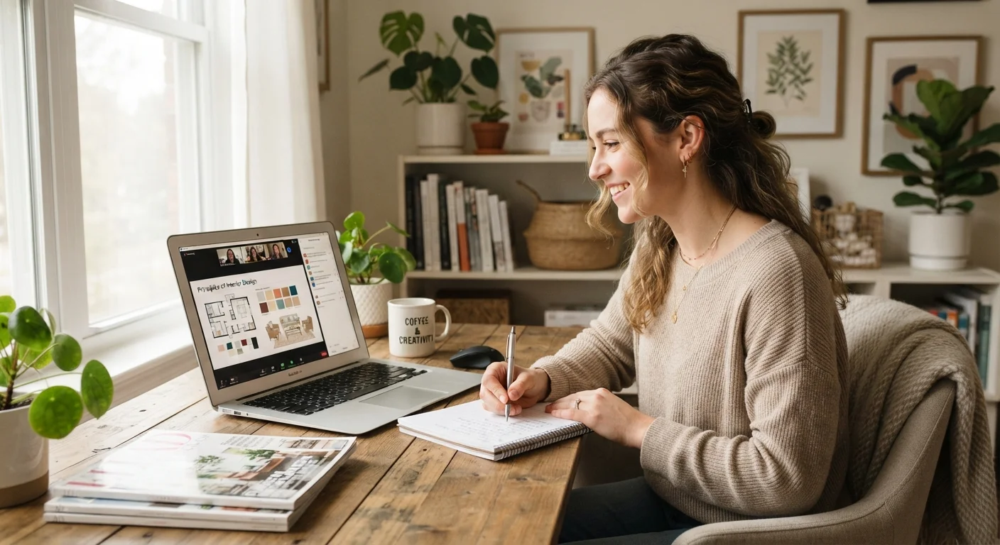

# Máster en Interiorismo Online vs. Presencial: Cuál Conviene Más

No hay una respuesta universal. La modalidad correcta depende de **tu ubicación, tu horario disponible y cómo aprendes mejor**, no de cuál se ve más "profesional" en redes sociales o cuál eligió tu círculo cercano.

Te explico las diferencias reales entre ambas, sin venderte una sobre la otra, para que decidas con criterio y no por moda.

## Online vs. presencial, en una tabla

| | Máster online | Máster presencial |
|---|---|---|
| **Acceso geográfico** | Sin límite, aprendes desde cualquier país | Limitado a tu ciudad o requiere reubicarte |
| **Horario** | Flexible, compatible con trabajo actual | Fijo, exige bloques de tiempo específicos |
| **Costo total** | Generalmente menor (sin traslado ni alojamiento) | Suele ser más alto por logística adicional |
| **Manejo de materiales físicos** | Depende del programa y sus recursos | Más directa con muestras, texturas y maquetas reales |
| **Networking** | Posible, pero requiere más iniciativa propia | Más natural por la convivencia presencial |

Ninguna modalidad es automáticamente mejor. Lo que cambia es qué necesitas resolver primero: acceso, horario o contacto físico inmediato con materiales.

## Ventajas reales de un máster online

La ventaja más clara es el **acceso**: puedes estudiar con instructores de otro país sin mudarte, algo que hace años era prácticamente imposible para la mayoría de personas interesadas en esta carrera, sobre todo fuera de las grandes capitales.

También resuelve el problema del horario. Si ya trabajas, un programa presencial con horario fijo puede ser simplemente incompatible con tu vida actual, mientras que uno online te permite avanzar en tus tiempos, sin sacrificar tu ingreso mientras estudias ni pedir permisos especiales en tu trabajo.

El costo total también suele ser menor, porque elimina traslado, alojamiento y a veces materiales que un programa presencial sí requiere comprar por adelantado, sin contar el tiempo que se pierde en desplazamientos cada semana, algo que en ciudades grandes puede sumar varias horas mensuales.

## Ventajas reales de un máster presencial

Sería deshonesto no reconocerlo: en interiorismo, el contacto físico con materiales tiene un peso particular que ningún video reemplaza del todo. Tocar una muestra de tela, ver de cerca la veta de una madera, entender la escala real de un mueble en el espacio, todo eso se aprende distinto en persona.

El networking también fluye más natural cuando compartes salón de clases con otras personas que están construyendo la misma carrera que tú. Esas relaciones, muchas veces, se convierten en referencias de proveedores o en sociedades para proyectos más grandes después.

Si tu ciudad tiene una oferta presencial sólida y tu horario lo permite, no es una mala opción. La pregunta real no es "cuál es mejor en abstracto", sino cuál resuelve mejor tu situación concreta, hoy, con los recursos que realmente tienes disponibles.

<a href="/masters/interiorismo" class="articulo-recomendado">
  Siguiente paso
  Máster Profesional en Interiorismo, Decoración y Diseño 3D →
</a>

## Qué preguntar antes de decidir, sin importar la modalidad

Más allá de online o presencial, hay preguntas que aplican igual a los dos formatos, y que definen si el programa realmente vale la pena.

- **¿El programa incluye proyectos prácticos reales, o solo teoría de diseño?** Un máster online bien diseñado puede tener más práctica aplicada que uno presencial mal estructurado, y viceversa. El formato no garantiza la calidad del contenido.
- **¿Hay mentoría directa con alguien activo en el sector?** La modalidad no reemplaza esto. Sin mentoría real, cualquier formato se queda corto, sin importar cuán bien producidas estén las clases.
- **¿Qué entregas al terminar?** Un portafolio, un proyecto completo o solo un certificado genérico. Esa respuesta importa más que si las clases fueron por Zoom o en un salón físico.
- **¿Cómo se maneja el tema de materiales y muestras en un programa online?** Si el programa es online, pregunta específicamente cómo resuelven esta parte, ya sea con kits de materiales enviados a casa o con guías detalladas de proveedores locales.

Si ya viste [los errores más comunes en un primer proyecto](/blog/interiorismo/errores-decorar-primer-proyecto), sabes que muchos de esos errores no dependen de la modalidad de estudio, sino de si el programa realmente cubrió la práctica aplicada, no solo la teoría.

## Cuándo tiene más sentido cada modalidad

**El online tiene más sentido si:**

- Vives fuera de una ciudad con oferta presencial de calidad
- Necesitas compatibilizar el estudio con un trabajo actual
- Te interesa aprender de instructores fuera de tu país

**El presencial tiene más sentido si:**

- Tienes acceso a un programa reconocido y de calidad en tu ciudad
- Priorizas el contacto físico inmediato con materiales sobre la flexibilidad de horario
- Tu horario actual permite bloques de clase fijos, semana tras semana

Muchas veces la decisión no es puramente ideológica ("prefiero lo online" o "prefiero lo presencial"), sino práctica: qué opción tienes realmente disponible, con la calidad de programa que buscas, dentro de tu presupuesto y tu tiempo real disponible cada semana.

## Preguntas frecuentes

**¿Un título online tiene el mismo valor frente a un cliente?**

El cliente valora resultados y portafolio, no el formato en que estudiaste. Lo que sí importa es que el programa, sea online o presencial, te haya dado proyectos prácticos reales que puedas mostrar después, con casos concretos y no solo teoría de diseño.

**¿Es más difícil aprender a manejar materiales en un programa online?**

Puede serlo si el programa no lo resuelve bien. Un buen máster online complementa la teoría con guías claras de materiales y, en algunos casos, kits físicos enviados directamente a los alumnos, o convenios con proveedores locales para conseguir muestras.

**¿Puedo combinar las dos modalidades?**

Sí, algunos programas online incluyen encuentros presenciales puntuales o talleres intensivos de materiales. Pregunta específicamente por esto si te interesa un punto intermedio entre ambos formatos, en vez de asumir que tienes que elegir uno de forma absoluta desde el primer día.

<a href="/masters/interiorismo" class="articulo-recomendado">
  Si buscas un máster online con mentoría real y casos prácticos, conoce nuestro
  Máster Profesional en Interiorismo, Decoración y Diseño 3D →
</a>
