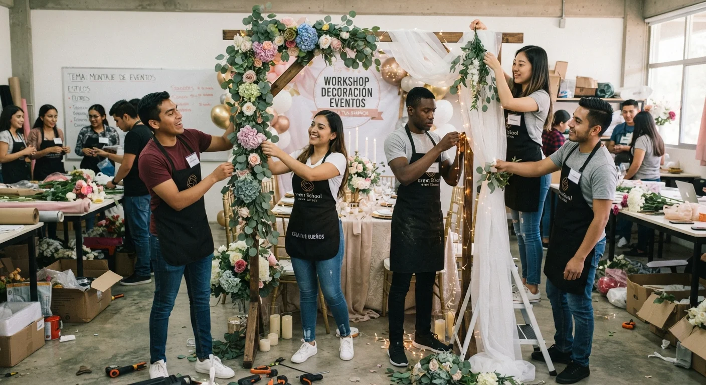

# Máster Online vs. Presencial en Organización de Eventos: Cuál Elegir

No hay una respuesta universal. La modalidad correcta depende de **tu ubicación, tu horario disponible y cómo aprendes mejor**, no de cuál se ve más "profesional" en redes sociales.

Te explico las diferencias reales entre ambas, sin venderte una sobre la otra, para que decidas con criterio y no por moda.

## Online vs. presencial, en una tabla

| | Máster online | Máster presencial |
|---|---|---|
| **Acceso geográfico** | Sin límite, aprendes desde cualquier país | Limitado a tu ciudad o requiere reubicarte |
| **Horario** | Flexible, compatible con trabajo actual | Fijo, exige bloques de tiempo específicos |
| **Costo total** | Generalmente menor (sin traslado ni alojamiento) | Suele ser más alto por logística adicional |
| **Práctica física** | Depende del programa y sus recursos | Más directa con montajes y materiales reales |
| **Networking** | Posible, pero requiere más iniciativa propia | Más natural por la convivencia presencial |

Ninguna modalidad es automáticamente mejor. Lo que cambia es qué necesitas resolver primero: acceso, horario o práctica física inmediata, y eso depende enteramente de tu situación actual, no de una regla general válida para todos.

## Ventajas reales de un máster online

La ventaja más clara es el **acceso**: puedes estudiar con instructores de otro país sin mudarte, algo que hace 10 años era prácticamente imposible para la mayoría de personas interesadas en esta carrera.

También resuelve el problema del horario. Si ya trabajas, un programa presencial con horario fijo puede ser simplemente incompatible con tu vida actual, mientras que uno online te permite avanzar en tus tiempos, sin sacrificar tu ingreso mientras estudias.

El costo total también suele ser menor, porque elimina traslado, alojamiento y a veces materiales que un programa presencial sí requiere comprar por adelantado, sin contar el tiempo que se pierde en desplazamientos cada semana.

## Ventajas reales de un máster presencial

Sería deshonesto no reconocerlo: la práctica física tiene un componente que ningún video reemplaza del todo. Montar una mesa, ver de cerca una paleta de color, sentir la escala real de un espacio decorado, todo eso se aprende distinto en persona, con retroalimentación inmediata de un instructor viendo tu trabajo en tiempo real.

El networking también fluye más natural cuando compartes salón de clases con otras personas que están construyendo la misma carrera que tú. Esas relaciones, muchas veces, se convierten en referencias de trabajo después, o incluso en sociedades para proyectos más grandes.

Si tu ciudad tiene una oferta presencial sólida y tu horario lo permite, no es una mala opción. La pregunta real no es "cuál es mejor en abstracto", sino cuál resuelve mejor tu situación concreta, hoy, con los recursos que realmente tienes disponibles.

<a href="/masters/wedding-planner" class="articulo-recomendado">
  Siguiente paso
  Máster Profesional en Wedding Planning & Organización de Eventos →
</a>

## Qué preguntar antes de decidir, sin importar la modalidad

Más allá de online o presencial, hay preguntas que aplican igual a los dos formatos, y que definen si el programa realmente vale la pena.

- **¿El programa incluye casos prácticos reales, o solo teoría?** Un máster online bien diseñado puede tener más práctica aplicada que uno presencial mal estructurado, y viceversa. El formato no garantiza la calidad del contenido.
- **¿Hay mentoría directa con alguien activo en el sector?** La modalidad no reemplaza esto. Sin mentoría real, cualquier formato se queda corto, sin importar cuán bien producidas estén las clases.
- **¿Qué entregas al terminar?** Un portafolio, un caso completo o solo un certificado genérico. Esa respuesta importa más que si las clases fueron por Zoom o en un salón físico.

Ya cubrimos con más detalle [qué debe tener cualquier certificación seria](/blog/wedding-planner/certificaciones-wedding-planner-2026), independiente de si es online o presencial.

## Cuándo tiene más sentido cada modalidad

**El online tiene más sentido si:**

- Vives fuera de una ciudad con oferta presencial de calidad
- Necesitas compatibilizar el estudio con un trabajo actual
- Te interesa aprender de instructores fuera de tu país

**El presencial tiene más sentido si:**

- Tienes acceso a un programa reconocido y de calidad en tu ciudad
- Priorizas la práctica física inmediata sobre la flexibilidad de horario
- Tu horario actual permite bloques de clase fijos, semana tras semana

Muchas veces la decisión no es puramente ideológica ("prefiero lo online" o "prefiero lo presencial"), sino práctica: qué opción tienes realmente disponible, con la calidad de programa que buscas, dentro de tu presupuesto y tu tiempo real disponible cada semana.

## Preguntas frecuentes

**¿Un título online tiene el mismo valor frente a un cliente?**

El cliente valora resultados y portafolio, no el formato en que estudiaste. Lo que sí importa es que el programa, sea online o presencial, te haya dado casos prácticos reales que puedas mostrar después.

**¿Es más difícil mantenerse motivado en un máster online?**

Puede serlo si el programa no tiene estructura ni acompañamiento. Un buen máster online incluye seguimiento activo, no solo videos grabados sin mentoría, para que no dependas únicamente de tu propia disciplina.

**¿Puedo combinar las dos modalidades?**

Sí, algunos programas online incluyen encuentros presenciales puntuales o práctica supervisada. Pregunta específicamente por esto si te interesa un punto intermedio entre ambos formatos, en vez de asumir que tienes que elegir uno de forma absoluta.

<a href="/masters/wedding-planner" class="articulo-recomendado">
  Si buscas un máster online con mentoría real y casos prácticos, conoce nuestro
  Máster Profesional en Wedding Planning & Organización de Eventos →
</a>
