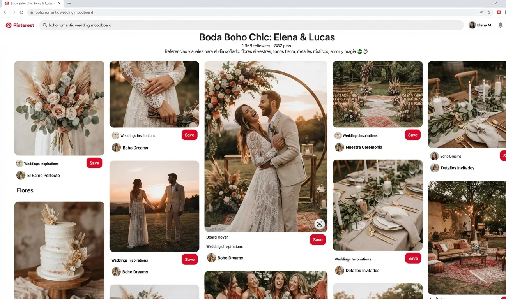
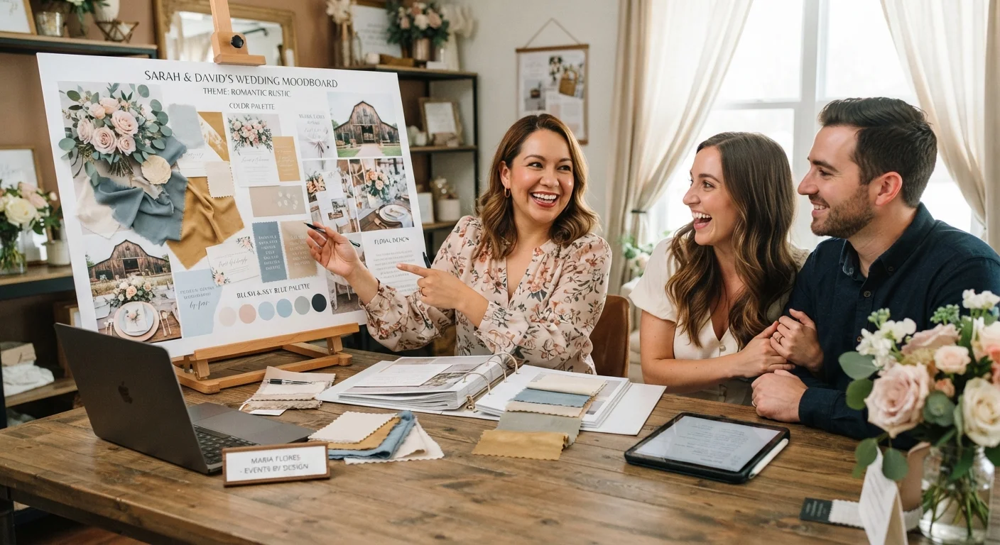

# Cómo Armar el Moodboard de una Boda, Paso a Paso

Un moodboard de boda se arma en cinco pasos: **entender el estilo de la pareja, definir paleta de color, recolectar referencias, seleccionar materiales y componer el resultado final**, siempre en ese orden.

Saltarse el primer paso es la razón número uno por la que un moodboard no convence al cliente. Te explico el proceso completo, en orden, sin asumir que ya tienes experiencia previa armando este tipo de material.

## Qué necesitas antes de empezar

No necesitas herramientas caras para armar un buen moodboard. Con Pinterest para recolectar referencias y Canva para componer el resultado final tienes más que suficiente para empezar, sin invertir en software especializado.

Lo que sí necesitas, sin excepción, es información real de la pareja antes de tocar cualquier herramienta. Un moodboard armado sin esa base es solo una colección bonita de imágenes sin dirección.

## Paso a paso: de la entrevista al moodboard final

**Paso 1: Entiende el estilo de la pareja**

Antes de buscar una sola imagen, pregunta directamente: qué colores les gustan, qué bodas han visto que les encantaron, y qué definitivamente no quieren ver en su propia celebración.

Esta última pregunta es tan importante como la primera. Saber qué evitar ahorra horas de trabajo en referencias que van a terminar descartadas, y evita que la pareja sienta que tiene que corregir todo desde cero en la primera revisión.

**Paso 2: Define una paleta de color base**

Con la información de la entrevista, elige 3 a 5 colores que van a guiar todo el proyecto. Ni más, ni menos, aunque la pareja te muestre referencias con paletas mucho más amplias.

Una paleta con demasiados colores termina en un moodboard confuso, sin un hilo conductor claro para el resto del equipo de proveedores que va a trabajar con esa referencia.

**Paso 3: Recolecta referencias visuales**

Aquí es donde entra Pinterest. Crea un tablero privado para el proyecto y guarda imágenes que se alineen con la paleta y el estilo definidos en los pasos anteriores, sin desviarte hacia lo que simplemente te gusta a ti como profesional.

No guardes imágenes solo porque son bonitas. Cada una debe aportar algo concreto: una idea de decoración de mesa, un tipo de arreglo floral, un estilo de iluminación, algo que puedas señalar y explicar si el cliente pregunta por qué la incluiste.

**Paso 4: Selecciona materiales y texturas**

Un buen moodboard no es solo color e imágenes bonitas. Incluye muestras o referencias de materiales reales: tipo de tela para manteles, textura de la papelería, tipo de flores y su disponibilidad según la temporada.

Esto ayuda a que proveedores como floristas y decoradores entiendan exactamente qué textura y calidad estás buscando, no solo el color, evitando así sorpresas el día del montaje.

**Paso 5: Compón el resultado final**

Con todo lo anterior, organiza el moodboard en Canva o una herramienta similar: paleta de color arriba, referencias visuales organizadas por categoría (decoración, flores, papelería, iluminación), y materiales al final.

<a href="/masters/wedding-planner" class="articulo-recomendado">
  Siguiente paso
  Máster Profesional en Wedding Planning & Organización de Eventos →
</a>

## Errores comunes al armar un moodboard

Estos son los errores que más se repiten entre quienes arman su primer moodboard sin guía.

- **Saltarse la entrevista inicial.** Empezar directo en Pinterest sin entender el estilo de la pareja produce un moodboard bonito pero desconectado de lo que realmente quieren, y eso se nota en la primera reunión de revisión.
- **Demasiadas referencias sin filtrar.** Un moodboard con 40 imágenes sin criterio confunde más de lo que ayuda. Menos imágenes, mejor seleccionadas, comunican más claro que un collage saturado.
- **Ignorar las tendencias del año.** Si ya viste [las tendencias de bodas actualmente](/blog/wedding-planner/tendencias-bodas), sabes que un moodboard actualizado ayuda a que la propuesta se sienta fresca, no repetida de temporadas anteriores.
- **No mostrar materiales reales.** Un moodboard solo de fotos de Pinterest, sin muestras de textura o material, deja a los proveedores adivinando detalles importantes que después se traducen en mal entendidos costosos.

## Cómo presentar el moodboard al cliente

La forma en que presentas el moodboard importa casi tanto como el contenido.

- **Explica el porqué de cada elección**, no solo muéstralo. "Elegimos este tono porque conecta con..." convence más que solo enseñar imágenes.
- **Deja espacio para ajustes.** Presenta el moodboard como punto de partida, no como decisión cerrada, para que el cliente se sienta parte del proceso.
- **Usa el moodboard en todas tus reuniones con proveedores.** Así todos trabajan sobre la misma referencia visual, sin interpretaciones distintas de lo que la pareja quiere.

## Preguntas frecuentes

**¿Cuánto tiempo toma armar un buen moodboard?**

Entre 3 y 5 horas para un moodboard completo, contando la entrevista inicial, la recolección de referencias y la composición final, sin apurar ninguno de los pasos.

**¿Necesito herramientas de diseño avanzadas?**

No. Pinterest y Canva son suficientes para la mayoría de los proyectos. Herramientas más avanzadas solo tienen sentido para presentaciones de muy alto nivel, donde el cliente espera un nivel extra de producción visual.

**¿El moodboard cambia durante el proceso de planeación?**

Sí, es normal que se ajuste. Trátalo como un documento vivo, no como algo fijo desde el primer día, especialmente si surgen nuevas ideas durante las reuniones con proveedores o si la pareja cambia de opinión sobre algún detalle.

<a href="/masters/wedding-planner" class="articulo-recomendado">
  Si quieres aprender este proceso completo aplicado a proyectos reales, conoce nuestro
  Máster Profesional en Wedding Planning & Organización de Eventos →
</a>
