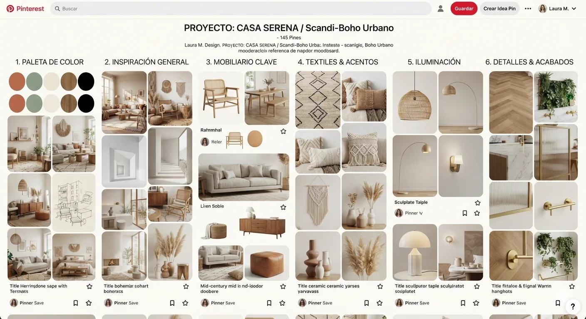
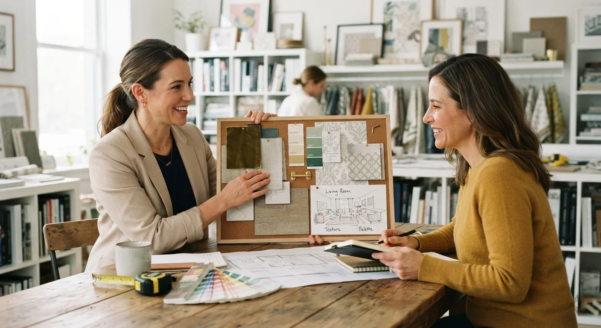

# Cómo Armar un Moodboard Profesional de Interiorismo, Paso a Paso

Un moodboard de interiorismo se arma en cinco pasos: **entender al cliente, definir paleta y estilo, recolectar referencias, seleccionar materiales, y componer el resultado final**, siempre en ese orden.

Saltarse el primer paso es la razón número uno por la que un moodboard no convence al cliente. Te explico el proceso completo, en orden, sin asumir que ya tienes experiencia previa armando este tipo de material.

## Qué necesitas antes de empezar

No necesitas software costoso para armar un buen moodboard. Con Pinterest para recolectar referencias y Canva para componer el resultado tienes más que suficiente para la mayoría de los proyectos, sin invertir en herramientas especializadas todavía.

Lo que sí necesitas, sin excepción, es información real del cliente antes de tocar cualquier herramienta. Un moodboard armado sin esa base es solo una colección bonita de imágenes sin dirección real.

## Paso a paso: del cliente al moodboard final

**Paso 1: Entiende cómo vive el cliente en ese espacio**

Antes de buscar una sola imagen, pregunta cómo usa realmente ese espacio: quién vive ahí, qué actividades hace en cada ambiente, y qué le molesta del espacio actual, más allá de lo puramente estético.

Un moodboard bonito que ignora cómo se usa el espacio en el día a día termina en un proyecto que se ve bien en fotos, pero no funciona en la vida real del cliente, algo que sale a la luz recién cuando ya es más costoso corregirlo.

**Paso 2: Define paleta y estilo base**

Con la información de la entrevista, elige entre 3 y 5 colores que van a guiar todo el proyecto, junto con una dirección de estilo clara (minimalista, cálido, ecléctico).

Una paleta con demasiados colores o un estilo indefinido termina en un moodboard confuso, sin un hilo conductor claro para el resto del equipo de proveedores.

**Paso 3: Recolecta referencias visuales**

Aquí es donde entra Pinterest. Crea un tablero privado para el proyecto y guarda imágenes que se alineen con la paleta y el estilo definidos en el paso anterior.

No guardes imágenes solo porque son bonitas. Cada una debe aportar algo concreto: una idea de distribución, un tipo de mobiliario, un estilo de iluminación específico que puedas justificar frente al cliente.

**Paso 4: Selecciona materiales y muestras reales**

Un buen moodboard de interiorismo no es solo color e imágenes. Incluye muestras o referencias de materiales reales: tipo de madera, textura de tela, acabado de pintura, tipo de piso, y hasta ferretería como manijas o llaves de agua si el proyecto lo requiere.

Esto es todavía más importante en interiorismo que en otros tipos de proyecto, porque los proveedores de acabados necesitan referencias exactas, no solo una idea general de color que puede interpretarse de formas muy distintas.

**Paso 5: Compón el resultado final**

Con todo lo anterior, organiza el moodboard en Canva o una herramienta similar: paleta de color arriba, referencias visuales organizadas por ambiente, y materiales al final, con notas claras de qué va en cada espacio.

<a href="/masters/interiorismo" class="articulo-recomendado">
  Siguiente paso
  Máster Profesional en Interiorismo, Decoración y Diseño 3D →
</a>

## Errores comunes al armar un moodboard de interiorismo

Estos son los errores que más se repiten entre quienes arman su primer moodboard profesional.

- **Saltarse la entrevista inicial.** Si ya viste [los errores más comunes en un primer proyecto](/blog/interiorismo/errores-decorar-primer-proyecto), sabes que empezar sin entender al cliente es de los errores más costosos de todo el proceso.
- **Demasiadas referencias sin filtrar.** Un moodboard con 40 imágenes sin criterio confunde más de lo que ayuda. Menos imágenes, mejor seleccionadas, comunican más claro.
- **No mostrar materiales reales.** Un moodboard solo de fotos de Pinterest, sin muestras de textura o material, deja a los proveedores adivinando detalles importantes.
- **Ignorar la distribución del espacio.** Un moodboard centrado solo en estilo, sin considerar cómo se usa el espacio realmente, produce propuestas bonitas pero poco prácticas.

## Cómo presentar el moodboard al cliente

La forma en que presentas el moodboard importa casi tanto como el contenido.

- **Explica el porqué de cada elección**, no solo muéstralo. "Elegimos este material porque resuelve..." convence más que solo enseñar imágenes bonitas.
- **Deja espacio para ajustes.** Presenta el moodboard como punto de partida, no como decisión cerrada, para que el cliente se sienta parte del proceso.
- **Usa el moodboard en todas tus reuniones con proveedores.** Así todos trabajan sobre la misma referencia visual, sin interpretaciones distintas de lo que el cliente realmente quiere para su espacio.

## Preguntas frecuentes

**¿Cuánto tiempo toma armar un buen moodboard de interiorismo?**

Entre 4 y 6 horas para un moodboard completo, contando la entrevista inicial, la recolección de referencias y la selección de materiales, sin apurar ninguno de los pasos.

**¿Necesito muestras físicas de material, o basta con fotos?**

Siempre que sea posible, muestras físicas. Las fotos pueden distorsionar el color y la textura real de un material, algo que se nota especialmente en telas y acabados de madera, donde la luz de la foto cambia mucho la percepción.

**¿El moodboard cambia durante el proyecto?**

Sí, es normal que se ajuste conforme avanza la ejecución. Trátalo como un documento vivo, no como algo fijo desde el primer día, sobre todo si surgen limitaciones de proveedor que obligan a cambiar algún material planeado.

<a href="/masters/interiorismo" class="articulo-recomendado">
  Si quieres aprender este proceso completo aplicado a proyectos reales, conoce nuestro
  Máster Profesional en Interiorismo, Decoración y Diseño 3D →
</a>
