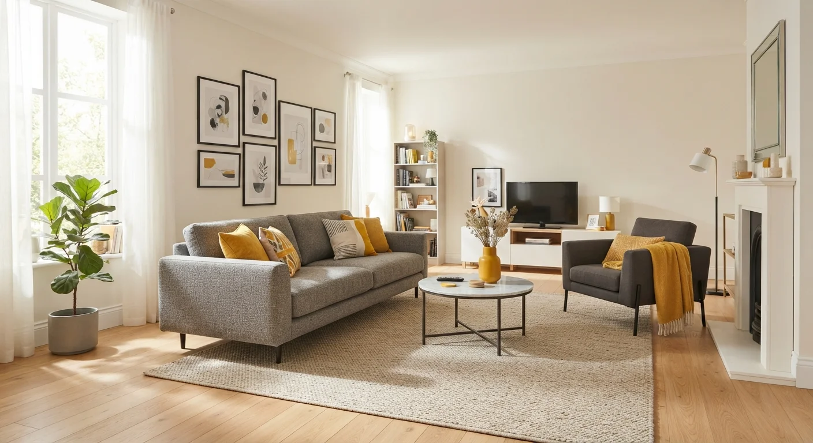
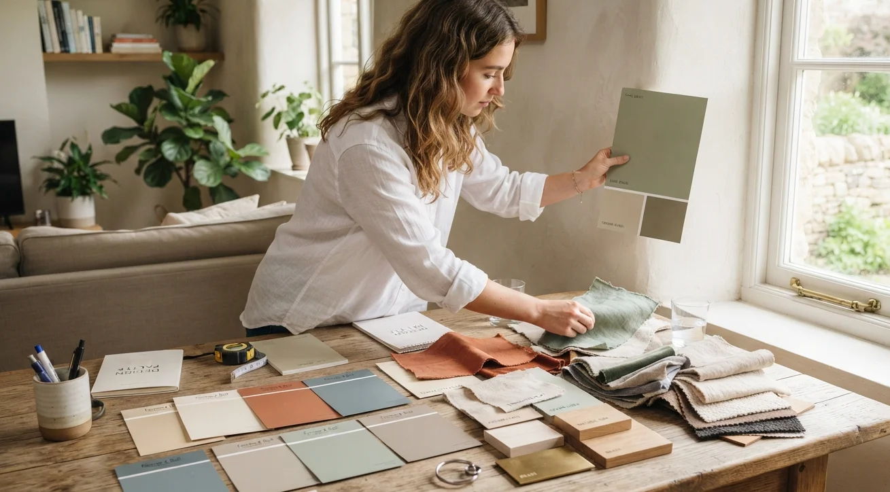

# Cómo Elegir una Paleta de Colores para un Proyecto de Decoración

Una paleta de colores bien elegida sigue la **regla 60-30-10**: 60% de un color dominante, 30% de un color secundario, y 10% de un color de acento, distribuido en todo el espacio.

No es una fórmula rígida, pero sí un punto de partida que evita el error más común: elegir colores por separado, sin pensar en cómo se van a ver juntos en el espacio completo, ya montado y con luz real.

## La regla 60-30-10, explicada

Esta proporción viene del diseño de interiores clásico, y sigue funcionando porque resuelve un problema muy concreto: sin ella, es fácil terminar con un espacio donde ningún color domina y todos compiten entre sí.

- **60% color dominante:** paredes, piso, piezas grandes de mobiliario.
- **30% color secundario:** cortinas, tapicería, alfombras.
- **10% color de acento:** cojines, objetos decorativos, detalles puntuales.

Esta distribución le da al ojo un punto de descanso (el dominante), un contraste medido (el secundario) y un toque de energía (el acento), sin que ninguno de los tres compita por atención con los otros dos.

## Cómo elegir el color dominante

El color dominante define el tono general del espacio, así que conviene elegirlo primero y con más cuidado que los otros dos, porque cualquier ajuste posterior sobre él sale más caro que sobre los otros dos.

Piensa en la luz natural del espacio antes de decidir: un color que se ve perfecto en una tienda con luz artificial puede verse completamente distinto en un ambiente con poca luz natural, o en una fachada orientada hacia el norte frente a una orientada hacia el sur.

Los tonos neutros cálidos (beige, crema, gris cálido) siguen siendo la opción más segura como dominante, precisamente porque dejan espacio para que el secundario y el acento tengan más protagonismo, sin competir por atención con la base del espacio.

## Cómo elegir el color secundario

El secundario debe tener suficiente contraste con el dominante para notarse, pero no tanto que rompa la armonía del conjunto.

Una forma simple de acertar: elige un color que esté a una o dos tonalidades de distancia del dominante en la misma familia de color, en vez de saltar a un extremo completamente opuesto.

Este es también el color donde más se nota si ya viste [las diferencias entre diseño de interiores y decoración](/blog/interiorismo/diseno-interiores-vs-decoracion): la elección del secundario suele resolverse con decoración (textiles), aunque a veces implica decisiones más técnicas si se aplica en muros o revestimientos.

<a href="/masters/interiorismo" class="articulo-recomendado">
  Siguiente paso
  Máster Profesional en Interiorismo, Decoración y Diseño 3D →
</a>

## Cómo elegir el color de acento

El acento es donde puedes tomar más riesgo, precisamente porque ocupa poco espacio visual. Un color intenso o poco convencional en el acento no compromete el resto del espacio si el dominante y el secundario están bien resueltos.

Este es el color que más se actualiza con el tiempo: cambiar cojines o algunos objetos decorativos permite renovar la sensación del espacio sin tocar lo que más costó definir (pintura, mobiliario grande).

## Errores comunes al elegir una paleta

Estos son los errores que más se repiten, incluso entre quienes ya tienen buen ojo para el color.

- **Elegir colores de forma aislada.** Un color que se ve bien en una muestra pequeña puede no funcionar igual en una pared completa o junto a otros elementos del espacio.
- **Ignorar la luz natural del ambiente.** El mismo color cambia radicalmente entre un espacio con mucha luz y uno con poca, algo que una muestra de pintura en la tienda no muestra.
- **Usar demasiados colores dominantes a la vez.** Sin una jerarquía clara (60-30-10), el espacio se siente desordenado, aunque cada color individual sea bonito.
- **No considerar el mobiliario ya existente.** Elegir una paleta completamente nueva sin pensar en las piezas que el cliente ya tiene genera conflictos que se pudieron evitar desde el inicio.

## Cómo probar la paleta antes de comprometerte

Antes de pintar una pared completa o comprar mobiliario grande, prueba la paleta a menor escala.

- **Pinta muestras grandes**, no solo el cuadrito pequeño de la tienda. Un color se percibe distinto en una superficie de 30x30 cm que en una de 5x5 cm.
- **Revisa la paleta en distintos momentos del día.** La luz de la mañana, la tarde y la noche cambian cómo se ve cada color.
- **Arma un mini moodboard físico** con muestras de pintura, tela y materiales antes de comprometerte con la compra final. Si ya viste [cómo armar un moodboard profesional](/blog/interiorismo/moodboard-interiorismo), este paso conecta directamente con ese proceso.

## Preguntas frecuentes

**¿Puedo usar más de tres colores en una paleta?**

Sí, pero manteniendo la misma lógica de proporción: un color o familia de color dominante, y el resto distribuido en porcentajes menores, sin que compitan entre sí.

**¿Los colores de tendencia siempre funcionan en cualquier espacio?**

No necesariamente. Un color de moda puede no funcionar bien con la luz natural o el mobiliario existente del espacio específico que estás decorando.

**¿Qué hago si el cliente quiere colores que no combinan bien entre sí?**

Explica la lógica del 60-30-10 y ofrece ajustar las proporciones, no necesariamente los colores. Muchas veces el problema no es el color en sí, sino cuánto espacio ocupa cada uno.

<a href="/masters/interiorismo" class="articulo-recomendado">
  Si quieres dominar la teoría del color aplicada a proyectos reales, conoce nuestro
  Máster Profesional en Interiorismo, Decoración y Diseño 3D →
</a>
