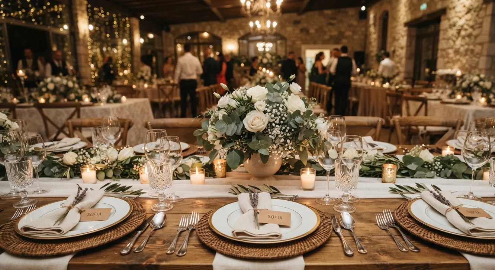

# Así se Ve el Primer Evento Pagado de una Wedding Planner

El primer evento pagado casi nunca se siente como una victoria clara. Se siente como **nervios, doble revisión de todo, y la sensación de que algo se te va a olvidar**, aunque hayas repasado el cronograma diez veces.

Lo que sigue no es la historia de una persona en particular. Es el patrón que se repite en la mayoría de las alumnas que llegan a este punto, con distintas caras y distintos países, pero con la misma estructura de fondo, casi sin excepción.

## Antes del evento: la preparación que nadie ve

Los días previos al primer evento pagado suelen ir en dos direcciones: exceso de preparación, revisando el cronograma una y otra vez sin necesidad, o procrastinación por ansiedad, evitando confirmar detalles por miedo a que algo salga mal y se confirme esa preocupación.

Ninguna de las dos reacciones es rara. Lo que marca la diferencia es tener un cronograma detallado por escrito, revisado con cada proveedor con al menos unos días de anticipación, en vez de confiar en la memoria bajo presión el mismo día del evento, cuando cualquier distracción puede costar caro.

## El día del evento: donde la teoría se encuentra con la realidad

Casi siempre pasa algo que no estaba en el plan: un proveedor que llega tarde, un cambio de último minuto que pide el cliente, un detalle de montaje que no se ve exactamente como en el moodboard aprobado semanas antes, o incluso un problema de clima que obliga a activar el plan B a último momento.

Lo que distingue a quien está preparada no es que nada salga mal. Es que resuelve sin que el cliente lo note, apoyándose en el cronograma y en las decisiones ya tomadas de antemano, en vez de improvisar desde cero en el momento con la presión de tener a los invitados ahí mismo, observando cada movimiento.

## Después del evento: la parte que casi nadie planea

Terminado el evento, hay dos tareas que muchas dejan pasar por cansancio, y que son justamente las que más rinden después: pedir fotos profesionales del montaje terminado y pedir el testimonio del cliente mientras la experiencia está fresca en su memoria, antes de que la rutina del día a día la vaya diluyendo.

Ese material es lo que convierte un evento aislado en una pieza de portafolio real, algo que ya cubrimos con más detalle en [nuestra guía de cómo empezar sin título universitario](/blog/wedding-planner/como-ser-wedding-planner-sin-titulo).

<a href="/masters/wedding-planner" class="articulo-recomendado">
  Siguiente paso
  Máster Profesional en Wedding Planning & Organización de Eventos →
</a>

## Lo que realmente cambia después del primer evento pagado

No es tanto la habilidad técnica, que ya existía desde antes gracias a la formación y los eventos previos sin cobrar tarifa completa. Lo que cambia es la seguridad: ya existe una prueba real, verificable, de que el trabajo, cobrado a precio justo, se sostiene y el cliente queda satisfecho con el resultado.

Esa seguridad es la que permite dejar de dudar sobre la tarifa del siguiente evento, en vez de seguir cobrando de menos "por si acaso" como en la etapa anterior, repitiendo un patrón que ya no tiene razón de ser una vez que existe esa primera prueba concreta. Si quieres ver cómo se calcula esa tarifa con criterio, ya lo cubrimos en [nuestra guía de cuánto cobrar por organizar un evento](/blog/wedding-planner/cuanto-cobrar-por-organizar-un-evento).

## Errores comunes en un primer evento pagado

Estos son los que más se repiten, sin importar la experiencia previa de cada persona ni el tipo de boda que se organice.

- **Aceptar demasiadas tareas fuera del cronograma acordado**, por no saber decir que no en el momento, sobre todo frente a un cliente nervioso que pide "una cosita más" a último minuto.
- **No delegar nada**, intentando resolver todo personalmente en vez de apoyarse en un asistente o proveedor de confianza para las tareas más operativas del día del evento.
- **No documentar el evento en el momento**, dejando pasar la oportunidad de fotos y video mientras todo estaba montado y en su mejor punto.
- **Subestimar el tiempo de montaje**, llegando con el margen justo en vez de dejar espacio de sobra para resolver cualquier imprevisto antes de que lleguen los primeros invitados a la recepción.

## Preguntas frecuentes

**¿Es normal sentir mucho nervio antes del primer evento pagado?**

Sí, es prácticamente universal. La preparación por escrito (cronograma, contactos de proveedores, plan B) reduce ese nervio mucho más que cualquier técnica de manejo de ansiedad aprendida de un libro, porque le da a la mente algo concreto en qué apoyarse.

**¿Qué pasa si algo sale mal en el primer evento pagado?**

Casi siempre pasa algo pequeño, y casi nunca lo nota el cliente si se resuelve con calma y sin dramatismo visible. Lo que sí nota es la reacción de quien coordina, no el imprevisto en sí, así que mantener la compostura importa más que evitar cualquier error posible.

**¿Cuándo se siente uno realmente listo para cobrar tarifa completa?**

Después de este primer evento pagado, ya hay base suficiente para hacerlo con confianza. La sensación de "estar completamente lista" rara vez llega antes de tener esa primera experiencia real detrás, así que esperar a sentirse lista suele significar esperar indefinidamente sin necesidad.

<a href="/masters/wedding-planner" class="articulo-recomendado">
  Si quieres llegar a tu primer evento pagado con una base sólida, conoce nuestro
  Máster Profesional en Wedding Planning & Organización de Eventos →
</a>
