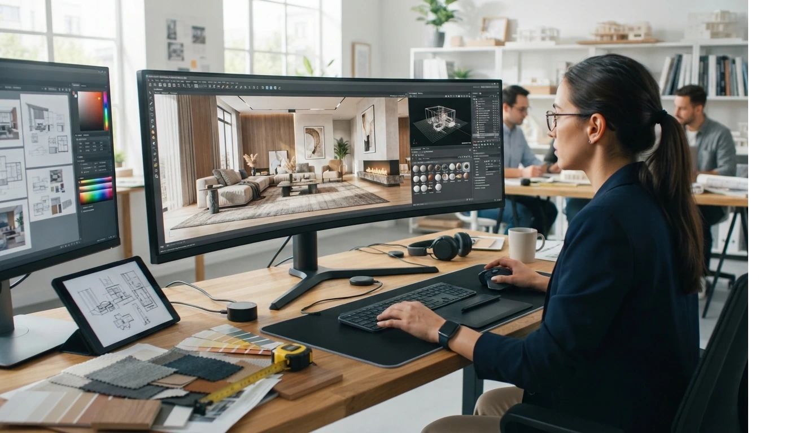
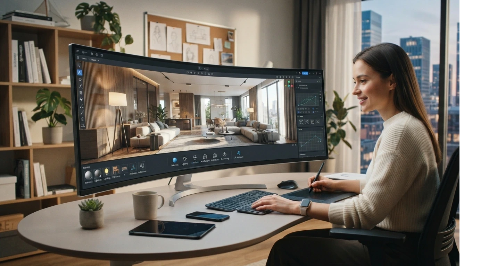

# Software de Diseño 3D que Todo Interiorista Debe Dominar en 2026

Tres programas cubren el 90% de lo que vas a necesitar: **AutoCAD** para planos técnicos, **SketchUp** para modelado 3D rápido y **Revit** para proyectos técnicos de mayor escala.

Enscape y V-Ray no son un cuarto camino aparte: son complementos de render que se instalan sobre estos programas para lograr el nivel de realismo que un cliente espera ver.

Aquí te explico para qué sirve cada uno, cómo se complementan entre sí, y por cuál empezar.

## Por qué necesitas más de uno

Ningún programa hace las tres cosas igual de bien: dibujar con precisión técnica, modelar rápido en volumen y coordinar un proyecto grande con varios responsables a la vez.

AutoCAD, SketchUp y Revit nacieron con filosofías distintas, y por eso los interioristas que trabajan con fluidez terminan usando más de uno, según la etapa del proyecto.

## AutoCAD, para planos técnicos

AutoCAD sigue siendo el estándar de la industria para plantas, alzados y secciones. Su fuerza está en la precisión: líneas, medidas exactas y un dibujo técnico que cualquier maestro de obra o arquitecto puede leer sin ambigüedad, sin importar en qué país trabajes.

Si coordinas con consultores externos que trabajan en formato DWG (el formato nativo de AutoCAD), tarde o temprano lo vas a necesitar, incluso si tu modelado principal lo haces en otro programa. Es habitual entregar la parte conceptual en SketchUp y la documentación final en AutoCAD.

## SketchUp, para modelado 3D rápido

SketchUp es, por lejos, el software más fácil de aprender de los tres, y el más usado para presentar ideas rápido: conceptos, distribución de espacios y primeras propuestas visuales para el cliente.

Si ya cubriste [las diferencias entre diseño de interiores y decoración](/blog/interiorismo/diseno-interiores-vs-decoracion-2026), esta es exactamente la herramienta donde se conectan los dos frentes: aquí defines la estructura técnica del espacio, y sobre esa base después trabajas color, mobiliario y estilo.

Es también el punto de entrada más lógico si recién estás empezando, porque no exige el mismo nivel de curva de aprendizaje que Revit.

<a href="/masters/interiorismo" class="articulo-recomendado">
  Siguiente paso
  Máster Profesional en Interiorismo, Decoración y Diseño 3D →
</a>

## Revit, para proyectos técnicos de mayor escala

Revit trabaja distinto a los otros dos: en vez de dibujar líneas o formas, construyes el proyecto con componentes que ya "saben" qué son (un muro sabe que es un muro, no solo una línea con relleno).

Eso lo hace mucho más potente para proyectos grandes, donde varios profesionales (arquitecto, interiorista, ingeniero) necesitan coordinar sobre el mismo modelo sin pisarse el trabajo, detectando choques entre sistemas antes de que lleguen a obra. También tiene la curva de aprendizaje más exigente de los tres, porque exige pensar en componentes en vez de líneas y formas sueltas.

No es el punto de partida recomendado si estás empezando. Tiene sentido aprenderlo cuando ya trabajas (o quieres trabajar) en proyectos de mayor escala, o en estudios que ya operan bajo ese flujo de coordinación con arquitectura e ingeniería.

## Enscape y V-Ray, el nivel de render final

Ni AutoCAD ni Revit ni SketchUp generan por sí solos el tipo de render fotorrealista que un cliente de gama alta espera ver antes de aprobar un proyecto.

Ahí es donde entran **Enscape** y **V-Ray**: se instalan como complemento dentro de SketchUp o Revit y agregan iluminación, materiales y texturas con un nivel de realismo mucho más cercano a una fotografía que a un modelo 3D básico.

No necesitas dominarlos desde tu primer proyecto. Tiene sentido invertir tiempo ahí cuando ya trabajas con clientes que valoran (y pagan) ese nivel extra de presentación visual, y no antes, porque el tiempo de aprendizaje se paga solo si el proyecto lo justifica.

## Cuál priorizar si estás empezando

No necesitas aprender los cinco a la vez, y mucho menos sumar Enscape o V-Ray antes de dominar bien la base. El orden que recomendamos en el instituto, probado con decenas de alumnos que empezaron desde cero:

1. **SketchUp primero.** Es el que más rápido te permite mostrar resultados a un cliente real.
2. **AutoCAD después**, cuando empieces a necesitar planos técnicos precisos o coordinar con consultores externos.
3. **Revit más adelante**, solo si tu carrera se dirige hacia proyectos de mayor escala o estudios con flujo BIM.
4. **Enscape o V-Ray al final**, cuando el tipo de cliente que atiendes justifique ese nivel de render.

Aprender los cinco a la vez, sin proyectos reales donde aplicarlos, es la forma más común de perder tiempo estudiando software sin avanzar en tu portafolio.

## Preguntas frecuentes

**¿Necesito los tres programas desde mi primer proyecto?**

No. Con SketchUp bien manejado puedes cerrar tus primeros proyectos. AutoCAD y Revit se vuelven necesarios a medida que la escala y complejidad de tus proyectos crece, no antes.

**¿Enscape y V-Ray hacen lo mismo?**

Cumplen un objetivo similar (renders fotorrealistas), pero cada uno tiene su propio flujo de trabajo y curva de aprendizaje. No necesitas dominar los dos a la vez, con uno bien manejado es suficiente para la mayoría de proyectos.

**¿Cuál es el software más importante si solo puedo aprender uno?**

SketchUp, porque es la base más transferible: te permite modelar rápido y sirve como punto de partida antes de sumar AutoCAD o Revit más adelante, sin importar hacia qué tipo de proyecto termines especializándote.

<a href="/masters/interiorismo" class="articulo-recomendado">
  Si quieres aprender estas herramientas aplicadas a proyectos reales, conoce nuestro
  Máster Profesional en Interiorismo, Decoración y Diseño 3D →
</a>
