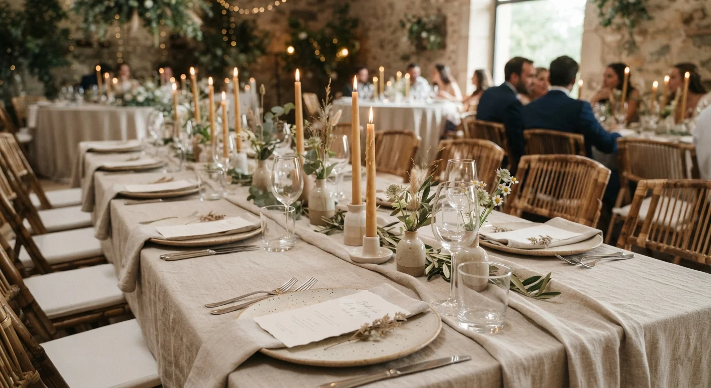
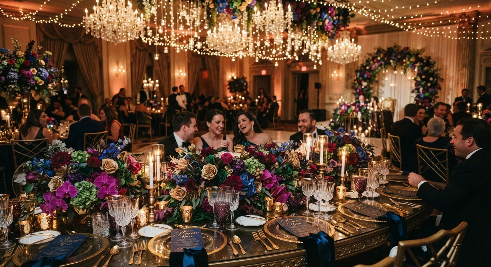

# Tendencias en Organización de Bodas para 2026

La boda "perfecta para Instagram" ya no es el objetivo. 2026 se mueve hacia **celebraciones personales, con historia propia y menos fórmula repetida** entre una boda y otra.

Te explico las tendencias que realmente están marcando este año, no una lista genérica reciclada de temporadas anteriores, para que las apliques en tus propuestas a clientes.

## Bodas con historia propia, no de catálogo

La tendencia de fondo detrás de todo lo demás: las parejas ya no quieren una boda que se vea genérica. Quieren un evento que cuente su historia, con guiños a momentos que los unen, desde la selección del anillo hasta los detalles de la recepción, pasando por las celebraciones de compromiso previas a la boda misma.

Esto cambia tu trabajo como wedding planner: ya no se trata solo de ejecutar un formato conocido, sino de traducir la historia de cada pareja en decisiones concretas de diseño, algo que exige más conversación inicial con el cliente antes de proponer cualquier idea.

## Dos estilos opuestos, conviviendo en el mismo año

2026 no tiene un solo estilo dominante. Conviven dos extremos: el **minimalismo** (sobriedad, funcionalidad, menos elementos pero más cuidados) y el **rococó glam** (elegancia excesiva, lujo romántico, ornamentación visible en cada detalle).

Colores como negro, blanco, beige y azul serenity aparecen en ambos estilos, aplicados de forma distinta según la propuesta: sobrios y limpios en el minimalismo, más saturados y contrastados en el estilo glam. Conocer los dos te permite ofrecer propuestas más precisas, en vez de un único estilo genérico para todos tus clientes, sin importar lo que cada pareja realmente busque para su celebración.

## Mesas serpenteantes, para más interacción

El formato de mesa larga sigue vigente, pero con un giro: mesas serpenteantes que favorecen la interacción entre invitados, en vez de filas rígidas y distantes que dificultan la conversación entre extremos de la mesa.

Se combinan con textiles naturales (manteles de lino arrugado, caminos de mesa de yute) y mezcla de materiales, como cerámica y madera, para dar sensación de confort sin perder sofisticación, incluso en propuestas de presupuesto moderado y sin necesidad de piezas importadas costosas.

<a href="/masters/wedding-planner" class="articulo-recomendado">
  Siguiente paso
  Máster Profesional en Wedding Planning & Organización de Eventos →
</a>

## Paletas de color con más carácter

Los neutros puros ceden espacio a paletas más definidas: tonos pastel polvorientos (malva, salvia, rosa maquillaje), metálicos suaves (oro rosa, latón, cobre envejecido) y tonos joya apagados (esmeralda, burdeos, amatista) combinados con lino crudo, en vez de la clásica combinación de blanco con un solo color de acento.

Tener una paleta de color clara y consistente ayuda a unificar toda la narrativa visual de la boda, desde la papelería hasta la decoración de mesa, pasando por el vestuario del cortejo y los arreglos florales.

## Papelería artesanal y arte en vivo

La papelería deja de ser solo funcional (invitación, señalética) para convertirse en parte de la experiencia: papel texturizado, señalética impresa en tela, ilustraciones personalizadas que anticipan el estilo visual de toda la boda desde antes de que el invitado llegue al lugar.

Una tendencia que está ganando terreno es el arte en vivo durante el evento, como acuarela en tiempo real durante el cóctel, ofreciendo a los invitados un recuerdo hecho en el momento, no comprado de antemano en una tienda de regalos genérica.

## Iluminación como protagonista del diseño

La iluminación dejó de ser un detalle técnico secundario para convertirse en parte central del diseño del evento, con instalaciones que definen el ambiente casi tanto como la decoración de mesa o el arreglo floral, y que muchas veces se convierten en el elemento más fotografiado de toda la noche.

Si ya viste [cuánto gana un wedding planner por país](/blog/wedding-planner/cuanto-gana-un-wedding-planner-2026), notarás que este tipo de propuestas más elaboradas suelen justificar tarifas más altas, precisamente por el nivel de coordinación técnica que exigen con proveedores especializados.

## Celebraciones de fin de semana, no de un solo día

Otra tendencia en crecimiento: bodas que se extienden más de un día, con actividades antes y después de la ceremonia principal, en vez de concentrar todo en una sola fecha. Cenas de bienvenida, brunch de despedida y actividades grupales alrededor de la boda se vuelven parte del paquete completo.

Esto le suma complejidad logística real al trabajo del wedding planner, porque implica coordinar varios eventos relacionados, no uno solo, cada uno con su propia lista de invitados, proveedores, cronograma y presupuesto asignado.

## Preguntas frecuentes

**¿Estas tendencias solo aplican a bodas de presupuesto alto?**

No. Los principios (personalización, paleta de color consistente, materiales con textura) se pueden aplicar en distintos rangos de presupuesto, ajustando la escala de cada elemento sin perder la esencia de la propuesta.

**¿Debo elegir entre minimalismo y rococó glam para toda mi cartera de clientes?**

No. Conviene manejar los dos, porque cada pareja tiene una visión distinta. Especializarte en uno solo limita el rango de clientes que puedes atender bien, sobre todo en mercados donde la demanda de ambos estilos es alta.

**¿Estas tendencias cambian cada año?**

Los formatos específicos varían, pero el principio de fondo (personalización sobre fórmula genérica) lleva varias temporadas consolidándose y probablemente siga marcando la pauta más allá de 2026, incluso cuando los colores y materiales concretos vayan cambiando de una temporada a otra.

<a href="/masters/wedding-planner" class="articulo-recomendado">
  Si quieres aprender a aplicar estas tendencias en propuestas reales, conoce nuestro
  Máster Profesional en Wedding Planning & Organización de Eventos →
</a>
