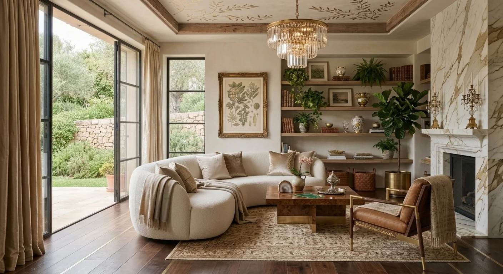
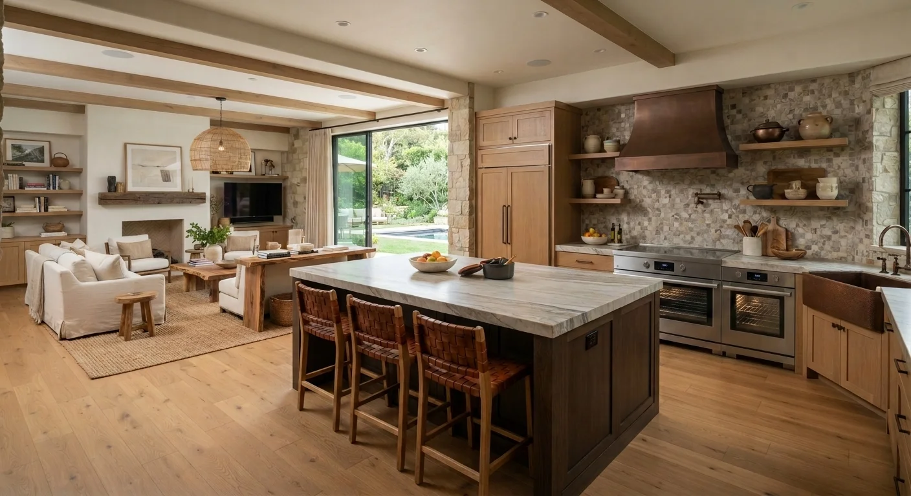

# Tendencias de Decoración de Interiores

El neutro plano ya no manda. El mercado se mueve hacia **colores profundos, materiales con historia y espacios que se sienten habitados, no de catálogo**.

Te explico las tendencias que realmente están marcando este año, no una lista genérica repetida de temporadas anteriores.

## Colores profundos, no neutros aséptico

La paleta de blanco roto, gris claro y taupe está cediendo terreno a tonos con más carácter: ciruela, verde abeto, azul real, terracota y marrón chocolate. También ganan protagonismo tonos como el verde esmeralda y el llamado "Transformative Teal", elegido color del año por una de las principales consultoras de tendencias del sector.

La razón detrás del cambio: los clientes buscan que su casa se sienta personal e íntima, no como una sala de exposición. El monocromo con estos colores intensos también gana terreno, para crear atmósferas envolventes en un solo ambiente, sobre todo en espacios donde antes se apostaba por seguridad absoluta con el blanco.

## Artesanía y piezas con historia

Después de años de producción en masa, la artesanía vuelve con fuerza: cerámica cruda, vidrio soplado, tejidos murales, mesas pequeñas de madera maciza, cuadros de artistas locales.

No es solo estética. Es una respuesta a espacios que se sentían impersonales. Un objeto con historia detrás comunica algo que ningún mueble de catálogo puede replicar, y ese factor emocional es justo lo que buscan los clientes que ya se cansaron de la decoración genérica.

## Diseño biofílico, más allá de las plantas

El diseño biofílico dejó de significar "pon unas plantas en el salón". Se trata de integrar luz natural optimizada con espejos y superficies reflectantes, formas orgánicas en curvas suaves de sofás y mesas, y materiales vivos (piedra natural, ratán, mimbre, madera) en toda la estructura del espacio, no solo como decoración superficial.

La meta es que el espacio completo transmita bienestar físico y mental, difuminando el límite entre interior, terraza y jardín cuando el proyecto lo permite. Ya no se trata de un detalle decorativo aislado, sino de una filosofía que atraviesa toda la casa.

## Minimalismo cálido, no minimalismo frío

El minimalismo racional y distante está dando paso a una versión más cálida: espacios serenos pero acogedores, con textura y personalidad, en vez de líneas puramente funcionales sin alma.

Esta evolución conecta con el interés por el "quiet luxury": lujo discreto, materiales de calidad, sin ostentación visual evidente.

<a href="/masters/interiorismo" class="articulo-recomendado">
  Siguiente paso
  Máster Profesional en Interiorismo, Decoración y Diseño 3D →
</a>

## Contraste de texturas naturales y acabados contemporáneos

Otra tendencia fuerte: mezclar materiales naturales (madera cruda, piedra, lino) con acabados contemporáneos (metal, vidrio, superficies lisas) en el mismo ambiente. El gres porcelánico se consolida como material protagonista este año, precisamente porque interpreta otros materiales con un realismo cada vez más sorprendente, en vez de limitarse a imitarlos.

El resultado busca contraste con armonía: espacios con más carácter, sin caer en la sobrecarga visual. Si ya viste [las diferencias entre diseño de interiores y decoración](/blog/interiorismo/diseno-interiores-vs-decoracion), esta tendencia es un buen ejemplo de por qué conviene manejar los dos frentes juntos: la mezcla de materiales es decisión técnica y estética a la vez.

## El baño como refugio, no solo espacio funcional

El baño dejó de sentirse frío y puramente práctico. Se trabaja como un pequeño refugio: piedra, mármoles con veta marcada, microcemento y maderas tratadas, combinadas con pinturas minerales y revestimientos de cal que aportan textura.

Es de los cambios más notorios frente a años anteriores, donde el baño era casi siempre el último espacio en recibir atención de diseño, tratado más como instalación técnica que como parte real de la experiencia del hogar.

## Cocinas más abiertas y sociales

La cocina se consolida como el centro real del hogar: más abierta, más estética, sin perder funcionalidad. El objetivo ya no es solo cocinar, sino que el espacio funcione como punto de encuentro social dentro de la casa.

## Hogares imperfectos, no de catálogo

Quizás la tendencia más importante de fondo: la evolución hacia hogares menos perfectos y más reales, con piezas personales, libros, textiles con textura y objetos que cuentan una historia, en vez de espacios que parecen recién salidos de una revista.

Los diseñadores hablan de "interiores honestos", donde la belleza está en la historia detrás de cada objeto y en la mezcla imperfecta de lo nuevo con lo heredado o lo encontrado. Esto no es una moda pasajera de un año. Es un cambio de expectativa del cliente que va a seguir influyendo en cómo se diseñan los espacios de aquí en adelante.

## Preguntas frecuentes

**¿Estas tendencias aplican solo a proyectos de gama alta?**

No. Los principios (color con carácter, materiales con textura, espacios biofílicos) se pueden aplicar con presupuestos distintos, ajustando la escala y los materiales específicos según lo que el cliente pueda invertir.

**¿Debo rediseñar todo el espacio para aplicar estas tendencias?**

No necesariamente. Cambios de color, textiles y algunas piezas artesanales pueden actualizar un espacio sin tocar nada estructural, sobre todo si el proyecto es de decoración y no de diseño integral.

**¿Cuánto duran estas tendencias antes de cambiar de nuevo?**

Los principios de fondo (biofilia, materiales con historia, calidez) llevan varias temporadas consolidándose, así que no son tendencias de un solo año que vayan a desaparecer pronto ni a quedar obsoletas de la noche a la mañana.

<a href="/masters/interiorismo" class="articulo-recomendado">
  Si quieres aprender a aplicar estas tendencias en proyectos reales, conoce nuestro
  Máster Profesional en Interiorismo, Decoración y Diseño 3D →
</a>
