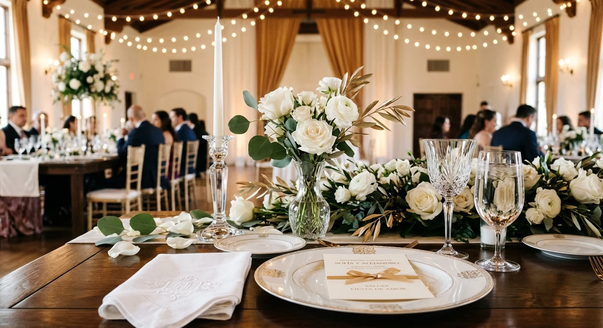

# Cómo Trabajar como Wedding Planner Remoto para el Mercado Hispano en Estados Unidos

Sí se puede atender clientes hispanos en Estados Unidos sin vivir ahí. La clave está en **coordinar bien con proveedores locales y entender lo que este cliente específico busca**, que no siempre es lo mismo que un cliente local en tu propio país de origen.

Te explico cómo funciona este modelo y cómo empezar a construir presencia en ese mercado, aunque nunca hayas trabajado con clientes fuera de tu país antes.

## Por qué el mercado hispano en EE.UU. es una oportunidad real

La población hispana en Estados Unidos representa un mercado grande y con poder adquisitivo real, y una parte importante de esas familias busca planificadoras que entiendan tanto el idioma como las tradiciones culturales de una boda latina, no solo alguien que hable español de forma básica.

Muchas parejas hispanas en EE.UU. quieren una boda que combine costumbres de su país de origen con el idioma y el contexto donde ahora viven. Un wedding planner que hable español con fluidez y entienda esas tradiciones tiene una ventaja real frente a planners locales que no comparten ese contexto cultural, incluso si esos planners locales tienen más presencia física en la ciudad del evento.

## Cómo funciona trabajar de forma remota con clientes en EE.UU.

El modelo se apoya en tres piezas: coordinación por videollamada con el cliente, una red de proveedores locales en la ciudad donde se realiza la boda, y un sistema claro de comunicación que compense la distancia física entre tú y el evento.

La diferencia horaria suele ser manejable entre Latinoamérica y Estados Unidos, lo que facilita coordinar reuniones en vivo sin mayor fricción, algo que no siempre pasa cuando se trabaja con clientes de otros continentes. Lo más importante es tener uno o dos proveedores de confianza en la ciudad del evento, que puedan ejecutar en terreno lo que se coordina a distancia, y que respondan con la misma seriedad que si estuvieras presente supervisando todo en persona.

Si ya viste [cómo maximizar la rentabilidad atendiendo clientes internacionales](/blog/wedding-planner/rentable-wedding-planner-latinoamerica), notarás que la lógica es la misma: la coordinación remota con proveedores locales de confianza es la habilidad central en cualquier mercado internacional, no solo en Estados Unidos, y es una habilidad que se puede desarrollar con práctica, no algo con lo que naces sabiendo.

## Qué buscan específicamente estos clientes

Estos clientes no buscan solo un servicio en español. Buscan a alguien que entienda detalles culturales concretos: el peso de la familia extendida en las decisiones, tradiciones específicas según el país de origen (México, Colombia, Venezuela, Cuba, entre otros), y un manejo natural del español que no se sienta traducido ni forzado.

También valoran mucho la referencia de boca en boca dentro de comunidades hispanas, que suelen estar bien conectadas entre sí en ciudades con población latina grande y activa en redes sociales. Un buen trabajo con una familia puede abrirte la puerta a varias referencias dentro de esa misma red social, precisamente porque las comunidades hispanas tienden a compartir recomendaciones de servicios de confianza con más frecuencia que otros grupos.

<a href="/masters/wedding-planner" class="articulo-recomendado">
  Siguiente paso
  Máster Profesional en Wedding Planning & Organización de Eventos →
</a>

## Cómo conseguir tus primeros clientes en ese mercado

Empezar en un mercado nuevo, aunque sea remoto, requiere presencia visible antes de que lleguen los primeros clientes reales dispuestos a contratar.

- **Crea contenido en español dirigido específicamente a este público**, mencionando ciudades con población hispana grande, no solo contenido genérico sobre bodas que podría aplicar a cualquier país.
- **Conéctate con proveedores latinos que ya trabajan en Estados Unidos.** Fotógrafos, catering y locaciones con dueños o encargados hispanos suelen estar más abiertos a recomendarte a sus propios clientes, precisamente porque comparten el mismo entendimiento cultural.
- **Documenta cualquier proyecto con clientes hispanos en EE.UU.**, aunque sea pequeño al inicio, para construir un portafolio específico que hable directamente a ese público, no un portafolio genérico de bodas en cualquier país.
- **Sé explícita sobre tu propuesta de valor**: no solo hablas español, entiendes las tradiciones y puedes coordinar todo el proceso de forma remota sin que el cliente sienta que pierde calidad de servicio por trabajar contigo a distancia.

## Retos reales de operar de forma remota desde otro país

Ser honesto sobre los retos ayuda a prepararte mejor para ellos.

- **Diferencia de moneda y forma de cobro.** Necesitas un método claro para recibir pagos en dólares desde otro país, con las comisiones y tiempos de transferencia que eso implica, y que el cliente entienda desde el inicio de la cotización.
- **Conocimiento limitado del terreno.** Sin vivir en la ciudad del evento, dependes completamente de que tus proveedores locales sean confiables y comuniquen bien cualquier imprevisto, sin la posibilidad de resolverlo tú misma en persona.
- **Competencia con planners locales bilingües.** Algunos wedding planners que sí viven en Estados Unidos también atienden este mercado, así que tu diferencial necesita ser claro y consistente, no solo "trabajo desde otro país pero hablo español".

## Preguntas frecuentes

**¿Necesito viajar a Estados Unidos para atender estos eventos?**

No es obligatorio si tienes proveedores locales de confianza para la ejecución en terreno, aunque algunos wedding planners eligen viajar para el evento principal si el presupuesto del proyecto lo permite y el cliente lo valora especialmente.

**¿Cómo cobro a un cliente en Estados Unidos desde otro país?**

Existen plataformas de pago internacional que facilitan recibir dólares desde cualquier país, aunque conviene revisar las comisiones y tiempos de cada opción antes de definir tu método de cobro, para que no te lleves sorpresas con el monto final recibido.

**¿Qué ciudades tienen más demanda de este tipo de servicio?**

Ciudades con población hispana grande (Miami, Los Ángeles, Houston, Nueva York, entre otras) suelen tener mayor demanda, aunque comunidades más pequeñas también generan oportunidades reales, muchas veces con menos competencia entre planners que hablan español.

<a href="/masters/wedding-planner" class="articulo-recomendado">
  Si quieres aprender a construir tu carrera con alcance internacional, conoce nuestro
  Máster Profesional en Wedding Planning & Organización de Eventos →
</a>
