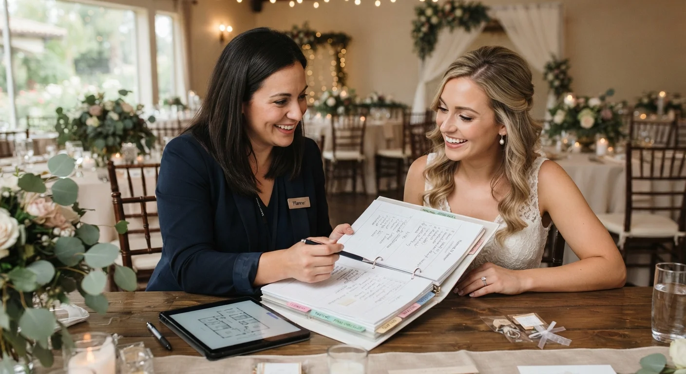

# Wedding Planner vs. Organizador de Eventos: Diferencias que Debes Conocer

La diferencia corta: **wedding planner** se especializa en bodas, con todo lo emocional y protocolar que eso implica. **Organizador de eventos** cubre un rango más amplio: corporativos, sociales, conferencias, lanzamientos.

No son lo mismo, pero tampoco son caminos separados. En la práctica, un profesional completo necesita manejar los dos, aunque decida enfocar su marca en uno de ellos.

Te explico las diferencias reales, y por qué no conviene formarte solo en uno de los dos.

## Wedding planner vs. organizador de eventos, en una tabla

| | Wedding planner | Organizador de eventos |
|---|---|---|
| **Tipo de evento** | Bodas exclusivamente | Corporativos, sociales, conferencias, bodas también |
| **Componente emocional** | Muy alto, maneja familias y protocolo íntimo | Variable, más orientado a logística y objetivos del cliente |
| **Repetición de clientes** | Cliente único, casi nunca repite | Empresas y organizadores que repiten contrato |
| **Presupuesto típico** | Alto por evento individual | Variable, desde pequeño hasta muy grande según el tipo |
| **Presión de fecha** | Fecha fija, sin margen de reprogramación | A veces más flexible, según el tipo de evento |

Ninguno es "superior" al otro. Son especializaciones que comparten la misma base: presupuestos, cronogramas, manejo de proveedores y coordinación el día del evento.

## Qué hace un wedding planner (el alcance real)

Un wedding planner maneja el evento con más carga emocional de todo el sector. No solo coordina logística: administra expectativas de familias, protocolo, y una fecha que no se puede mover si algo sale mal.

Requiere un tipo de paciencia distinto: cada boda es única para ese cliente, aunque para ti sea tu boda número cincuenta. Eso exige un manejo de las relaciones interpersonales que va más allá de la parte puramente operativa del evento.

## Qué hace un organizador de eventos (el alcance real)

Un organizador de eventos trabaja con un rango mucho más amplio de formatos: lanzamientos de producto, conferencias, eventos corporativos, fiestas privadas, y también bodas cuando decide incluirlas en su oferta.

La relación con el cliente suele ser distinta: empresas que contratan de forma recurrente, con objetivos más medibles (asistencia, satisfacción, cierre de ventas) que emocionales, y presupuestos que pueden repetirse año tras año.

<a href="/masters/wedding-planner" class="articulo-recomendado">
  Siguiente paso
  Máster Profesional en Wedding Planning & Organización de Eventos →
</a>

## Diferencias clave que casi nadie te explica

Más allá de la tabla, hay tres diferencias que conviene entender bien, aunque termines manejando los dos frentes a la vez.

- **Manejo de expectativas.** En bodas, la expectativa es casi siempre perfección emocional. En eventos corporativos, la expectativa suele ser cumplimiento de objetivos medibles.
- **Recurrencia de negocio.** Un cliente de bodas casi nunca vuelve a contratarte para otra boda. Un cliente corporativo puede convertirse en ingreso recurrente durante años.
- **Presión del día del evento.** Una boda no tiene "reintento": si algo sale mal, no hay forma de repetirla. Muchos eventos corporativos sí permiten ajustar sobre la marcha sin el mismo costo emocional.

## Por qué conviene formarte en los dos juntos

Aquí está el error más común al elegir carrera: pensar que hay que escoger un camino y dejar el otro de lado.

En la práctica, la base técnica es la misma en los dos casos: presupuestos, cronogramas, manejo de proveedores, coordinación el día del evento. Lo que cambia es el contexto emocional y el tipo de cliente.

Por eso el máster de wedding planning en el instituto no se llama solo "wedding planning": se llama **Wedding Planning & Organización de Eventos**, precisamente porque separar ambos mundos en programas distintos no refleja cómo se mueve el mercado real.

Quien solo se forma en bodas pierde acceso a contratos corporativos recurrentes. Quien solo se forma en eventos corporativos pierde el nicho de bodas, que suele pagar mejor por evento individual. Si ya viste [cuánto gana un wedding planner por país](/blog/wedding-planner/cuanto-gana-un-wedding-planner), notarás que ambos mercados se complementan en vez de competir entre sí.

## Un caso real: los dos frentes, en la misma carrera

Una alumna nuestra en Monterrey empezó su carrera enfocada solo en bodas. Después de dos años, una empresa le pidió organizar el evento de lanzamiento de un producto, algo completamente fuera de su especialidad original.

Aceptó, aplicando la misma base de presupuestos y cronogramas que ya dominaba, pero ajustando el manejo del cliente hacia objetivos corporativos en vez de emocionales.

Ese evento le abrió una línea de ingresos que hoy representa una parte importante de su facturación anual, algo que nunca hubiera pasado si se hubiera cerrado exclusivamente a bodas.

## Preguntas frecuentes

**¿Puedo especializarme solo en bodas si eso es lo que me apasiona?**

Sí, puedes enfocar tu marca en bodas. Pero conocer también organización de eventos te da opciones de ingreso adicional en temporadas bajas de bodas.

**¿Cuál paga mejor, bodas o eventos corporativos?**

Depende del cliente. Una boda de presupuesto alto puede pagar más por evento individual, pero un contrato corporativo recurrente puede superar eso en ingreso anual total, sobre todo si logras varios contratos activos al mismo tiempo.

**¿Necesito formación distinta para cada uno?**

No necesariamente distinta, sino complementaria. La base (presupuestos, cronogramas, proveedores) es la misma; lo que cambia es el manejo del cliente y el contexto emocional de cada tipo de evento.

<a href="/masters/wedding-planner" class="articulo-recomendado">
  Si quieres formarte en ambos frentes con una base sólida, conoce nuestro
  Máster Profesional en Wedding Planning & Organización de Eventos →
</a>
